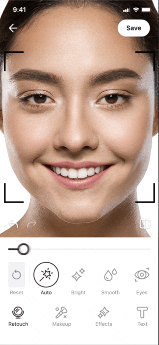
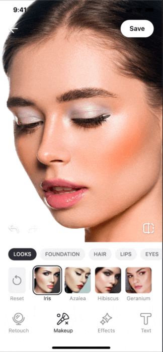
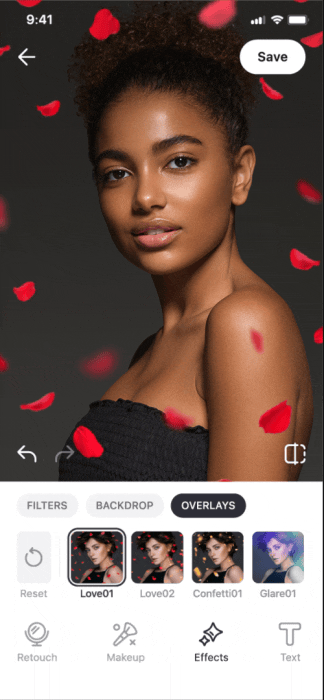
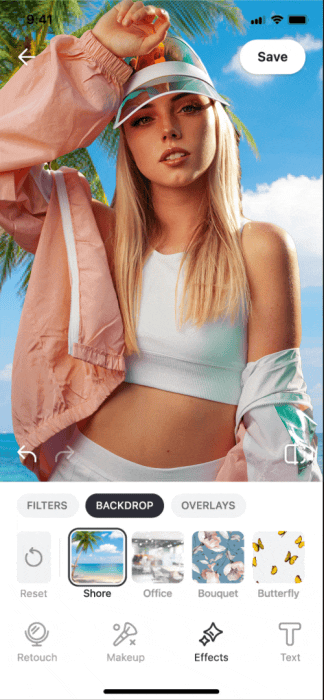

# Banuba Video Editor & Photo Editor SDKs - Android integration sample

&nbsp;
&nbsp;
&nbsp;
&nbsp;
&nbsp;

&nbsp;
&nbsp;
&nbsp;
&nbsp;

## Overview
[Banuba Video Editor SDK](https://www.banuba.com/video-editor-sdk) allows you to quickly add short video functionality and possibly AR filters and effects into your mobile app.  

[Banuba AR Photo Editor SDK](https://www.banuba.com/photo-editor-sdk) allows you to quickly add the photo editing capabilities to your app.

## Usage
### License
Before you commit to a license, you are free to test all the features of the SDK for free. The trial period lasts 14 days.

Send us a message to start the [Video Editor SDK trial](https://www.banuba.com/video-editor-sdk#form) | [Photo Editor SDK trial](https://www.banuba.com/photo-editor-sdk#form). We will get back to you with the trial token.

Feel free to contact us if you have any questions regarding [Video Editor SDK](https://www.banuba.com/faq/kb-tickets/new) and [Photo Editor SDK](https://www.banuba.com/support)

### Installation
1. Clone the repository and open the project in IDE
2. Add the license token [within the app](app/src/main/java/com/banuba/example/integrationapp/SampleApp.kt#L13)
3. Run the sample application in your IDE

### Quickstart Integration Guide
Our [Quickstart Guide](mddocs/quickstart.md) will help you to quickly integrate and customize Video Editor SDK into your Android project.

### Documentation
Please visit [Video Editor SDK](https://docs.banuba.com/ve-pe-sdk/docs/android/requirements-ve) and [Photo Editor SDK](https://docs.banuba.com/ve-pe-sdk/docs/android/requirements-pe) documentation to know more about SDK.

### Requirements
- Kotlin 1.8+ or Java 17
- Android OS 6.0 or higher with Camera 2 API
- OpenGL ES 3.0 (3.1 for Neural networks on GPU)
- :white_check_mark: arm64-v8a , :white_check_mark: armv7, :exclamation: x86-64 limited support, :x: x86 - no support

### Supported media formats
| Audio                                  | Video      | Images      |
|----------------------------------------| ---------  | ----------- |
| .aac, .mp3, .wav, .ogg, .m4a, .flac |.mp4, .mov | .jpg, .gif, .heic, .png, .nef, .cr2, .jpeg, .raf, .bmp

## Releases
[1.34.0](https://www.notion.so/vebanuba/1-34-0-a93561e02494400f99358e021d340534)\
[1.33.0](https://www.notion.so/vebanuba/1-33-0-2b49e129a00e444ba9b6f5e62f0b20b3)\
[1.32.0](https://www.notion.so/vebanuba/1-32-0-964738ed7fc2402a8f2bd5560c74ca20)\
[1.30.2](https://www.notion.so/vebanuba/1-30-2-d2e8a131674c43e8b3579d56e85bbc86)\
[1.30.2](https://www.notion.so/vebanuba/1-30-2-d2e8a131674c43e8b3579d56e85bbc86)\
[1.30.2](https://www.notion.so/vebanuba/1-30-2-d2e8a131674c43e8b3579d56e85bbc86)\
[1.30.1](https://www.notion.so/vebanuba/1-30-1-5a08b6f2e9dc43be8bff62667daa4b1d)\
[1.30.0](https://www.notion.so/vebanuba/1-30-0-e8a3f0f7235946d6b0a42039da8ed148)\
[1.29.3](https://www.notion.so/vebanuba/1-29-3-3902233840384206ae54b5255ea048b4)\
[1.29.2](https://www.notion.so/vebanuba/1-29-2-a1a86dda6ae94527a4922ce482dd85d6)\
[1.29.1](https://www.notion.so/vebanuba/1-29-1-78170ead1c7a4853b39d0d7a4c068b0e)\
[1.29.0](https://www.notion.so/vebanuba/1-29-0-99aed44d533b4670ab053055e0e02d01)\