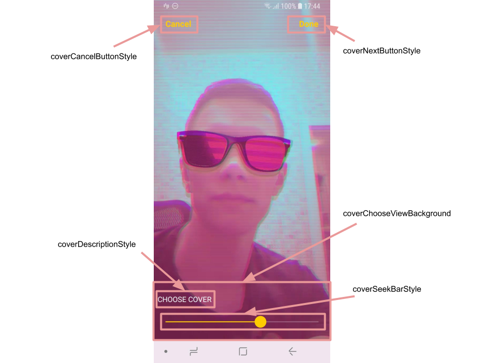

# Banuba VideoEditor SDK
## Cover screen styles

- [coverNextButtonStyle](app/src/main/res/values/themes.xml#L191)

    style for the button that proceeds with selected frame as a cover and starts exporting video
- [coverCancelButtonStyle](app/src/main/res/values/themes.xml#L192)

    style for the button that returns to the previous screen
- [coverSeekBarStyle](app/src/main/res/values/themes.xml#L193)

    style for the cover seek bar
- [coverDescriptionStyle](app/src/main/res/values/themes.xml#L194)

    style for the TextView with description of cover screen
- [coverChooseViewBackground](app/src/main/res/values/themes.xml#L195)

    custom theme attribute that setups background to the LinearLayout containing cover description and seek bar

    