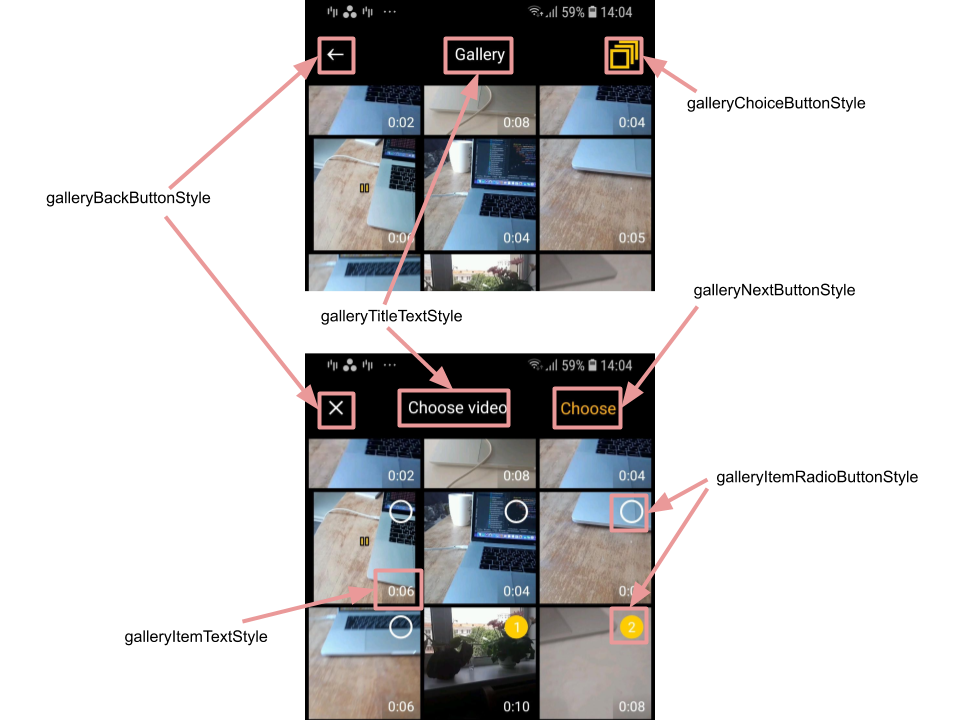
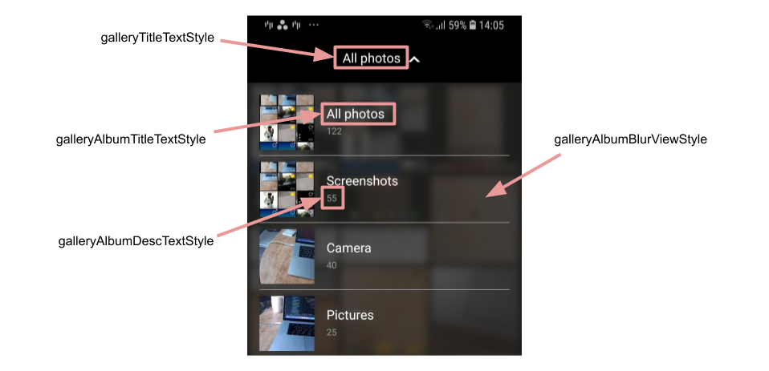

# Banuba VideoEditor SDK
## Gallery screen styles

- [galleryImageViewStyle](app/src/main/res/values/themes.xml#L90)

    style defines the overview of gallery icon on the camera screen. By default the last media resource is used as gallery icon drawable. It can be changed by switching "use_custom_image" attribute to "true" and setup custom drawable as a background resource in this style
- [galleryTitleTextStyle](app/src/main/res/values/themes.xml#L91)

    style for the gallery screen title. For pictures gallery the recent album's title is used
- [galleryChoiceButtonStyle](app/src/main/res/values/themes.xml#L92)

    style for the button that switches multi selection
- [galleryBackButtonStyle](app/src/main/res/values/themes.xml#L93)

    style for the button placed on the top left corner of the screen. This button has different drawables depends on the current gallery state and has different behaviour:
    - ["back"](gallery_styles.md#L50) to return to the previous screen
    - ["cross"](gallery_styles.md#L51) to cancel multi selection mode
- [galleryNextButtonStyle](app/src/main/res/values/themes.xml#L94)

    style for the button that appears in case of multi selection mode to proceed with selected resources
- [galleryItemRadioButtonStyle](app/src/main/res/values/themes.xml#L95)

    style for the radio button that is used to define selected resource. It has a bulk of custom attributes to customize internal colors 
- [galleryItemTextStyle](app/src/main/res/values/themes.xml#L96)

    style for the TextView that shows duration for video resources

    

- [galleryEmptyTextStyle](app/src/main/res/values/themes.xml#L97)

    style for the title and description views that are shown in case of empty gallery
- [galleryAlbumBlurViewStyle](app/src/main/res/values/themes.xml#L98)

    style for the custom view that is used to apply blur effect as a background for albums list. It can have custom tint via "overlay_color" attribute
- [galleryAlbumTitleTextStyle](app/src/main/res/values/themes.xml#L99)

    style for the album title
- [galleryAlbumDescTextStyle](app/src/main/res/values/themes.xml#L100)

    style for the album description

    

Besides concrete styles there are a lot of theme attributes that allows to configure gallery screen:
- [galleryColumnsNumber](app/src/main/res/values/themes.xml#L102) - setup how much columns the gallery screen shows
- [gallery_bg_color](app/src/main/res/values/themes.xml#L104) - background color for gallery screen
- [gallery_item_corner_radius](app/src/main/res/values/themes.xml#L105) - setup corner radius for every gallery item
- [gallery_item_margin](app/src/main/res/values/themes.xml#L106) - setup margins between items in gallery (applied in all directions)
- [gallery_icon_back](app/src/main/res/values/themes.xml#L107) - for drawable in case of "back" button returns to the previous screen
- [gallery_icon_cross](app/src/main/res/values/themes.xml#L108) - for drawable in case of "back" button cancels selected resources
- [gallery_album_divider_color](app/src/main/res/values/themes.xml#L109) - divider color in the albums list
