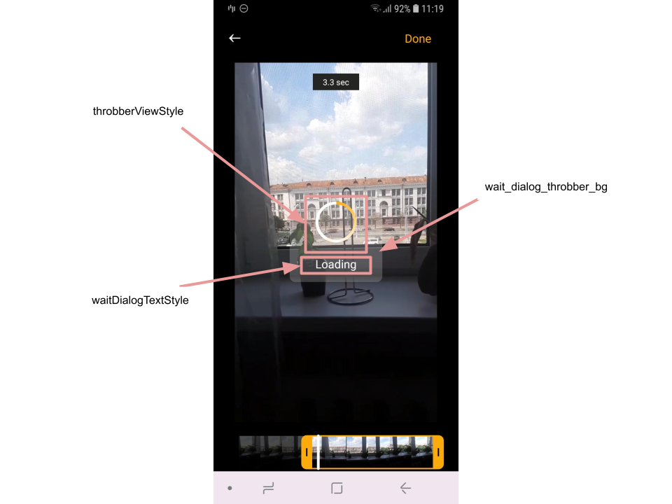
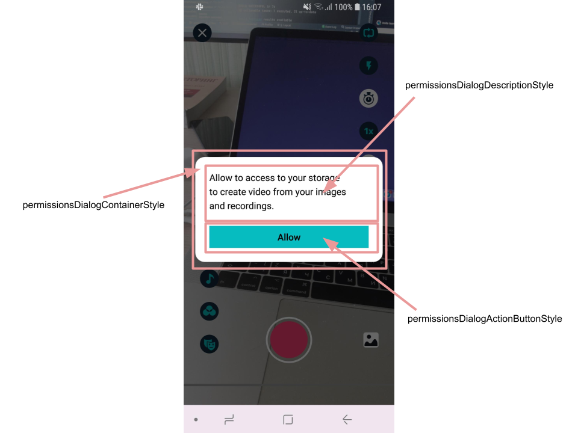
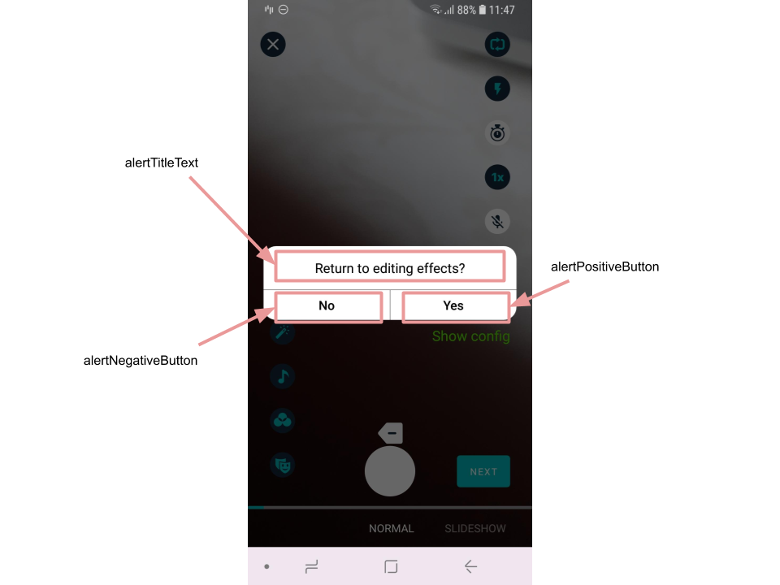

# Banuba AI Video Editor SDK
## Alert Dialog styles

There are following types of user notification used in AI Video Editor SDK:
- toast
- wait dialog (represents long running tasks)
- info alert
- confirmation alert

All of them are customized by theme attributes described in this file.

### **Toast**

- [toastStyle](https://github.com/Banuba/ve-sdk-android-integration-sample/blob/main/app/src/main/res/values/themes.xml#L198)

    style to customize toast messages

    

### **Wait dialog**

- [throbberViewStyle](https://github.com/Banuba/ve-sdk-android-integration-sample/blob/main/app/src/main/res/values/themes.xml#L42)

    style for the circle progress bar. It is allowed to customize gradient colors using custom attribute

- [waitDialogTextStyle](https://github.com/Banuba/ve-sdk-android-integration-sample/blob/main/app/src/main/res/values/themes.xml#L43)

    style for the TextView that shows a description

- [wait_dialog_throbber_bg](https://github.com/Banuba/ve-sdk-android-integration-sample/blob/main/app/src/main/res/values/themes.xml#L199)

    theme attribut that configures the background of circle progress bar within progress dialog

    

### **Info alert**
Info alerts are messages that are used to show information message to the user (recently they are rationale messages that should be shown before ask the user to grant permissions).

- [permissionsDialogContainerStyle](https://github.com/Banuba/ve-sdk-android-integration-sample/blob/main/app/src/main/res/values/themes.xml#L316)

    style for the container of info alert

- [permissionsDialogDescriptionStyle](https://github.com/Banuba/ve-sdk-android-integration-sample/blob/main/app/src/main/res/values/themes.xml#L317)

    style for the description text 

- [permissionsDialogActionButtonStyle](https://github.com/Banuba/ve-sdk-android-integration-sample/blob/main/app/src/main/res/values/themes.xml#L319)

    style for the single button on the info alert

## String resources
| ResourceId        |      Value      |   Description |
| ------------- | :----------- | :------------- |
| permission_camera_description_message | Allow to access your Camera and, Microphone to take and edit photos or videos, and record audio. | message to show as info alert before request vital video edior permissions
| permission_gallery_description_message |  Allow to access to your storage to create video from your images and recordings. | message to show as info alert before request gallery permission
| permission_dialog_allow | Allow | button title for simple confirmation from the user
| permission_dialog_settings | Settings | button title for redirection to application settings (it is used in case the user did not granted permissions but still tries to make something unavailable without permission)

### **Confirmation alert**

Confirmation alerts are used when some action from the user is required. They have two buttons representing different user experience flow.

To customize this type of dialogs you should override following styles :
 - alertParentViewStyle - for the whole alert container
 - alertTitleTextStyle - for the alert title (how to add an icon to every alert is described below)
 - alertDescriptionTextStyle - for the optional alert description (now it is used only for Audio Browser feature, so if you does not have it just do not override this attribute)
 - alertPositiveBtnStyle - for the right button that represents user's confirmation
 - alertNegativeBtnStyle - for the left button representing user's cancellation

To customize **the whole appearance** of confirmation alerts you should override `ConfirmationDialogProvider` interface and provide your custom implementation through DI. With custom implementation you should take into account confirmation alert types to create consistent user experience within Video Editor SDK.

Every alert dialog has its own type within SDK. It allows to customize descriptions and text over the positive and negative buttons. To do so you need to override the following **string resources** (they named according to the type of alert where they are used):
- "alert_return_to_camera"

    "alert_return_to_camera_positive"

    "alert_return_to_camera_negative"
- "alert_delete_video_message"
    
    "alert_delete_video_positive"

    "alert_delete_video_negative"
- "alert_save_video_chunk_message"

    "alert_save_video_positive"

    "alert_save_video_negative"
- "alert_return_to_editor"

    "alert_return_to_editor_positive"

    "alert_return_to_editor_negative"
- "alert_return_to_trimmer"

    "alert_return_to_trimmer_positive"

    "alert_return_to_trimmer_negative"
- "alert_reset_all_message"

    "alert_reset_all_positive"

    "alert_reset_all_negative"
- "editor_alert_reset_all"

    "editor_alert_reset_all_positive"

    "editor_alert_reset_all_negative"
- "editor_alert_reset_effects"

    "editor_alert_reset_effects_positive"

    "editor_alert_reset_effects_negative"
- "editor_alert_delete_voice_record"

    "editor_alert_delete_voice_record_positive"

    "editor_alert_delete_voice_record_negative"

Also there is a possibility to **add custom icon** for every alert dialog type. To setup drawables for this reason they should be passed into custom theme attributes:

- [alert_camera_return_to_camera](https://github.com/Banuba/ve-sdk-android-integration-sample/blob/main/app/src/main/res/values/themes.xml#L43)
- [alert_camera_delete_video](https://github.com/Banuba/ve-sdk-android-integration-sample/blob/main/app/src/main/res/values/themes.xml#L44)
- [alert_camera_return_to_editor](https://github.com/Banuba/ve-sdk-android-integration-sample/blob/main/app/src/main/res/values/themes.xml#L45)
- [alert_camera_return_to_trimmer](https://github.com/Banuba/ve-sdk-android-integration-sample/blob/main/app/src/main/res/values/themes.xml#L46)
- [alert_camera_save](https://github.com/Banuba/ve-sdk-android-integration-sample/blob/main/app/src/main/res/values/themes.xml#L47)
- [alert_camera_reset_all](https://github.com/Banuba/ve-sdk-android-integration-sample/blob/main/app/src/main/res/values/themes.xml#L48)
- [alert_editor_delete_voice_record](https://github.com/Banuba/ve-sdk-android-integration-sample/blob/main/app/src/main/res/values/themes.xml#L49)
- [alert_editor_reset_all](https://github.com/Banuba/ve-sdk-android-integration-sample/blob/main/app/src/main/res/values/themes.xml#L50)
- [alert_editor_reset_effects](https://github.com/Banuba/ve-sdk-android-integration-sample/blob/main/app/src/main/res/values/themes.xml#L51)
