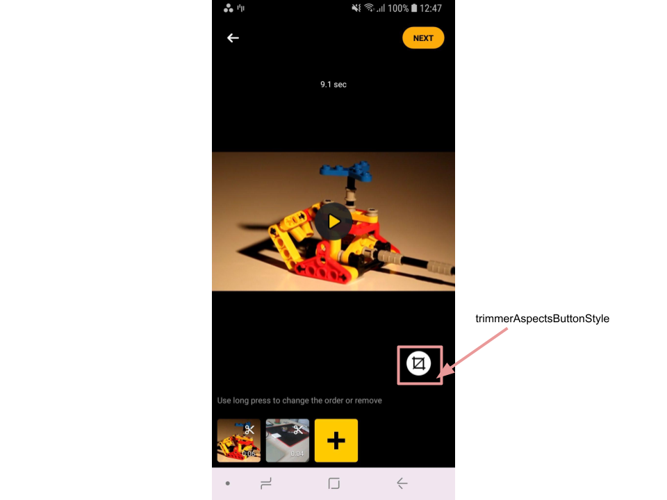
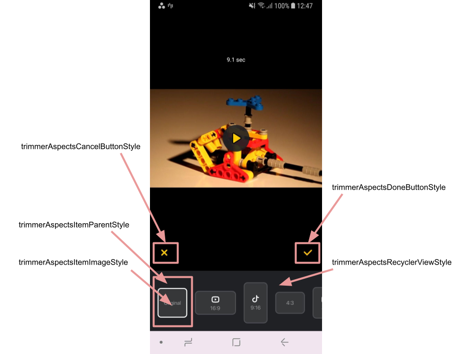

# Banuba AI Video Editor SDK
## Aspects screen styles

- [trimmerAspectsButtonStyle](https://github.com/Banuba/ve-sdk-android-integration-sample/blob/main/app/src/main/res/values/themes.xml#L147)

    style for the button that opens aspects list

    

- [trimmerAspectsDoneButtonStyle](https://github.com/Banuba/ve-sdk-android-integration-sample/blob/main/app/src/main/res/values/themes.xml#L148)

    style for the button that applies selected aspect

- [trimmerAspectsCancelButtonStyle](https://github.com/Banuba/ve-sdk-android-integration-sample/blob/main/app/src/main/res/values/themes.xml#L149)

    style for the button that returns the user to the previous screen

- [trimmerAspectsRecyclerViewStyle](https://github.com/Banuba/ve-sdk-android-integration-sample/blob/main/app/src/main/res/values/themes.xml#L150)

    style for the view containing all aspects

- [trimmerAspectsItemParentStyle](https://github.com/Banuba/ve-sdk-android-integration-sample/blob/main/app/src/main/res/values/themes.xml#L151)

    style for the view containing single aspect

- [trimmerAspectsItemImageStyle](https://github.com/Banuba/ve-sdk-android-integration-sample/blob/main/app/src/main/res/values/themes.xml#L152)

    style for the image for single aspect

- [trimmerAspectsItemDescriptionStyle](https://github.com/Banuba/ve-sdk-android-integration-sample/blob/main/app/src/main/res/values/themes.xml#L153)

    style for the description text for single aspect

    


### Icon resources

| ResourceId        |   Description |
| ------------- | :------------- |
| ic_aspect_original | Icon for `EditorAspectSettings.Original` aspect |
| ic_aspect_16_9 | Icon for `EditorAspectSettings.16_9` aspect |
| ic_aspect_9_16 | Icon for `EditorAspectSettings.9_16` aspect |
| ic_aspect_4_3 | Icon for `EditorAspectSettings.4_3` aspect |
| ic_aspect_4_5 | Icon for `EditorAspectSettings.4_5` aspect |

**NOTE: Aspects feature may be turned off.** To remove it you should override `AspectsProvider` implementation with just one `EditorAspectSettings` type. For example:

```kotlin
override val aspectsProvider: BeanDefinition<AspectsProvider> = single(override = true) {
    object : AspectsProvider {
        override fun provide(): AspectsProvider.AspectsData {
            val allAspects = listOf(
                EditorAspectSettings.`4_5`
             )
            return AspectsProvider.AspectsData(
                allAspects = allAspects,
                default = allAspects.first()
            )
        }
    }
}
```

In this example there is **no aspects icon** on trimmer screen and **all videos will be resized to 4x5 aspect ratio** by default besides the way they were added (from gallery or recorded on camera).

:exclamation: If you want to display video without black lines override `videoDrawParams` property in EditorKoinModule.
```kotlin
val videoDrawParams: BeanDefinition<VideoDrawParams> = factory(override = true) {
    VideoDrawParams(
        scaleType = VideoScaleType.Center,
        normalizedCropRect = RectF(0F, 0F, 1F, 1F)
    )
}
```
Default value is:
```kotlin
val videoDrawParams: BeanDefinition<VideoDrawParams> = factory(override = true) {
    VideoDrawParams(
        scaleType = VideoScaleType.Fit(VideoBackgroundType.Black),
        normalizedCropRect = RectF(0F, 0F, 1F, 1F)
    )
}
```

:exclamation:If you want to display 9x16 video at Editor screen with original size override editorVideoScaleType property in EditorKoinModule. By default, the video will be scaled to fill black lines and some of the parts will be not visible at the editor.
```kotlin
override val editorVideoScaleType: BeanDefinition<VideoScaleType>=
    factory(named("editorVideoScaleType"), override = true) {
         VideoScaleType.FIT
}
```
<p align="center">
    &nbsp;
</p>

```kotlin
override val editorVideoScaleType: BeanDefinition<VideoScaleType>=
    factory(named("editorVideoScaleType"), override = true){
         VideoScaleType.CENTER
}
```
<p align="center">
    &nbsp;
</p>