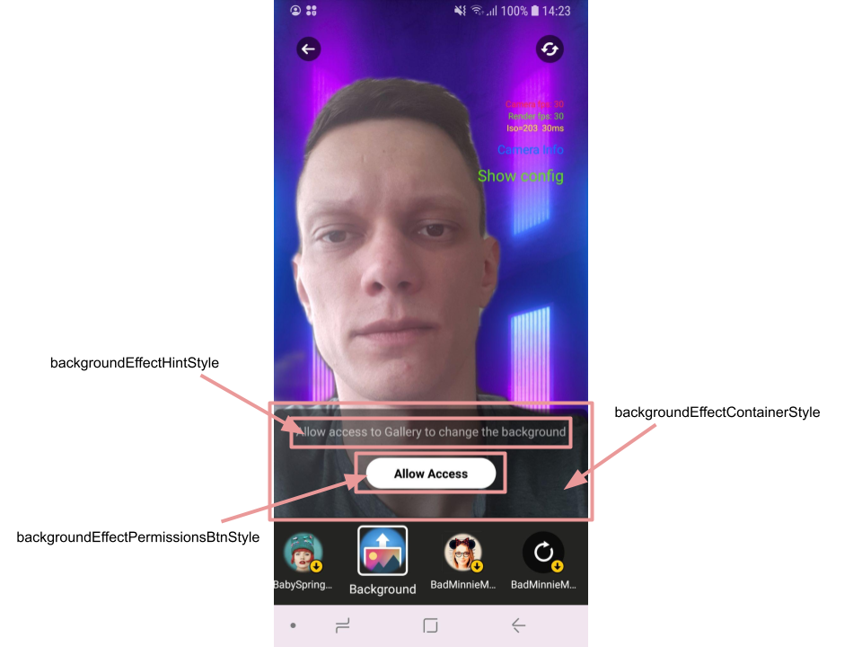
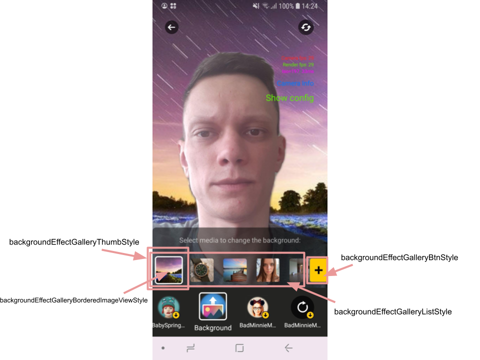

# Background mask integration

## Overview

Background mask is an AR effect that allows to apply images or videos as a background during recording video.

To use the Background effect in an app, please, request it from Banuba representatives.

## Integration

### Step 1

 - If you use [AR cloud](ar_cloud.md), the Background effect is available for you to download right from the AR masks list on the Camera screen.

 - If you store AR effects internally, request the mask from Banuba representatives and place it into assets/bnb-resources/effects folder of your app.

 ### Step 2

 Add theme attributes with your custom [styles](../app/src/main/res/values/themes.xml#L1306) mentioned in Customization section.

## Customization

Background mask is provided with additional UI that helps to select required media file. UI is customized by [main theme attributes](../app/src/main/res/values/themes.xml#L398) like any other Video Editor SDK screens.

 - **backgroundEffectContainerStyle** - style for the background of the main UI container 
 - **backgroundEffectHintStyle** - style for the hint on the top of the main UI container
 - **backgroundEffectEmptyViewStyle** - style for the view that is shown in case of no media files found
 - **backgroundEffectPermissionsBtnStyle** - style for the button that requests premission to device storage
 - **backgroundEffectGalleryListStyle** - style for the media files container
 - **backgroundEffectGalleryBtnStyle** - style for the button to the right of the media files list that opens the gallery screen to choose the file out there
 - **backgroundEffectGalleryThumbStyle** - style for the media file item presented in the files list
 - **backgroundEffectGalleryThumbTextStyle** - style for the text over the media file item (duration of the video files is shown here)
 - **backgroundEffectGalleryThumbProgressStyle** - style for the small circle progress bar shown while media file is loading into files list
 - **backgroundEffectGalleryBorderedImageViewStyle** - style for the media item containig some custom attributes that holds selection animation logic (i.e. scaling of selected item)

## String resources

| ResourceId        |      Value      |   Description |
| ------------- | :----------- | :------------- |
| background_effect_empty_view | No media found | text shown in case no media found on the device for background
| background_effect_permission_btn | Allow Access | label on the button that request access to device storage for the media files 
| background_effect_list_hint | Select media to change the background: | hint over the list of media files
| background_effect_list_permission | Allow access to Gallery to change the background | hint shown in case of not granted premission to access device storage
| background_effect_invalid_file | Damaged file | toast message that is shown if the user selects not allowed media file for background