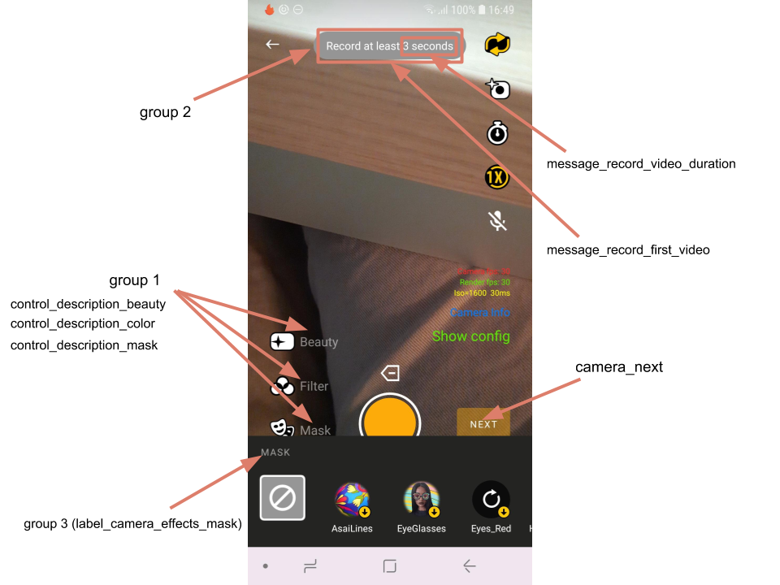

# Banuba VideoEditor SDK
## Camera string resources

We grouped all string resources that are used on camera sceen into 3 groups:

1. All **action buttons** may have a **text title** (its visibility is configured by *descriptionPosition* attribute of [cameraActionButtonStyle](https://github.com/Banuba/ve-sdk-android-integration-sample/blob/main/app/src/main/res/values/themes.xml#L25))

2. Upon some actions **notification** displayed as **toast** is shown top of the screen. Some of them has a dynamic message depends on additional data (i.e. parameters from config files)

3. Bottom view with **AR masks and color filters** may have a **label** (its visibility is configured in [checkableEffectTitleStyle](https://github.com/Banuba/ve-sdk-android-integration-sample/blob/main/app/src/main/res/values/themes.xml#L39)

Groups described above are showcasted on the screenshot along with some string resources: 



| ResourceId        |      Value      |   Description |
| ------------- | :----------- | :------------- |
| control_description_switch | Flip | title for the icon to switch camera facing
| control_description_flashlight |  Flash | title for the icon to switch flashlight
| control_description_timer | Timer | title for the timer icon
| control_description_speed | Speed | title for the icon to switch recording speed
| control_description_mute | Mute | title for the icon to switch mic recording
| control_description_beauty | Beauty | title for the icon to apply beautification effect
| control_description_music | Music | title for the icon to request an [audio content](https://github.com/Banuba/ve-sdk-android-integration-sample#configure-audio-content)
| control_description_color | Filter | title for the icon to open color filters
| control_description_mask | Mask | title for the icon to open AR masks
| message_record_first_video | Record at least %1$s | message shown in case user tries to proceed with the video shorter than ```minVideoDuration``` parameter from [camera.json](https://github.com/Banuba/ve-sdk-android-integration-sample/blob/main/app/src/main/assets/camera.json#L3)
| message_record_video_duration | {0,choice,0#{0} second\|1#{0} seconds\|2#{0} seconds\|3#{0} seconds\|4#{0} seconds\|4&lt;{0} seconds} | special string that defines the string value of the placeholder from ```message_record_first_video``` string (i.e. "1 second" or "3 seconds")
| notification_beautifier_on | Magic! | message shown when beautification effect is applied
| notification_flash_on | Light! | message shown when the flashlight is being turned on
| notification_timer_on | Timer %1$d seconds is on | message shown when one of the TimerEntry was selected (placeholder is a TimerEntry value in seconds)
| notification_timer_off | Timer is off | message shown when the timer is being turned off
| err_no_space_left | Not enough disk space | message widely used in SDK and informing that there is not space to effort further operations
| err_no_time_left | Max video length %1$.1f sec | message shown in case of user tries to record video longer than the ```maxVideoDuration``` parameter from [camera.json](https://github.com/Banuba/ve-sdk-android-integration-sample/blob/main/app/src/main/assets/camera.json#L3) file
| err_no_space_left_recording | Running out of disk space. Recording is canceled. | message shown in case the phone is running out of space during video recording
| label_camera_effects_luts | Filter | label at the top of the color filters list (visibility of the label is configured in [cameraEffectsLabelStyle](https://github.com/Banuba/ve-sdk-android-integration-sample/blob/main/app/src/main/res/values/themes.xml#L32))
| label_camera_effects_mask | Mask | label at the top of the AR masks list (visibility of the label is configured in [cameraEffectsLabelStyle](https://github.com/Banuba/ve-sdk-android-integration-sample/blob/main/app/src/main/res/values/themes.xml#L32))
| camera_next | Next | text on the button that goes on the editor screen


In case if a TextView that are shown on camera has no string resource mentioned here that means you may use any resource from outside the SDK and apply it through view's style configuration.

All alert messages shown on the camera screen that require user's action are described in [Alert dialogs](alert_styles.md) section.

