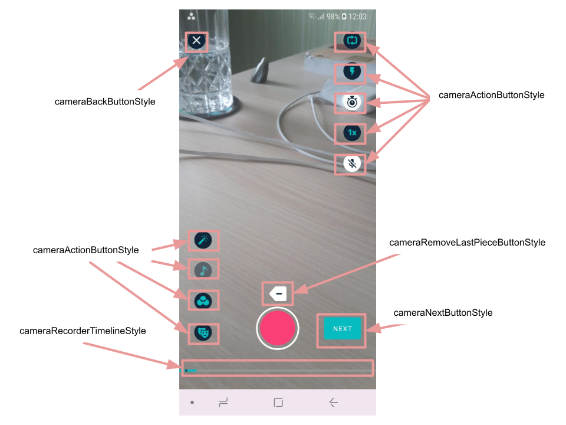
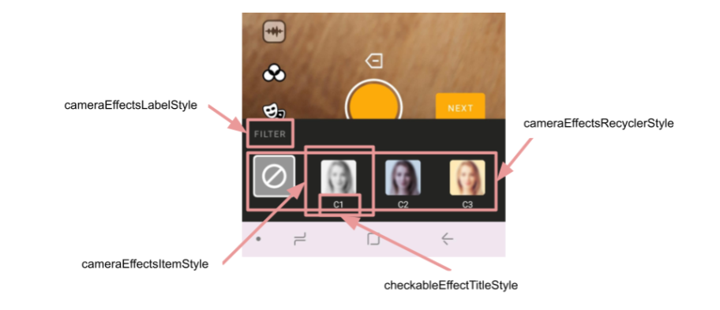

# Banuba AI Video Editor SDK
## Camera screen styles  

- [cameraOverlayStyle](https://github.com/Banuba/ve-sdk-android-integration-sample/blob/1e37324dea76304e8e9205d463844ac5c8c199f7/app/src/main/res/values/themes.xml#L17)

    style is intended to **setup action button icons**, customize relative position and appearance of music, gallery, switch camera icons. Icons drawables customized by using custom attributes of this style (for instance, [icon_mask_on](https://github.com/Banuba/ve-sdk-android-integration-sample/blob/main/app/src/main/res/values/themes.xml#L205) and [icon_mask_off](https://github.com/Banuba/ve-sdk-android-integration-sample/blob/main/app/src/main/res/values/themes.xml#L206) setup drawables for icons related to applied AR mask effect)  
- [cameraActionButtonStyle](https://github.com/Banuba/ve-sdk-android-integration-sample/blob/1e37324dea76304e8e9205d463844ac5c8c199f7/app/src/main/res/values/themes.xml#L18)

    style defines action buttons appearance

- [cameraBackButtonStyle](https://github.com/Banuba/ve-sdk-android-integration-sample/blob/1e37324dea76304e8e9205d463844ac5c8c199f7/app/src/main/res/values/themes.xml#L20)

    style defines "back" button appearance
- [cameraNextButtonStyle](https://github.com/Banuba/ve-sdk-android-integration-sample/blob/1e37324dea76304e8e9205d463844ac5c8c199f7/app/src/main/res/values/themes.xml#L21)

    style defines "next" button appearance
- [cameraRemoveLastPieceButtonStyle](https://github.com/Banuba/ve-sdk-android-integration-sample/blob/1e37324dea76304e8e9205d463844ac5c8c199f7/app/src/main/res/values/themes.xml#L22)

    style defines an appearance of the button that is used to delete the last recorded video chunk from the timeline
- [cameraRecorderTimelineStyle](https://github.com/Banuba/ve-sdk-android-integration-sample/blob/1e37324dea76304e8e9205d463844ac5c8c199f7/app/src/main/res/values/themes.xml#L24)
    style is intended to customize the timeline

    

    If you want to customize your camera screen with the **music icon on the top** of the screen you should:
    - setup [cameraMusicTopIconStyle](https://github.com/Banuba/ve-sdk-android-integration-sample/blob/1e37324dea76304e8e9205d463844ac5c8c199f7/app/src/main/res/values/themes.xml#L19) - special style that defines appearance of music icon in case it is placed on the top of the camera screen (if the music icon is placed on the left side the cameraActionButtonStyle is applied to it, so this attribute can be omitted)
    - in `CameraOverlayStyle` sibling set attribute [icon_music_screen_position](https://github.com/Banuba/ve-sdk-android-integration-sample/blob/main/app/src/main/res/values/themes.xml#L264) to `top`

    


- [cameraEffectsLabelStyle](https://github.com/Banuba/ve-sdk-android-integration-sample/blob/1e37324dea76304e8e9205d463844ac5c8c199f7/app/src/main/res/values/themes.xml#L25)

    style of the label, which appears at the top of the visual effects menu (color filters and AR masks). By default the label is not visible so this style can be omitted
- [cameraEffectsItemStyle](https://github.com/Banuba/ve-sdk-android-integration-sample/blob/1e37324dea76304e8e9205d463844ac5c8c199f7/app/src/main/res/values/themes.xml#L26)

    style applied to every item within visual effects list
- [cameraEffectsRecyclerStyle](https://github.com/Banuba/ve-sdk-android-integration-sample/blob/1e37324dea76304e8e9205d463844ac5c8c199f7/app/src/main/res/values/themes.xml#L27)

    style applied to RecyclerView containing visual effects list
- [cameraSpeedPickerLabelStyle](https://github.com/Banuba/ve-sdk-android-integration-sample/blob/1e37324dea76304e8e9205d463844ac5c8c199f7/app/src/main/res/values/themes.xml#L28)

    style is applied to the recording speed options label. By default the label is not visible so this style can be omitted
- [cameraSpeedPickerViewStyle](https://github.com/Banuba/ve-sdk-android-integration-sample/blob/1e37324dea76304e8e9205d463844ac5c8c199f7/app/src/main/res/values/themes.xml#L29)

    style is applied to custom recording speed options container
- [cameraSpeedPickerItemStyle](https://github.com/Banuba/ve-sdk-android-integration-sample/blob/1e37324dea76304e8e9205d463844ac5c8c199f7/app/src/main/res/values/themes.xml#L30)

    style is applied to TextView representing every recording speed option within container

- [checkableEffectTitleStyle](https://github.com/Banuba/ve-sdk-android-integration-sample/blob/1e37324dea76304e8e9205d463844ac5c8c199f7/app/src/main/res/values/themes.xml#L32)

    style is used to set text appearance of "checkable" effects (applied/removed by selection) title. This type of effects includes:
    - color filters on camera screen
    - AR masks on camera screen
    - color filters on editor screen
    
    The other effects type - "actionable" - defined in [editor styles](editor_styles.md#L57)

    


## String resources

We use 3 grous for all string resources on camera screen:

1. All **action buttons** may have a **text title**. You can adjust the size, color, font, margins, shadow, ellipsize(truncate at marquee) and position of the title text, overriding the attributes below in [CameraActionButtonStyle](https://github.com/Banuba/ve-sdk-android-integration-sample/blob/1e37324dea76304e8e9205d463844ac5c8c199f7/app/src/main/res/values/themes.xml#L488).
```xml
<style name="CustomCameraActionButtonStyle" parent="CameraActionButtonStyle">
    <item name="description">Custom Title</item> <!--title text value-->
    <item name="descriptionSize">14sp</item><!--title text size-->
    <item name="descriptionColor">color/white</item><!--title text color-->
    <item name="descriptionMarginStart">4dp</item><!--title text margin start-->
    <item name="descriptionMarginEnd">4dp</item><!--title text margin end-->
    <item name="descriptionTypeface">@font/roboto</item><!--title text typeface-->
    <item name="descriptionPosition">[left|bottom|right|none]</item><!--title text position-->
    <item name="descriptionApplyShadow">[true|false]</item> <!--title text shadow state-->
    <item name="descriptionApplyMarquee">[true|false]</item> <!--title text ellipsize truncate at marquee state-->
</style>
```

2. **Notification** displayed as [Toast](https://developer.android.com/reference/android/widget/Toast) is shown at the top of the screen upon some actions. Some of them has a dynamic message that depends on additional data (i.e. parameters from config files)

3. Bottom view with **AR masks and color filters** may have a **label** (its visibility is configured in [checkableEffectTitleStyle](https://github.com/Banuba/ve-sdk-android-integration-sample/blob/1e37324dea76304e8e9205d463844ac5c8c199f7/app/src/main/res/values/themes.xml#L32)

Groups described above are showcasted on the screenshot along with some string resources: 


| ResourceId        |      Value      |   Description |
| ------------- | :----------- | :------------- |
| control_description_switch | Flip | title for the icon to switch camera facing
| control_description_flashlight |  Flash | title for the icon to switch flashlight
| control_description_timer | Timer | title for the timer icon
| control_description_speed | Speed | title for the icon to switch recording speed
| control_description_mute | Mute | title for the icon to switch mic recording
| control_description_beauty | Beauty | title for the icon to apply beautification effect
| control_description_music | Music | title for the icon to request an [audio content](https://github.com/Banuba/ve-sdk-android-integration-sample#configure-audio-content)
| control_description_color | Filter | title for the icon to open color filters
| control_description_mask | Mask | title for the icon to open AR masks
| message_record_first_video | Record at least %1$s | message shown in case user tries to proceed with the video shorter than ```minVideoDuration``` parameter from [CameraConfig](https://github.com/Banuba/ve-sdk-android-integration-sample/blob/main/mddocs/config_camera.md)
| message_record_video_duration | {0,choice,0#{0} second\|1#{0} seconds\|2#{0} seconds\|3#{0} seconds\|4#{0} seconds\|4&lt;{0} seconds} | special string that defines the string value of the placeholder from ```message_record_first_video``` string (i.e. "1 second" or "3 seconds").  In this string only the selected words should be translated: {0,choice,0#{0} **second**\|1#{0} **seconds**\|2#{0} **seconds**\|3#{0} **seconds**\|4#{0} **seconds**\|4&lt;{0} **seconds**}. Other formatting should remain the same for every locale
| notification_beautifier_on | Beautification on | message shown when beautification effect is applied
| notification_beautifier_off | Beautification off | message shown when beautification effect is no longer applied
| notification_flash_on | Light! | message shown when the flashlight is being turned on
| notification_timer_on | Timer %1$d seconds is on | message shown when one of the TimerEntry was selected (placeholder is a TimerEntry value in seconds)
| notification_timer_off | Timer is off | message shown when the timer is being turned off
| notification_speed_changed | Recording speed %1$s | message shown when the speed of recording changes
| err_no_space_left | Not enough disk space | message widely used in Video Editor SDK and informing that there is not space to effort further operations
| err_no_time_left | Max video length %1$.1f sec | message shown in case of user tries to record video longer than the ```maxVideoDuration``` parameter from [CameraConfig](https://github.com/Banuba/ve-sdk-android-integration-sample/blob/main/mddocs/config_camera.md) class
| err_no_space_left_recording | Running out of disk space. Recording is canceled. | message shown in case the phone is running out of space during video recording
| label_camera_effects_luts | Filter | label at the top of the color filters list (visibility of the label is configured in [cameraEffectsLabelStyle](https://github.com/Banuba/ve-sdk-android-integration-sample/blob/1e37324dea76304e8e9205d463844ac5c8c199f7/app/src/main/res/values/themes.xml#L25))
| label_camera_effects_mask | Mask | label at the top of the AR masks list (visibility of the label is configured in [cameraEffectsLabelStyle](https://github.com/Banuba/ve-sdk-android-integration-sample/blob/1e37324dea76304e8e9205d463844ac5c8c199f7/app/src/main/res/values/themes.xml#L25))
| camera_next | Next | text on the button that goes on the editor screen


In case if a TextView that are shown on camera has no string resource mentioned here that means you may use any resource from outside the Video Editor SDK and apply it through view's style configuration.

All alert messages shown on the camera screen that require user's action are described in [Alert dialogs](alert_styles.md) section.

