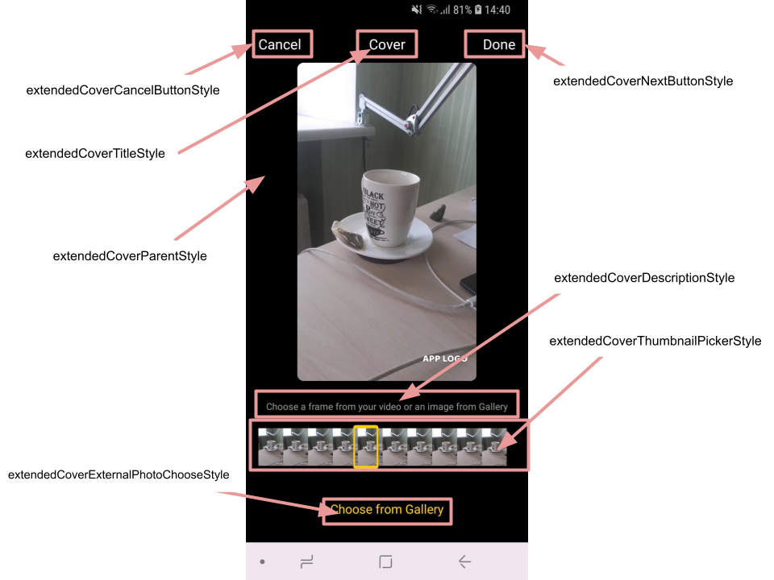
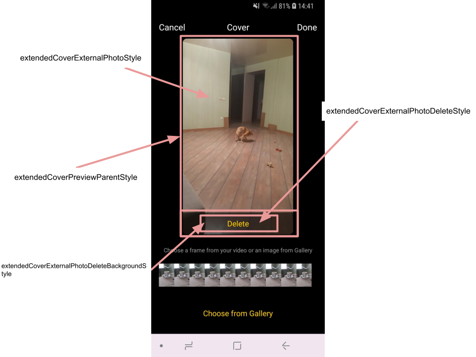

# Banuba AI Video Editor SDK
## Cover screen styles

- [extendedCoverParentStyle](../app/src/main/res/values/themes.xml#L250)

    style for the root Constraint layout that represents cover screen
- [extendedCoverNextButtonStyle](../app/src/main/res/values/themes.xml#L251)
    
    style for the button that proceeds the user to the export
- [extendedCoverCancelButtonStyle](../app/src/main/res/values/themes.xml#L252)

    style for the button that return the user to the editor screen
- [extendedCoverTitleStyle](../app/src/main/res/values/themes.xml#L254)

    style for the label in the top middle of the screen
- [extendedCoverDescriptionStyle](../app/src/main/res/values/themes.xml#L255)

    style for the hint placed below the preview

- [extendedCoverThumbnailPickerStyle](../app/src/main/res/values/themes.xml#L256)

    style for the view that is used to pick a thumbnail as the video cover

- [extendedCoverExternalPhotoChooseStyle](../app/src/main/res/values/themes.xml#L259)

    style for the text button allowing the user to choose the cover image from the gallery

    

- [extendedCoverPreviewParentStyle](../app/src/main/res/values/themes.xml#L262)

    style for the Constraint layout containing the recent cover preview

- [extendedCoverExternalPhotoStyle](../app/src/main/res/values/themes.xml#L264)

    style for the ImageView that shows the cover image

- [extendedCoverExternalPhotoDeleteBackgroundStyle](../app/src/main/res/values/themes.xml#L266)

    style for the view at the bottom of the preview that plays a role of the background of "delete" button

- [extendedCoverExternalPhotoDeleteStyle](../app/src/main/res/values/themes.xml#L269)

    style for the text button for deletion of the chosen cover image



## String resources

**Pay attention** that some strings on the cover screen are defined in the styles. To localize these strings firstly create string resources and setup them into styles under `android:text` attribute.

| ResourceId        |      Value      |   Description |
| ------------- | :----------- | :------------- |
| cover_image_text | Choose cover | label over the progress bar that allows to choose a cover from video frames. The view is customized in ```extendedCoverDescriptionStyle```
| cover_progress_text | Please, wait | text that is shown on the [throbber](alert_styles.md#L25) when the process of extracting cover image was started. The text appearance is customized by the ```waitDialogTextStyle```
| err_cover_image | Failed to create cover image | message shown as a [toast](alert_styles.md#L11) in case of error happened during the process of extracting cover image
