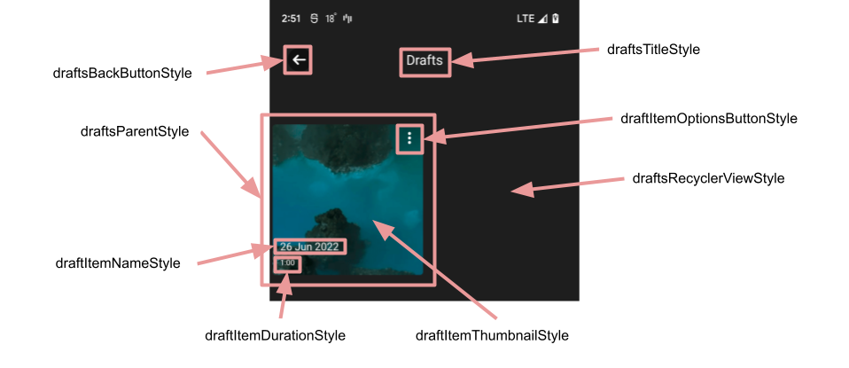
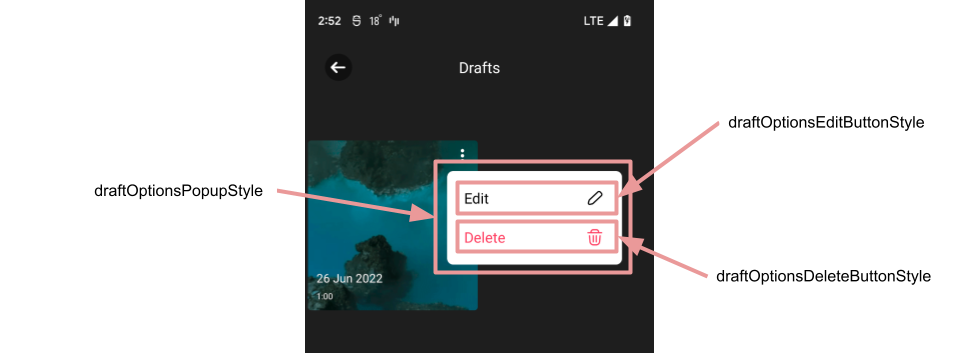
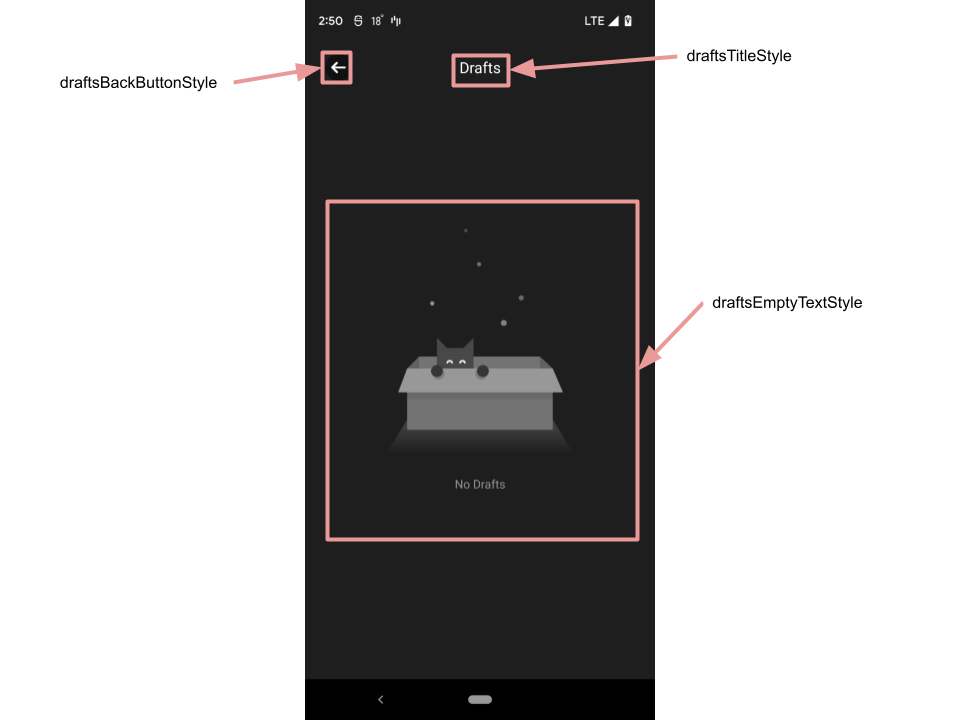
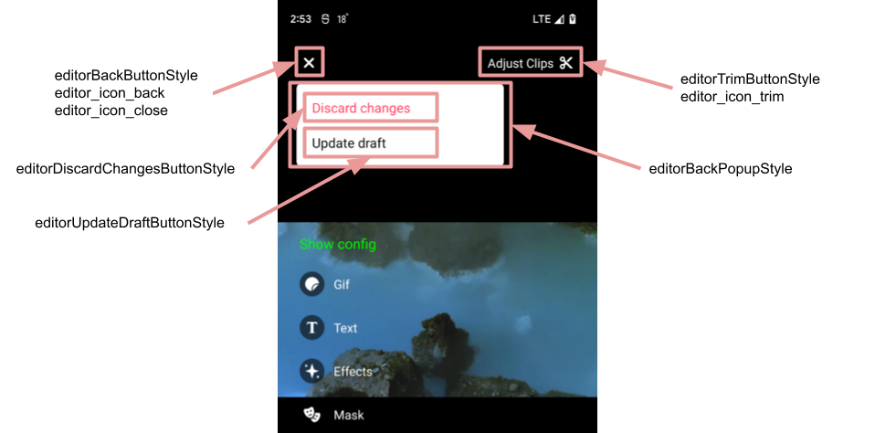

# Banuba AI Video Editor SDK

## Drafts API

The ```DraftsHelper``` class can be used to get all drafts, delete and open drafts. This class has next methods:

```kotlin
interface DraftsHelper {

    val allDrafts: StateFlow<List<Draft>>

    fun delete(draft: Draft)

    fun deleteAll()

    fun openDraft(draft: Draft): Intent

    fun openLastDraft(): Intent
}
```

To get the ```DraftsHelper``` object use ```inject()``` method:

```kotlin
val draftsHelper: DraftsHelper by inject()
```

## Drafts screen styles

- [draftsBackButtonStyle](../app/src/main/res/values/themes.xml#L415)

    style for the back button on drafts screen

- [draftsTitleStyle](../app/src/main/res/values/themes.xml#L416)

    style for the title of drafts screen

- [draftsRecyclerViewStyle](../app/src/main/res/values/themes.xml#L417)

    style for the view containing all drafts

- [draftsParentStyle](../app/src/main/res/values/themes.xml#L414)

    style for the item representing every draft inside the recycler view container

- [draftItemThumbnailStyle](../app/src/main/res/values/themes.xml#L420)

  style for the draft preview

- [draftItemNameStyle](../app/src/main/res/values/themes.xml#L422)

    style for the name of the draft

- [draftItemDurationStyle](../app/src/main/res/values/themes.xml#L423)

    style for the duration of the draft

- [draftItemOptionsButtonStyle](../app/src/main/res/values/themes.xml#L421)

    style for the button that opens available options for the current draft



- [draftOptionsPopupStyle](../app/src/main/res/values/themes.xml#L424)

    style for the options popup of the draft

- [draftOptionsEditButtonStyle](../app/src/main/res/values/themes.xml#L425)

    style for the edit button of the options popup of the draft

- [draftOptionsDeleteButtonStyle](../app/src/main/res/values/themes.xml#L426)

    style for the delete button of the options popup of the draft



- [draftsEmptyTextStyle](../app/src/main/res/values/themes.xml#L418)

    style for the view that is shown in case of absent drafts



- [editorBackButtonStyle](../app/src/main/res/values/themes.xml#L67)

    style for the button that is used to return the user on the previous screen

- [editorTrimButtonStyle](../app/src/main/res/values/themes.xml#L102)

    style for the button that is used to return the user on the trimmer screen if draft is opened

- [editorBackPopupStyle](../app/src/main/res/values/themes.xml#L103)

    style for the back popup that is shown when draft was changed

- [editorDiscardChangesButtonStyle](../app/src/main/res/values/themes.xml#L104)

    style for the discard changes button of the back popup

- [editorUpdateDraftButtonStyle](../app/src/main/res/values/themes.xml#L105)

    style for the update draft button of the back popup



## String resources

| ResourceId        |      Value      |   Description |
| ------------- | :----------- | :------------- |
| drafts_title | Drafts | label of the drafts screen
| drafts_empty_description | No Drafts | text description inside ```draftsEmptyTextStyle```
| drafts_options_edit | Edit | text of button inside ```draftOptionsEditButtonStyle```
| drafts_options_delete | Delete | text of button inside ```draftOptionsDeleteButtonStyle```
| editor_trim_video | Adjust Clips | text of button inside ```editorTrimButtonStyle```
| editor_discard_changes | Discard changes | text of button inside ```editorDiscardChangesButtonStyle```
| editor_update_draft | Update draft | text of button inside ```editorUpdateDraftButtonStyle```
