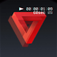

# Banuba AI VideoEditor SDK
## Editor screen styles

- [editorOverlayStyle](../app/src/main/res/values/themes.xml#L65)

    style defines back icon drawable, playback icon visibility, several editor screen appearance parameters, also setups icons used for voice recording (they can be omitted if music editor feature is enabled)
- [editorActionsStyle](../app/src/main/res/values/themes.xml#L66)

    style **setups drawables** for all action buttons **on the editor screen** (for instance, [editor_act_icon_masks_off](../app/src/main/res/values/themes.xml#L656) and [editor_act_icon_masks_on](../app/src/main/res/values/themes.xml#L657) setup drawables for an icon that related to AR masks applied to video)
- [editorActionButtonStyle](../app/src/main/res/values/themes.xml#L67)

    style defines how action buttons look like (size, title visibility, margins, etc.). It is applied to every action button on the editor screen
- [editorBackButtonStyle](../app/src/main/res/values/themes.xml#L68)

    style for the button that is used to return the user on the previous screen
- [editorNextButtonStyle](../app/src/main/res/values/themes.xml#L69)

    style for the button that is used to proceed with current video

    
- [editorTextActionsStyle](../app/src/main/res/values/themes.xml#L70)

    style setups drawables for text editor options (alignment, background)
- [editorTextColorLabelStyle](../app/src/main/res/values/themes.xml#L71)

    style for appearance of text label for colors applicable in text editor
- [editorTextEditorInputStyle](../app/src/main/res/values/themes.xml#L73)

    style for the view used in text editor to create text effect. It should be mentioned that background color, typeface and text color are customized by the user while creating text effect, so you should avoid to setup these attributes in this style. Also input view allows autosizing
- [editorTypefaceSwitcherStyle](../app/src/main/res/values/themes.xml#L74)

    style for the view that is used to switch typeface in text editor 
- [editorTextDoneStyle](../app/src/main/res/values/themes.xml#L75)

    style for the button on the text editor that applies created text effect to the video. It can be the same as editorDoneStyle if you do not need to make them different

- [editorTextColorBackground](../app/src/main/res/values/themes.xml#L72)

    attribute defines a background drawable under the list of available colors on text editor screen (@null can be used if the transparent color is needed)

- [editorTextColorItemBackground](../app/src/main/res/values/themes.xml#L102)

    attribute for the drawable resource that defines a background of every color item in text editor (checkout an [**example**](../app/src/main/res/drawable/bg_checkable_color.xml))

    
- [editorPlaybackControllerParentStyle](../app/src/main/res/values/themes.xml#L90)

    style defines appearance of the view containig buttons to control applying effects screen (cancel, play/pause, done)

- [editorPlaybackControllerCancelStyle](../app/src/main/res/values/themes.xml#L93)

    style defines cancel button appearance

- [editorPlaybackControllerPlayStyle](../app/src/main/res/values/themes.xml#L96)

    style defines playback button appearance (drawable resource should have two states: activated - for pause icon and non activated for play icon)

- [editorPlaybackControllerDoneStyle](../app/src/main/res/values/themes.xml#L99)

    style defines done button appearance

- [editorUndoButtonStyle](../app/src/main/res/values/themes.xml#L77)

    style for the button that is used to remove the last added effect on visual or time effects editor
- [editorVisualAndTimeEffectsRecyclerStyle](../app/src/main/res/values/themes.xml#L78)

    style for the RecyclerView containing visual or time effects
- [editorApplyEffectHintStyle](../app/src/main/res/values/themes.xml#L81)

    style for the TextView that shows a hint on visual/time effects editor
- [editorTimelineStyle](../app/src/main/res/values/themes.xml#L89)

    style for the timeline that represents effects applied on the video in case of editing visual or time effects

- [actionableEffectTitleStyle](../app/src/main/res/values/themes.xml#L31)

    style is used to set text appearance for "actionable" effects (applied by long pressing) title. This type of effects includes: 
    - visual effects on editor screen
    - time effects on editor screen
    - AR masks on editor screen
    
    The other effects type - "checkable" - defined in [camera styles](camera_styles.md#L52)

- [editorEffectVisualStyle](../app/src/main/res/values/themes.xml#L82)

    style for the every item in the visual effects list

    
- [editorEffectTimeStyle](../app/src/main/res/values/themes.xml#L83)

    style for the every item in the time effects list
- [editorEffectMaskStyle](../app/src/main/res/values/themes.xml#L84)

    style for the every item in the AR mask effects list
- [editorEffectLutItemStyle](../app/src/main/res/values/themes.xml#L85)

    style for the every item in the color filters list
- [editorColorEffectsLabelStyle](../app/src/main/res/values/themes.xml#L86)

    style for the color filter list label. By default the label is not visible so this style can be omitted. This style is similar to [cameraEffectsLabelStyle](camera_styles.md#L33) for camera screen
- [editorColorEffectsRecyclerStyle](../app/src/main/res/values/themes.xml#L87)

    style applied to RecyclerView containing color filters. This style is similar to [cameraEffectsRecyclerStyle](camera_styles.md#L39) for camera screen
- [editorBoardStyle](../app/src/main/res/values/themes.xml#L76)

    style for the custom view that holds all visual effects on the editor screen. This view handles different touch actions (drag, zoom in or out) on effects. It has a bulk of custom attributes that setup its appearance depends on user action


## String resources

| ResourceId        |      Value      |   Description |
| ------------- | :----------- | :------------- |
| control_description_stickers | Stickers | title of the action button that opens stickers
| control_description_text_effects | Text | title of the action button that opens text effects editor
| control_description_visual_effects | VHS | title of the action button that opens visual effects editor
| control_description_mask_effects | Mask | title of the action button that opens AR masks
| control_description_music_effects | Music | title of the action button that opens an audio content
| control_description_time_effects | Time | title of the action button that opens time effects editor
| control_description_color_effects | Luts | title of the action button that opens color filters
| control_description_interactions | Interactions | title of the action button that opens interaction effects editor (feature recently under development)
| control_description_link | Link | title of the action button that applies link to the video (feature recently under development)
| editor_next | Next | text on the button defined in ```editorNextButtonStyle```. Also used on the [trimmer screen](trimmer_styles.md#L10) for the view defined in ```trimmerNextButtonStyle```
| editor_done | Done | text on the button defined in ```editorTextDoneStyle```. Also used on the [cover screen](cover_styles.md#L4) for the view defined in ```extendedCoverNextButtonStyle```
| editor_cancel | Cancel | text that is used on the [trimmer screen](trimmer_styles.md#L50) for the view defined in ```trimmerCancelButtonStyle``` and on the [cover screen](cover_styles.md#L7) for the view defined in ```extendedCoverCancelButtonStyle```
| editor_effect_hint | Press and hold | hint that is shown on visual effects editor telling the user how the effect can be applied. The view itself is customized in ```editorApplyEffectHintStyle```
| editor_effect_undo | Undo | text on the button that allows to remove recently added effect. View is defined in ```editorUndoButtonStyle```
| font_regular_title | Regular | title of the normal text appearance for the text effects. The view is defined in ```editorTypefaceSwitcherStyle```
| font_bold_title | Bold | title of the bold text appearance for the text effects. The view is defined in ```editorTypefaceSwitcherStyle```
| font_italic_title | Italic | title of the italic text appearance for the text effects. The view is defined in ```editorTypefaceSwitcherStyle```
| err_file_not_supported | File is not supported | message shown as a [toast](alert_styles.md#L11) when the user is trying to use any media file (select from gallery or select as a cover) that is not supported by the Video Editor SDK
| err_editor_network_connection_failure | Connection failed | message shown as a [toast](alert_styles.md#L11) in case of the user is trying to load more [stickers](integration_customizations.md#configure-stickers-content) but the request is failed
| err_editor_player_initializer | Error on player launch | message shown as a [toast](alert_styles.md#L11) in case of internal error within the Video Editor SDK


## Effects customization

Effect customization is defined by android resources with well-defined names which follow a strict scheme. 

| Customization | Resource type | Resource name template | Example
| --- | --- | --- | --- |
| Title | string | visual_effect_{id}, time_effect_{id} | visual_effect_flash
| Icon | drawable | ic_visual_effect_{id}, ic_time_effect_{id} | ic_time_effect_rapid
| Color | color | visual_effect_color_{id}, time_effect_color_{id} | visual_effect_color_vhs

To change appearance o the effect, you should place any android resources named according to the scheme presented above into res folder of your app. The resource depends on the item you want to customize (string for the title, drawable for the icon, color for the color on the timeline).

Effects identifiers are presented in the table below:

| Effect      | Type | String identifier | Default icon |
| :---------- | :---:| :--------------:  | :----------: |
| Acid-whip | visual | acid_whip| 
| Cathode | visual | cathode | 
| Flash | visual | flash | 
| Glitch | visual | glitch | 
| Glitch 2 | visual | glitch2 | 
| Glitch 3 | visual | glitch3 | 
| Heat map | visual | heat_map | 
| DSLR Kaleidoscope | visual | dslr_kaleidoscope | 
| Kaleidoscope | visual | kaleidoscope | 
| Lumiere | visual | lumiere | 
| Pixel dynamic | visual | pixel_dynamic | 
| Pixel static | visual | pixel_static | 
| Polaroid | visual | polaroid | 
| Rave | visual | rave | 
| Soul | visual | soul | 
| Stars | visual | stars | 
| Transition 1 | visual | transition1 | 
| Transition 2 | visual | transition2 | 
| Transition 3 | visual | transition3 | 
| Transition 4 | visual | transition4 | 
| TV Foam | visual | tv_foam | 
| DV Cam | visual | dv_cam | 
| VHS | visual | vhs | 
| VHS 2 | visual | vhs2 | 
| Zoom | visual | zoom | 
| Zoom 2 | visual | zoom2 | 
| Slow mo | time | slow_motion | 
| Rapid | time | rapid | 


**Example**

To change the title of Flash visual effect to SuperFlash, you should place 
```xml
<string name="visual_effect_flash">SuperFlash</string>
```
into strings.xml file of your app.

To change an icon of Rapid time effect, you should place drawable resource with the name "ic_time_effect_rapid" into drawable folder of your app.

To change the color on the timeline for the VHS visual effect, place color resource with the name "visual_effect_color_vhs" into colors.xml file of your app.
