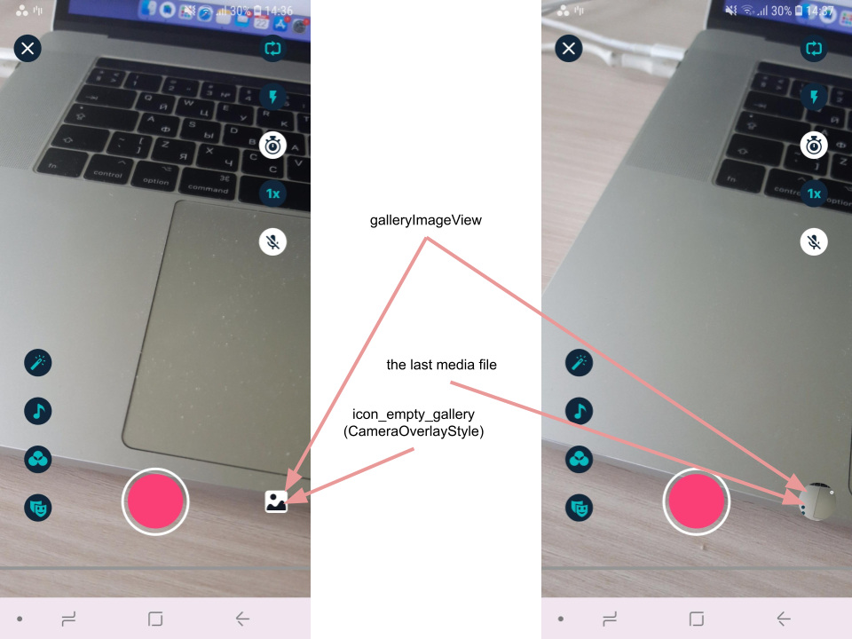

# FAQ  
These are the answers to the most popular questions we are asked about the Banuba AI Video Editor SDK

- [I want to turn off animations from slideshow](#i-want-to-turn-off-animations-from-slideshow)
- [I want to start VideoEditor with a preselected audio track](#i-want-to-start-videoEditor-with-a-preselected-audio-track)
- [I want to customize gallery icon](#i-want-to-customize-gallery-icon)
- [I want to change the font in Video Editor](#i-want-to-change-the-font-in-video-editor)
- [How to change drafts configuration](#how-to-change-drafts-configuration)
- [How to add other text fonts that are used in the editor screen](#how-to-add-other-text-fonts-that-are-used-in-the-editor-screen)
- [Optimizing app size](#optimizing-app-size)
- [How do I change the duration of the image display in a slideshow?](#how-do-I-change-the-duration-of-the-image-display-in-a-slideshow)
- [How do I change the launguage (how do I add new locale support)](#how-do-I-change-the-launguage-how-do-I-add-new-locale-support)
- [How do I integrate custom FFmpeg dependency in app?](#how-to-integrate-custom-ffmpeg-dependency)


### I want to turn off animations from slideshow

Slideshow is created either by selecting pictures from gallery or by making a photo on Video Editor camera screen.

Every slide within slideshow can appear with or without animations. This behavior is configured within [**EditorConfig**](config_videoeditor.md#slideshow) class under ```slideshow``` section:

To turn off animations just **setup false for both fields**.

### I want to start VideoEditor with a preselected audio track

To open Video Editor SDK you should create an intent by utilizing any avilable function inside **VideoCreationActivity**: **startFromCamera()**, **startFromTrimmer()** or **startFromEditor()**. All these functions have an argument called **audioTrackData** where you should pass preselected audio track or null (by default). For example, to open an SDK from the camera screen with the track use the code snippet below:

```kotlin
startActivity(
    VideoCreationActivity.startFromCamera(
                context = applicationContext,
                audioTrackData = preselectedTrackData
            )
)
```
**audioTrackData** is an object of TrackData class

```kotlin
data class TrackData(
    val id: UUID,
    val title: String,
    val localUri: Uri,
    val artist: String? = null
)
```

### I want to customize gallery icon

Gallery icon is represented by AppCompatImageView. Its style placed into `galleryImageViewStyle` attribute of the main theme ([**example**](../app/src/main/res/values/themes.xml#L116))

**Drawable resource** of the gallery icon may vary depending on the use case:
 - in case of the very first launch, if the user **did not grant permission** to [read external storage](https://developer.android.com/reference/android/Manifest.permission#READ_EXTERNAL_STORAGE), or if the gallery on the device **is empty**, the drawable resource defined in `icon_empty_gallery` attribute of the `CameraOverlayStyle` ([**example**](../app/src/main/res/values/themes.xml#L525)) will be used
 - in other cases you can select what to show as a gallery icon: 
    -  **the last media file** from the device
    - **custom drawable** resource



**By default the last media file is used as a drawable**. You have an option to **put background** to the gallery icon by changing `icon_gallery_background` attribute of `CameraOverlayStyle` and you can **add rounded corners** to the gallery icon by changing `icon_gallery_radius` attribute of this style ([**example**](../app/src/main/res/values/themes.xml#L528)).

 **To setup custom drawable resource** instead of the last media file you have to put custom style into `galleryImageViewStyle` attribute of the main theme ([**example**](../app/src/main/res/values/themes.xml#L116)) and set there `use_custom_image` to `true` and put your drawable as `android:src` attribute value

 ### I want to change the font in Video Editor

All text view styles in Video Editor SDK are inherited from the `Text` style, thus the font set in this style will be applied to all text views in Video Editor.

To apply `customFont` to Video Editor just override this style:

 ```
<style name="Text">
    <item name="android:fontFamily">@font/customFont</item>
</style>
 ```

Using this approach you don't have to repeatedly set the font to any other styles while customizing the Video Editor.


 

 ### How to change drafts configuration

 By default drafts enabled, asks the user to save a draft before leave any VideoEditor screen. If you need to change drafts configuration you should add the code below in the `VideoEditorKoinModule`:

 ```kotlin
     override val draftConfig: BeanDefinition<DraftConfig> = factory(override = true) {
         DraftConfig.ENABLED_ASK_TO_SAVE
     }
 ```

You can choose one of these options:
1. `ENABLED_ASK_TO_SAVE` - drafts enabled, asks the user to save a draft
2. `ENABLED_ASK_IF_SAVE_NOT_EXPORT` - drafts enabled, asks the user to save a draft without export
3. `ENABLED_SAVE_BY_DEFAULT` - drafts enabled, saved by default without asking the user
4. `DISABLED` - disabled drafts

 ### How to add other text fonts that are used in the editor screen

To add other text fonts that are used in the editor screen follow the next steps:

1. Add font files to the `app/src/main/res/font/` directory;

2. Add fonts names to the [**strings.xml**](../app/src/main/res/values/strings.xml) resource file:
    ```xml
    <string name="font_1_title" translatable="false">Font 1 Title</string>
    <string name="font_N_title" translatable="false">Font N Title</string>
    ```

3. Add `font_resources.xml` with fonts array declaration to the `app/src/main/res/values/` directory. The format of `font_resources.xml` should be the next one:
    ```xml
    <?xml version="1.0" encoding="utf-8"?>
    <resources>
        <array name="font_resources">
            <item>@array/font_1_resource</item>    <!-- link to the font description array -->
            <item>@array/font_N_resource</item>
        </array>

        <array name="font_1_resource">
            <item>@string/font_1_title</item>      <!-- font name -->
            <item>@font/font_1</item>              <!-- link to the font file -->
        </array>

        <array name="font_N_resource">
            <item>@string/font_N_title</item>
            <item>@font/font_N</item>
        </array>
    </resources>
    ```

4. The final step is to pass your custom `font_resources` id to the `ResourcesTextOnVideoTypefaceProvider` in the ```VideoEditorModule``` to override the default implementation:

    ```kotlin
    override val textOnVideoTypefaceProvider: BeanDefinition<TextOnVideoTypefaceProvider> =
        single(override = true) {
            ResourcesTextOnVideoTypefaceProvider(
                fontsArrayResId = R.array.font_resources,
                context = get()
            )
        }
    ```

### Optimizing app size

The easiest way to gain immediate app size savings when publishing to Google Play is by uploading your app as an [**Android App Bundle**](https://developer.android.com/guide/app-bundle), which is a new upload format that includes all your app’s compiled code and resources. Google Play’s new app serving model then uses your app bundle to generate and serve optimized APKs for each user’s device configuration, so they download only the code and resources they need to run your app.

As a result, the final size of our library for one of the platform types (`armeabi-v7a`,` arm64-v8a`, `x86`,` x86_64`) will be **24-26 MB** less than indicated in the documentation

### How do I change the duration of the image display in a slideshow?

Use the ```slideShowSourceVideoDurationMs``` parameter in [EditorConfig](config_videoeditor.md) class:

```kotlin
{
   single<EditorConfig>(override = true) {
      EditorConfig(
         slideShowSourceVideoDurationMs = 3000
      )
   }
}
```

### How do I change the launguage (how do I add new locale support)?

There is no special language switching mechanism in the Video Editor SDK (VE SDK).

Out of the box, the VE SDK includes support for two locales: English (default) and Russian. If you need to support any other locales, you can do it according to the standard Android way. See how [Create locale directories and resource files](https://developer.android.com/training/basics/supporting-devices/languages#CreateDirs) for more details. After adding a new locale resource file into your application with integrated VE SDK, you need to re-define the VE SDK strings keys with new locale string values.
To do that you need to add all needed string keys in the new locale `strings.xml` file. You can find the main VE SDK string keys you need in the [Configure screens](integration_advanced_customizations.md#configure-screens) doc page. E.g. string keys of the Editor screen you can find [here](editor_styles.md#string-resources).
The newly added locale will be applied after the device language is changed by system settings.

If you need to change language programmatically in your application, see the next links how it can be done:
[one](https://www.geeksforgeeks.org/how-to-change-the-whole-app-language-in-android-programmatically/),
[two](https://medium.com/swlh/android-app-specific-language-change-programmatically-using-kotlin-d650a5392220)

### How to integrate custom FFmpeg dependency.
Check out [step-by-step guide](ffmpeg_dependency.md) to integrate custom FFmpeg dependency.
