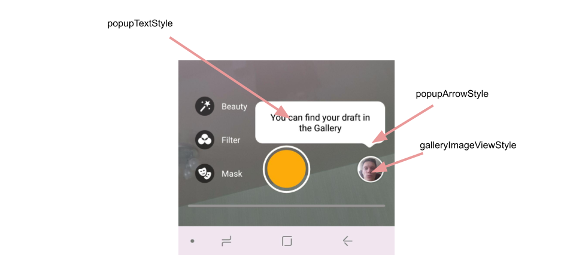
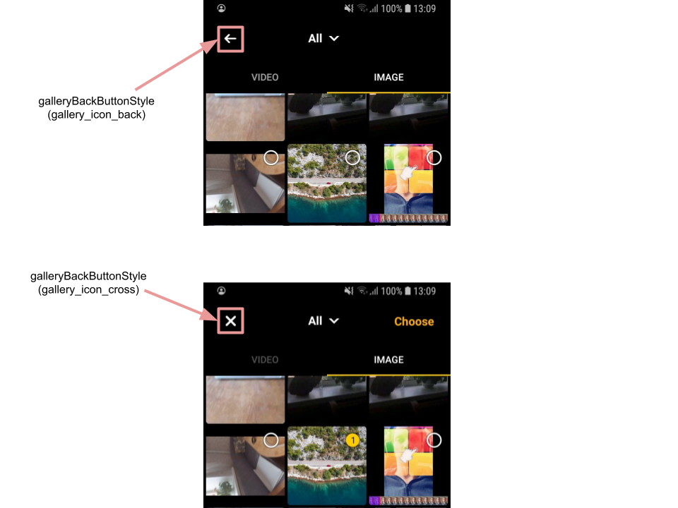
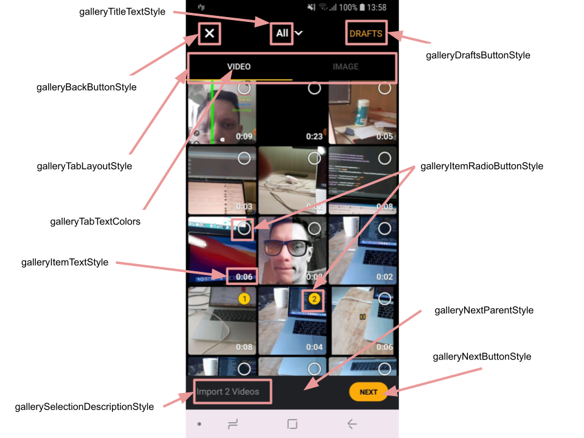
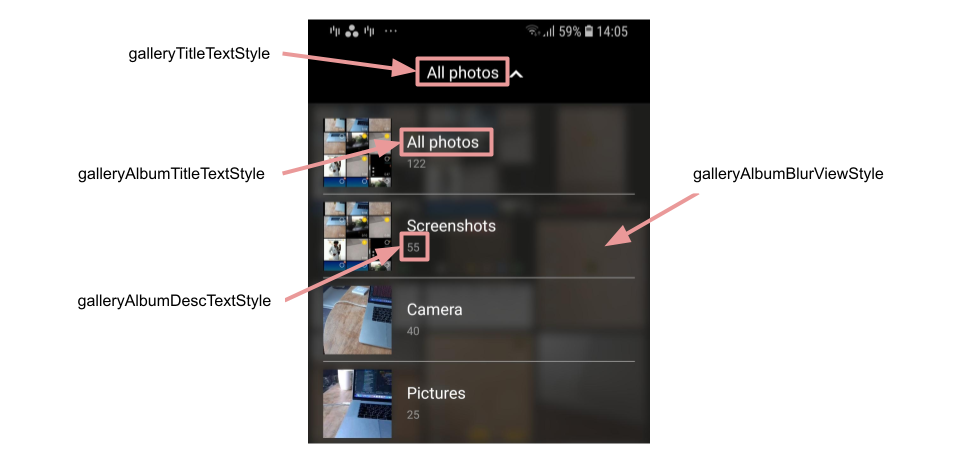
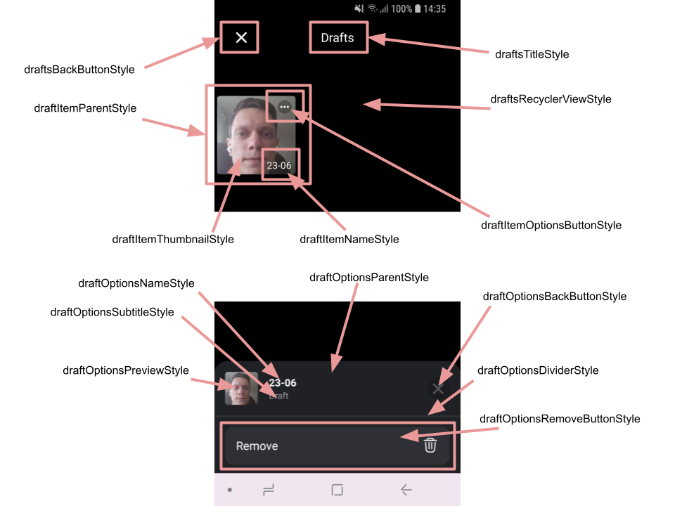

# Banuba AI Video Editor SDK

## Gallery screen configuration

There is a "gallery" section in [**videoeditor.json**](https://github.com/Banuba/ve-sdk-android-integration-sample/blob/main/app/src/main/assets/videoeditor.json#L36) configuration file. It has some attributes that impact on gallery screen appearance and logic.

```json
"gallery": {
    "supportsMixMediaData": false,
    "supportsVideo": true,
    "supportsImage": true
  }
```
- **supportsMixMediaData** - recently deprecated but mandatory flag (to be removed in the next release), it allowed to show pictures and videos together in single list without separate navigation tabs
- **supportsVideo** - optional flag, it defines if "video" tab is on the screen (by default it has value "true")
- **supportsImage** - optional flag, it defines if "image" tab is on the screen (by default it has value "true")

**Note**. If *supportsVideo* and *supportsImage* flags both has value "false" an app will crash with an exception. We suggest to use only one of these two flags to hide corresponding navigation tab.


## Gallery screen styles

- [galleryImageViewStyle](https://github.com/Banuba/ve-sdk-android-integration-sample/blob/1e37324dea76304e8e9205d463844ac5c8c199f7/app/src/main/res/values/themes.xml#L105)

    style defines the overview of gallery icon on the **camera screen**. By default the last media resource is used as gallery icon drawable. To show the custom icon for gallery the `use_custom_image` attribute should be changed to "true" and the custom drawable should be passed as `android:src` value. If there are no media resource on the device the icon from `icon_empty_gallery` attribute of `CameraOverlayView` style is used (if `use_custom_image` is false). 

- [popupTextStyle](https://github.com/Banuba/ve-sdk-android-integration-sample/blob/faafb9a67708fccec5fd30399b504fbe548cc159/app/src/main/res/values/themes.xml#L419)

    style for text that is shown within popup to attract the user to the Drafts feature

- [popupArrowStyle](https://github.com/Banuba/ve-sdk-android-integration-sample/blob/faafb9a67708fccec5fd30399b504fbe548cc159/app/src/main/res/values/themes.xml#L420)

    style for the arrow image of drafts hint popup

    

- [galleryBackButtonStyle](https://github.com/Banuba/ve-sdk-android-integration-sample/blob/1e37324dea76304e8e9205d463844ac5c8c199f7/app/src/main/res/values/themes.xml#L107)

    style for the button placed on the top left corner of the screen. This icon has **two states:** if some files are already selected in the gallery and if nothing is selected. Both states have different drawables that are configured into `VideoCreationTheme` [attributes](https://github.com/Banuba/ve-sdk-android-integration-sample/blob/main/app/src/main/res/values/themes.xml#L111):

    - `gallery_icon_back` -  nothing is selected → **get back to the previous screen**
    - `gallery_icon_cross` - some files are selected → **clear selection** 

    

- [galleryTitleTextStyle](https://github.com/Banuba/ve-sdk-android-integration-sample/blob/1e37324dea76304e8e9205d463844ac5c8c199f7/app/src/main/res/values/themes.xml#L106)

    style for the gallery screen title (screen title equals to the selected media album)

- [galleryItemRadioButtonStyle](https://github.com/Banuba/ve-sdk-android-integration-sample/blob/1e37324dea76304e8e9205d463844ac5c8c199f7/app/src/main/res/values/themes.xml#L113)

    style for the radio button that is used to define selected resource. It has a bulk of custom attributes to customize internal colors 
- [galleryItemTextStyle](https://github.com/Banuba/ve-sdk-android-integration-sample/blob/1e37324dea76304e8e9205d463844ac5c8c199f7/app/src/main/res/values/themes.xml#L114)

    style for the TextView that shows duration for video resources

- [galleryTabLayoutStyle](https://github.com/Banuba/ve-sdk-android-integration-sample/blob/1e37324dea76304e8e9205d463844ac5c8c199f7/app/src/main/res/values/themes.xml#L119)

    style for the tab layout used for video and image tabs 

- [galleryTabTextColors](https://github.com/Banuba/ve-sdk-android-integration-sample/blob/1e37324dea76304e8e9205d463844ac5c8c199f7/app/src/main/res/values/themes.xml#L120)

    attribute holds the text colors for different states of tabs

- [galleryDraftsButtonStyle](https://github.com/Banuba/ve-sdk-android-integration-sample/blob/1e37324dea76304e8e9205d463844ac5c8c199f7/app/src/main/res/values/themes.xml#L112)

    style for the button that opens Drafts screen

- [galleryNextParentStyle](https://github.com/Banuba/ve-sdk-android-integration-sample/blob/1e37324dea76304e8e9205d463844ac5c8c199f7/app/src/main/res/values/themes.xml#L108)

    style for the bottom view that containes selection info and next button

- [galleryNextButtonStyle](https://github.com/Banuba/ve-sdk-android-integration-sample/blob/1e37324dea76304e8e9205d463844ac5c8c199f7/app/src/main/res/values/themes.xml#L109)

    style for the button that appears during selection to proceed with selected resources

- [gallerySelectionDescriptionStyle](https://github.com/Banuba/ve-sdk-android-integration-sample/blob/1e37324dea76304e8e9205d463844ac5c8c199f7/app/src/main/res/values/themes.xml#L110)

    style for the description of selected files

    

- [galleryEmptyTextStyle](https://github.com/Banuba/ve-sdk-android-integration-sample/blob/1e37324dea76304e8e9205d463844ac5c8c199f7/app/src/main/res/values/themes.xml#L115)

    style for the title and description views that are shown in case of empty gallery
- [galleryAlbumBlurViewStyle](https://github.com/Banuba/ve-sdk-android-integration-sample/blob/1e37324dea76304e8e9205d463844ac5c8c199f7/app/src/main/res/values/themes.xml#L116)

    style for the custom view that is used to apply blur effect as a background for albums list. It can have custom tint via "overlay_color" attribute
- [galleryAlbumTitleTextStyle](https://github.com/Banuba/ve-sdk-android-integration-sample/blob/1e37324dea76304e8e9205d463844ac5c8c199f7/app/src/main/res/values/themes.xml#L117)

    style for the album title
- [galleryAlbumDescTextStyle](https://github.com/Banuba/ve-sdk-android-integration-sample/blob/1e37324dea76304e8e9205d463844ac5c8c199f7/app/src/main/res/values/themes.xml#L118)

    style for the album description

    

Besides concrete styles there are a lot of theme attributes that allows to configure gallery screen:
- [galleryColumnsNumber](https://github.com/Banuba/ve-sdk-android-integration-sample/blob/1e37324dea76304e8e9205d463844ac5c8c199f7/app/src/main/res/values/themes.xml#L122) - setup how much columns the gallery screen shows
- [gallery_bg_color](https://github.com/Banuba/ve-sdk-android-integration-sample/blob/1e37324dea76304e8e9205d463844ac5c8c199f7/app/src/main/res/values/themes.xml#L123) - background color for gallery screen
- [gallery_item_corner_radius](https://github.com/Banuba/ve-sdk-android-integration-sample/blob/1e37324dea76304e8e9205d463844ac5c8c199f7/app/src/main/res/values/themes.xml#L124) - setup corner radius for every gallery item
- [gallery_item_margin](https://github.com/Banuba/ve-sdk-android-integration-sample/blob/1e37324dea76304e8e9205d463844ac5c8c199f7/app/src/main/res/values/themes.xml#L125) - setup margins between items in gallery (applied in all directions)
- [gallery_album_divider_color](https://github.com/Banuba/ve-sdk-android-integration-sample/blob/1e37324dea76304e8e9205d463844ac5c8c199f7/app/src/main/res/values/themes.xml#L126) - divider color in the albums list

## Drafts

- [draftsBackButtonStyle](https://github.com/Banuba/ve-sdk-android-integration-sample/blob/1e37324dea76304e8e9205d463844ac5c8c199f7/app/src/main/res/values/themes.xml#L396)

    style for the back button on drafts screen

- [draftsTitleStyle](https://github.com/Banuba/ve-sdk-android-integration-sample/blob/1e37324dea76304e8e9205d463844ac5c8c199f7/app/src/main/res/values/themes.xml#L397)

    style for the title of drafts screen

- [draftsRecyclerViewStyle](https://github.com/Banuba/ve-sdk-android-integration-sample/blob/1e37324dea76304e8e9205d463844ac5c8c199f7/app/src/main/res/values/themes.xml#L398)

    style for the view containing all drafts

- [draftItemParentStyle](https://github.com/Banuba/ve-sdk-android-integration-sample/blob/1e37324dea76304e8e9205d463844ac5c8c199f7/app/src/main/res/values/themes.xml#L400)

    style for the item representing every draft inside the recycler view container

- [draftItemThumbnailStyle](https://github.com/Banuba/ve-sdk-android-integration-sample/blob/1e37324dea76304e8e9205d463844ac5c8c199f7/app/src/main/res/values/themes.xml#L401)

  style for the draft preview

- [draftItemNameStyle](https://github.com/Banuba/ve-sdk-android-integration-sample/blob/1e37324dea76304e8e9205d463844ac5c8c199f7/app/src/main/res/values/themes.xml#L403)

    style for the name of the draft

- [draftItemOptionsButtonStyle](https://github.com/Banuba/ve-sdk-android-integration-sample/blob/1e37324dea76304e8e9205d463844ac5c8c199f7/app/src/main/res/values/themes.xml#L402)

    style for the button that opens available options for the current draft

- [draftOptionsParentStyle](https://github.com/Banuba/ve-sdk-android-integration-sample/blob/1e37324dea76304e8e9205d463844ac5c8c199f7/app/src/main/res/values/themes.xml#L404)

    style for the bottom container of available options for the current draft

- [draftOptionsPreviewStyle](https://github.com/Banuba/ve-sdk-android-integration-sample/blob/1e37324dea76304e8e9205d463844ac5c8c199f7/app/src/main/res/values/themes.xml#L405)

    style for the draft preview image

- [draftOptionsNameStyle](https://github.com/Banuba/ve-sdk-android-integration-sample/blob/1e37324dea76304e8e9205d463844ac5c8c199f7/app/src/main/res/values/themes.xml#L406)

    style for the draft name

- [draftOptionsSubtitleStyle](https://github.com/Banuba/ve-sdk-android-integration-sample/blob/1e37324dea76304e8e9205d463844ac5c8c199f7/app/src/main/res/values/themes.xml#L407)

    style for the draft subtitle

- [draftOptionsDividerStyle](https://github.com/Banuba/ve-sdk-android-integration-sample/blob/1e37324dea76304e8e9205d463844ac5c8c199f7/app/src/main/res/values/themes.xml#L409)

    style for the horizontal divider within options bottom container

- [draftOptionsRemoveButtonStyle](https://github.com/Banuba/ve-sdk-android-integration-sample/blob/1e37324dea76304e8e9205d463844ac5c8c199f7/app/src/main/res/values/themes.xml#L410)

    style for the button that removes current draft



- [draftsEmptyTextStyle](https://github.com/Banuba/ve-sdk-android-integration-sample/blob/1e37324dea76304e8e9205d463844ac5c8c199f7/app/src/main/res/values/themes.xml#L399)

    style for the view that is shown in case of absent drafts


## String resources

| ResourceId        |      Value      |   Description |
| ------------- | :----------- | :------------- |
| gallery_next | Next | text on the button that opens the editor screen with selected videos or images. Defined in ```galleryNextButtonStyle```
| gallery_drafts | Drafts | text on the button that opens drafts screen
| gallery_tab_title_image | Image | label of image tab
| gallery_tab_title_video | Video | label of video tab
| gallery_selection_count_default | Select Items | description inside ```gallerySelectionDecriptionStyle``` while no selection made
| gallery_selection_count_description_video | Import %1$d Videos | **plurals resource** that is used inside ```gallerySelectionDescriptionStyle``` when user selects video
| gallery_selection_count_description_image | Import %1$d Images | **plurals resource** that is used inside ```gallerySelectionDescriptionStyle``` when user selects image
| gallery_album_untitled | untitled | the title of the album that has no name (it may be created in case of some videos or images has no album name in theirs meta data)
| gallery_album_all_media | All | the title of the album that contains all media resources
| gallery_empty_image_list | No images found | message that is shown in the middle of the gallery screen in case of there are no images found on device. The view is defined in ```galleryEmptyTextStyle```
| gallery_empty_video_list | No videos found | message that is shown in the middle of the gallery screen in case of there are no videos found on device. The view is defined in ```galleryEmptyTextStyle```
| gallery_choose_at_least | Select at least %1$d files | **plurals resource** that is used for the [toast](alert_styles.md#L11) message that is shown when the user want to open the editor screen but the number of selected resources (videos or images) is less than predefined custom value (recently "1" is used). This predefined value is a placeholder in every plural string resource here
| err_gallery_broken_file | Damaged file | message shown as a [toast](alert_styles.md#L11) in case of tapping on the damaged media file
| err_gallery_limit_selected | You can select only %1$d files | **plurals resource** that is used for the toast message if the user tries to select more files than allowed
| drafts_title | Drafts | label of the drafts screen
| drafts_empty_description | No Drafts | text description inside ```draftsEmptyTextStyle```
| drafts_options_subtitle | Draft | subtitle of the draft
| drafts_options_remove | Remove | label of the button inside ```draftOptionsRemoveButtonStyle```
| drafts_popup_hint | You can find your draft in the Gallery | hint that is shown on the camera screen to attract the user to the new feature