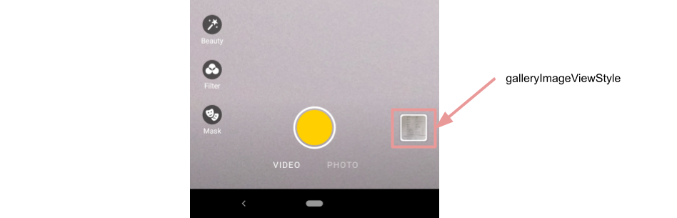
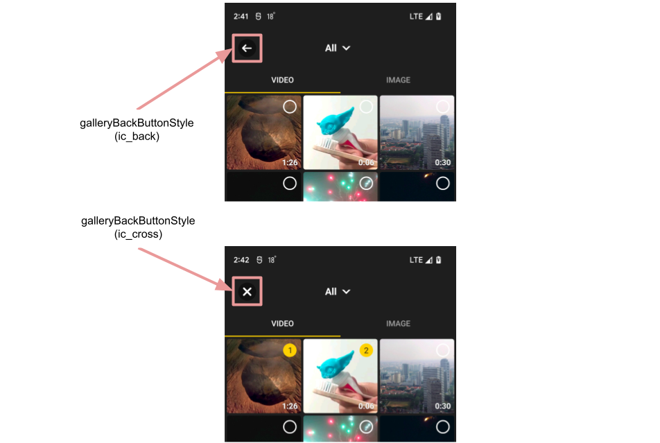
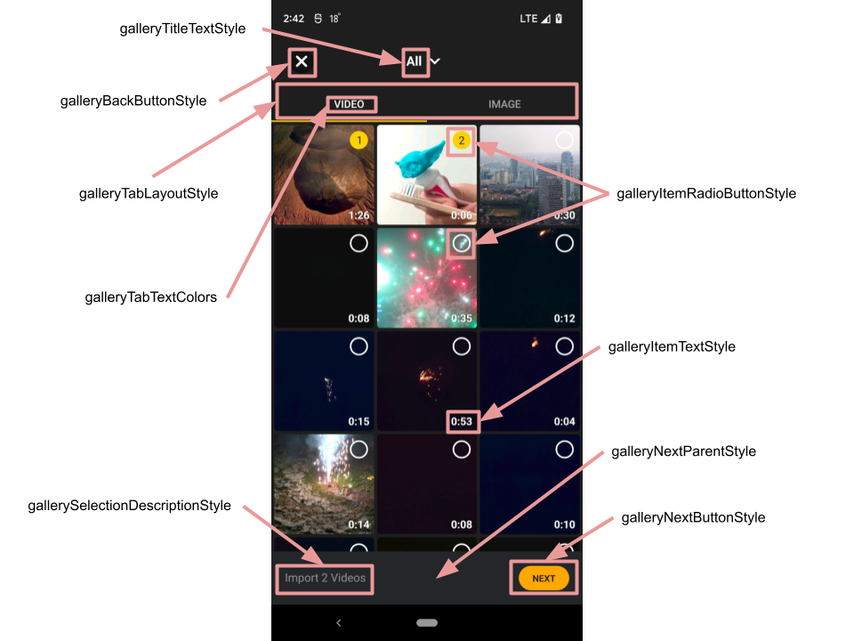
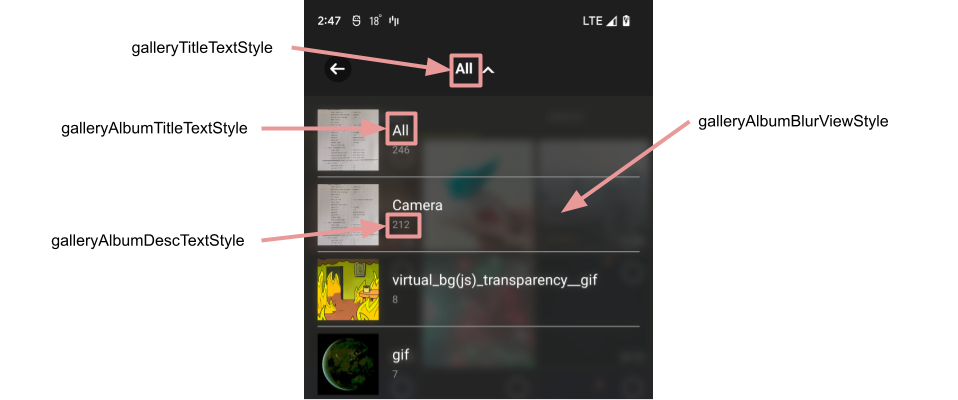

# Banuba AI Video Editor SDK

## Gallery screen configuration

There is a "gallery" section in [**EditorConfig**](./config_videoeditor.md#gallery) class. It has some attributes that impact on gallery screen appearance and logic.

## Gallery screen styles

- [galleryImageViewStyle](../app/src/main/res/values/themes.xml#L104)

    style defines the overview of gallery icon on the **camera screen**. By default the last media resource is used as gallery icon drawable. To show the custom icon for gallery the `use_custom_image` attribute should be changed to "true" and the custom drawable should be passed as `android:src` value. If there are no media resource on the device the icon from `icon_empty_gallery` attribute of `CameraOverlayView` style is used (if `use_custom_image` is false). 

    

- [galleryBackButtonStyle](../app/src/main/res/values/themes.xml#L106)

    style for the button placed on the top left corner of the screen. This icon has **two states:** if some files are already selected in the gallery and if nothing is selected. Both states have different drawables that are configured into `VideoCreationTheme` [attributes](../app/src/main/res/values/themes.xml#L811):

    - `ic_back` -  nothing is selected → **get back to the previous screen**
    - `ic_cross` - some files are selected → **clear selection** 

    

- [galleryTitleTextStyle](../app/src/main/res/values/themes.xml#L105)

    style for the gallery screen title (screen title equals to the selected media album)

- [galleryItemRadioButtonStyle](../app/src/main/res/values/themes.xml#L112)

    style for the radio button that is used to define selected resource. It has a bulk of custom attributes to customize internal colors 
- [galleryItemTextStyle](../app/src/main/res/values/themes.xml#L113)

    style for the TextView that shows duration for video resources

- [galleryTabLayoutStyle](../app/src/main/res/values/themes.xml#L118)

    style for the tab layout used for video and image tabs 

- [galleryTabTextColors](../app/src/main/res/values/themes.xml#L119)

    attribute holds the text colors for different states of tabs

- [galleryNextParentStyle](../app/src/main/res/values/themes.xml#L107)

    style for the bottom view that containes selection info and next button

- [galleryNextButtonStyle](../app/src/main/res/values/themes.xml#L108)

    style for the button that appears during selection to proceed with selected resources

- [gallerySelectionDescriptionStyle](../app/src/main/res/values/themes.xml#L109)

    style for the description of selected files

    

- [galleryEmptyTextStyle](../app/src/main/res/values/themes.xml#L114)

    style for the title and description views that are shown in case of empty gallery
- [galleryAlbumBlurViewStyle](../app/src/main/res/values/themes.xml#L115)

    style for the custom view that is used to apply blur effect as a background for albums list. It can have custom tint via "overlay_color" attribute
- [galleryAlbumTitleTextStyle](../app/src/main/res/values/themes.xml#L116)

    style for the album title
- [galleryAlbumDescTextStyle](../app/src/main/res/values/themes.xml#L117)

    style for the album description

    

Besides concrete styles there are a lot of theme attributes that allows to configure gallery screen:
- [galleryColumnsNumber](../app/src/main/res/values/themes.xml#L121) - setup how much columns the gallery screen shows
- [gallery_bg_color](../app/src/main/res/values/themes.xml#L122) - background color for gallery screen
- [gallery_item_corner_radius](../app/src/main/res/values/themes.xml#L123) - setup corner radius for every gallery item
- [gallery_item_margin](../app/src/main/res/values/themes.xml#L124) - setup margins between items in gallery (applied in all directions)
- [gallery_album_divider_color](../app/src/main/res/values/themes.xml#L125) - divider color in the albums list

## String resources

| ResourceId        |      Value      |   Description |
| ------------- | :----------- | :------------- |
| gallery_next | Next | text on the button that opens the editor screen with selected videos or images. Defined in ```galleryNextButtonStyle```
| gallery_tab_title_image | Image | label of image tab
| gallery_tab_title_video | Video | label of video tab
| gallery_selection_count_default | Select Items | description inside ```gallerySelectionDecriptionStyle``` while no selection made
| gallery_selection_count_description_video | Import %1$d Videos | **plurals resource** that is used inside ```gallerySelectionDescriptionStyle``` when user selects video
| gallery_selection_count_description_image | Import %1$d Images | **plurals resource** that is used inside ```gallerySelectionDescriptionStyle``` when user selects image
| gallery_selection_count_description_mix | Import %1$d Files | **plurals resource** that is used inside ```gallerySelectionDescriptionStyle``` when user selects video or image
| gallery_album_untitled | untitled | the title of the album that has no name (it may be created in case of some videos or images has no album name in theirs meta data)
| gallery_album_all_media | All | the title of the album that contains all media resources
| gallery_empty_image_list | No images found | message that is shown in the middle of the gallery screen in case of there are no images found on device. The view is defined in ```galleryEmptyTextStyle```
| gallery_empty_video_list | No videos found | message that is shown in the middle of the gallery screen in case of there are no videos found on device. The view is defined in ```galleryEmptyTextStyle```
| gallery_choose_at_least | Select at least %1$d files | **plurals resource** that is used for the [toast](alert_styles.md#L11) message that is shown when the user want to open the editor screen but the number of selected resources (videos or images) is less than predefined custom value (recently "1" is used). This predefined value is a placeholder in every plural string resource here
| err_gallery_broken_file | Damaged file | message shown as a [toast](alert_styles.md#L11) in case of tapping on the damaged media file
| err_gallery_limit_selected | You can select only %1$d files | **plurals resource** that is used for the toast message if the user tries to select more files than allowed
