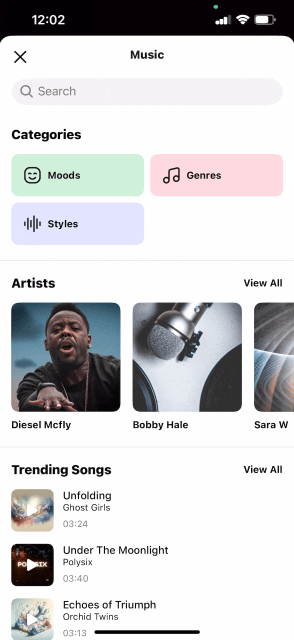

# Audio integration guide

- [Overview](#Overview)
- [Audio Browser](#Audio-Browser)
- [Mubert integration](#Mubert-integration)
- [External API](#External-API)
- [Used string resources](#Used-string-resources)

## Overview
Audio is a key part of making awesome video content.  

Video Editor SDK can play, trim, merge and apply audio content to a video.  

:exclamation: Important  
1. Banuba does not provide any audio content for Video Editor SDK.
2. Video Editor can apply audio file stored on the device. The SDK is not responsible for downloading audio content except [Mubert](https://mubert.com/)

There are 2 approaches of providing audio content:
1. ```AudioBrowser``` - specific module and a set of screens that includes built in support of browsing and applying audio content within video editor. The user does not leave the sdk while using audio.
2. ```External API``` - the client implements specific API for managing audio content. The user is taken on client's screen when audio is requested.

## Audio Browser
Audio Browser is a specific Android module that allows to browse, play and apply audio content within video editor.  
It supports 2 sources for audio content:
1. ```My Library``` - includes audio content available on the user's device
2. ```Mubert``` - includes built in integration with [Mubert](https://mubert.com/) API.

<p align="center">
&nbsp;
</p>

Below is a guide to integrate it into your project.
First, add a dependency to your [gradle](../app/build.gradle#L65) file.

```kotlin
implementation "com.banuba.sdk:ve-audio-browser-sdk:${current sdk version}"
```

Next, add ```AudioBrowserKoinModule``` to Koin modules in [VideoEditorModule](../app/src/main/java/com/banuba/example/integrationapp/VideoEditorModule.kt#L66)
```diff
startKoin {
    ...    
    modules(
+       AudioBrowserKoinModule().module,
       VideoEditorKoinModule().module
    )
}
```
and add specific implementation for ```musicTrackProvider``` in [VideoEditorModule](../app/src/main/java/com/banuba/example/integrationapp/VideoEditorModule.kt#L127)
```kotlin
single<ContentFeatureProvider<TrackData, Fragment>>(named("musicTrackProvider")) {
    AudioBrowserMusicProvider()
}
```

## Mubert integration
Audio Browser has built in integration with [Mubert](https://mubert.com/) API.  
Please contact Mubert representatives to request API KEY.

Set Mubert license and token keys in [VideoEditorModule](../app/src/main/java/com/banuba/example/integrationapp/VideoEditorModule.kt).
```kotlin
single {
  MubertApiConfig(
    mubertLicence = "...",
    mubertToken = "..."
  )
}
```

You can use ```MubertApiConfig``` to customize network requests to Mubert as well.

| Property | Available values | Description |
| ------------- | :------------: | :------------- |
| **generatedTrackDurationSec** | Number > 0 | duration that applied for generated tracks in seconds
| **generateTrackBitrate** | any of the following values: 32, 96, 128, 192, 256, 320 | sound quality measured in kbps
| **generatedTrackIntencity** |  any of the following values: low, medium, high | instrumental saturation (number of stems) for generated tracks
| **generatedTrackFormat** |  any of the following values: mp3, wav, flac | format of generated tracks
| **generatedTracksAmount** | Number > 0 | amount of tracks to generate for selected category

## External API
Video Editor includes special API for integrating your custom audio content provider and applying this content in video editor.   
The user will be taken to your app specific screen when audio is requested on video editor screen i.e. camera or editor.
Next, once the user picks audio content on your app screen you need to follow API and return the user to video editor.  
Any audio file should stored on the device before applying.

Below is a guide of using API to provide your audio to video editor.  
First, create new Activity ```CustomAudioContentActivity``` that will handle API and create new method to start it from video editor.
This Activity you can use to implement any API for downloading audio content and showing your beautiful UI to your users.
```kotlin
class CustomAudioContentActivity : AppCompatActivity() {
  ...
  
  companion object {
    fun buildPickMusicResourceIntent(
      context: Context,
      extras: Bundle
    ) =
      Intent(context, AwesomeAudioContentActivity::class.java).apply {
        putExtras(extras)
      }
  }
}
```
where ```extras``` includes a data that can be used in the Activity.
1. ```ProvideTrackContract.EXTRA_LAST_PROVIDED_TRACK``` of TrackData. Can be null. ```null``` is used to dissmiss audio.
2. ```ProvideTrackContract.EXTRA_TRACK_TYPE``` of TrackType.

Next, create ```CustomActivityMusicProvider``` and implement ```ContentFeatureProvider<TrackData>```.
```kotlin
class CustomActivityMusicProvider : ContentFeatureProvider<TrackData, Fragment> {

    private var activityResultLauncher: ActivityResultLauncher<Intent>? = null

    private val activityResultCallback: (TrackData?) -> Unit = {
        activityResultCallbackInternal(it)
    }
    private var activityResultCallbackInternal: (TrackData?) -> Unit = {}

    override fun init(hostFragment: WeakReference<Fragment>) {
        activityResultLauncher = hostFragment.get()?.registerForActivityResult(
            ProvideTrackContract(),
            activityResultCallback
        )
    }

    override fun requestContent(
        context: Context,
        extras: Bundle
    ): ContentFeatureProvider.Result<TrackData> = ContentFeatureProvider.Result.RequestUi(
        intent = CustomAudioContentActivity.buildPickMusicResourceIntent(
            context,
            extras
        )
    )

    override fun handleResult(
        hostFragment: WeakReference<Fragment>,
        intent: Intent,
        block: (TrackData?) -> Unit
    ) {
        activityResultCallbackInternal = block
        activityResultLauncher?.launch(intent)
    }
}
```

And set ```CustomActivityMusicProvider``` to [VideoEditorModule](../app/src/main/java/com/banuba/example/integrationapp/VideoEditorModule.kt)
```kotlin
    single<ContentFeatureProvider<TrackData>>(named("musicTrackProvider"), override = true) {
        CustomActivityMusicProvider()
    }
```
Please keep in mind that only one instance of ```musicTrackProvider``` can exist either your custom of```External API``` or 
```Audio Browser```.

Finally, pass audio content to apply audio in video editor. Instance of ```TrackData``` is used for passing in ```Intent``` to video editor. 
The audio should be stored on  the device.
```kotlin
val trackData = TrackData(
        UUID.randomUUID(),
        "My awesome track",
        audioTrackUri, // Uri of the audio track on local storage
        // file:///data/user/0/<package>/files/<any folder>/awesome.wav
        "Awesome Artist"
    )
```
To pass ```TrackData``` to video editor your need to use ```setResult``` with ```Intent``` and finish current Activity.
```kotlin
val trackToApply: TrackData = ...

val resultIntent = Intent().apply {
    putExtra(ProvideTrackContract.EXTRA_RESULT_TRACK_DATA,
       trackToApply)
}
setResult(Activity.RESULT_OK, resultIntent)
finish()
```
To dismiss previously selected audio track you can pass ```null``` for ```TrackData```.


## Used string resources

| ResourceId        |      Value      |
| ------------- | :----------- |
| apply_track | Use |
| remove_track| Stop\nusing |
| track_loading_failed | Sorry, audio content is temporarily unavailable |
| track_search_cancel | Cancel |
| audio_browser_title_library | My library |
| audio_browser_title_category | Music |
| audio_browser_title_empty_category | Music |
| audio_browser_load_more | Show more |
| audio_browser_error_tracks_not_found | No tracks found |
| audio_browser_error_categories_not_found | No categories found |
| audio_browser_error_empty_library | No tracks yet |
| audio_browser_error_license_not_active | The license is not active |
| audio_browser_error_license_expired | The license expired |
| audio_browser_error_license_access | Access denied, check license access type |
| audio_browser_error_license_api_version | Access denied, check license API version |
| audio_browser_error_license_wrong_key | Mubert key is missing. In order to get it contact Banuba rep. |
| audio_browser_hint_search_categories | Search by categories |
| audio_browser_hint_search_sub_categories | Search by groups |
| audio_browser_hint_search_tracks | Search by tracks |
| audio_browser_error_dialog_title | Oops, something went wrong… |
| audio_browser_error_dialog_description | Please, try again later. |
| audio_browser_error_dialog_retry | Retry |
| audio_browser_error_dialog_close | Close |
| permission_library_description_message | Allow to access to your storage to select an audio tracks from your device. |
| not_supported_audio_browser | Default music browser is not included in your package. You can plugin your own music |
| audio_browser_connection_error_title | No internet connection |
| audio_browser_connection_error_message | Please, check your connection and try again. |
| audio_browser_connection_error_btn | Retry |
| audio_browser_connection_error_toast | No internet connection |
| action_add_music_track | Tracks |
| action_add_voice_recording | Record |
| action_effects | Effects |
| action_edit | Edit |
| action_delete | Delete |
| edit_track_volume_title | Volume |
| edit_track_volume_percent | %1$d%% |
| edit_track_audio_duration | Audio duration |
| edit_track_duration_error | Audio should be longer than %1$.1f sec |
| error_voice_recording_start | Error on voice recording start |
| error_voice_recording_stop | Error on voice recording stop |
| error_invalid_duration_voice_recording | Min voice recording duration - %1$.1f sec |
| error_invalid_duration_music_track | Min music track duration - %1$.1f sec |
| error_voice_recording_delete_file | Internal error when try to delete voice recording file |
| error_track_limit | Max available tracks - %1$d |
| error_no_space | No space |

