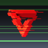
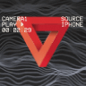

# Effects integration guide

- [Face AR masks](#face-ar-masks)
- [Color filters](#Color-filters)
- [Visual FX](#Visual-FX)
- [Time](#Time)
- [Transitions](#Transitions)

## Face AR masks

Any Face AR mask is a folder that includes a number of files required for [Face AR SDK](https://docs.banuba.com/face-ar-sdk-v1) to play the mask.

There are 3 options for adding and managing AR masks:

* Store all masks in [assets/bnb-resources/effects](../app/src/main/assets/bnb-resources/) folder in the app.
* Use AR Cloud for storing effects on a server.

You can use both options i.e. store just a few AR effects in assets and 100 or more AR masks on AR Cloud.

## Color filters
Any color filter(or LUT) is a pair of files texture and preview. The texture file should be stored in [assets/bnb-resources/luts](../app/src/main/assets/bnb-resources/luts) folder. 
Preview file is normally stored in a specific Android drawable folder i.e. [drawable-xhdpi](../app/src/main/res/drawable-xhdpi).
For example, color filter ```canada``` includes [texture file](../app/src/main/assets/bnb-resources/luts/canada.png) amd [preview file](../app/src/main/res/drawable-xhdpi/canada.png).  

You can move all available color filters in this sample to your project.

:exclamation: Important  
```AR Cloud``` does not support storing color filters.


By default, color filters are listed in alphabetical order.  

Create class [CustomColorFilterOrderProvider](../app/src/main/java/com/banuba/example/integrationapp/VideoEditorModule.kt#L231) and implement ```OrderProvider``` to provide custom order of color filters.
```kotlin
class CustomColorFilterOrderProvider : OrderProvider {
    override fun provide() = listOf(
        "egypt",
        "byers",
        "chile",
        "hyla",
        "new_zeland",
        "korben",
        "canada",
        "remy",
        "england",
        "retro",
        "norway",
        "neon",
        "japan",
        "instant",
        "lux",
        "sunset",
        "bubblegum",
        "chroma",
        "lilac",
        "pinkvine",
        "spark",
        "sunny",
        "vinyl",
        "glitch",
        "grunge"
    )
}
```
:exclamation: Important  
These are names of specific color filters located in ```assets/bnb-resources/luts```.  

Next, use ```CustomColorFilterOrderProvider``` in [VideoEditorModule](../app/src/main/java/com/banuba/example/integrationapp/VideoEditorModule.kt#L141)
```kotlin
single<OrderProvider>(named("colorFilterOrderProvider")) {
    CustomColorFilterOrderProvider()
}
```

## Visual FX 
FX(or visual) effect can be applied on a recorded video on editor screen i.e. ```Zoom```, ```Glitch```, etc. 

Video Editor has built in integration of managing these effects. The list of effects depends on license.

Implement  ```EnabledEffectsProvider``` interface in [VideoEditorModule](../app/src/main/java/com/banuba/example/integrationapp/VideoEditorModule.kt) to disable effects.
Here is an example of enabling just 2 effects ```Zoom```, ```Glitch```
```kotlin
single(named("fxEffectsProvider"), override = true) {
    EnabledEffectsProvider {
        listOf("zoom", "glitch")
    }
}
```

You can use ```DefaultEnabledFxEffectsProvider().provide()``` to get all effect names.

Effect customization is implemented by android resources with well-defined names which follow a strict scheme.

| Customization | Resource type | Resource name template | Example
| --- | --- | --- | --- |
| Title | string | visual_effect_{id}, time_effect_{id} | visual_effect_flash
| Icon | drawable | ic_visual_effect_{id}, ic_time_effect_{id} | ic_time_effect_rapid
| Color | color | visual_effect_color_{id}, time_effect_color_{id} | visual_effect_color_vhs

To change appearance o the effect, you should place any android resources named according to the scheme presented above into res folder of your app. The resource depends on the item you want to customize (string for the title, drawable for the icon, color for the color on the timeline).

Effects identifiers are presented in the table below:

| Effect      | Type | String identifier | Default icon |
| :---------- | :---:| :--------------:  | :----------: |
| Acid-whip | visual | acid_whip| 
| Cathode | visual | cathode | 
| Flash | visual | flash | 
| Glitch | visual | glitch | 
| Glitch 2 | visual | glitch2 | 
| Glitch 3 | visual | glitch3 | 
| Heat map | visual | heat_map | 
| DSLR Kaleidoscope | visual | dslr_kaleidoscope | 
| Kaleidoscope | visual | kaleidoscope | 
| Lumiere | visual | lumiere | 
| Pixel dynamic | visual | pixel_dynamic | 
| Pixel static | visual | pixel_static | 
| Polaroid | visual | polaroid | 
| Rave | visual | rave | 
| Soul | visual | soul | 
| Stars | visual | stars | 
| Transition 1 | visual | transition1 | 
| Transition 2 | visual | transition2 | 
| Transition 3 | visual | transition3 | 
| Transition 4 | visual | transition4 | 
| TV Foam | visual | tv_foam | 
| DV Cam | visual | dv_cam | 
| VHS | visual | vhs | 
| VHS 2 | visual | vhs2 | 
| Zoom | visual | zoom | 
| Zoom 2 | visual | zoom2 | 
| Slow mo | time | slow_motion | 
| Rapid | time | rapid | 


For example, to change the title of ```Flash``` visual effect to ```SuperFlash``` add it in  ```strings.xml``` in your app.
```xml
<string name="visual_effect_flash">SuperFlash</string>
```

You can change the color on the timeline for any visual effect. For example, for ```VHS```  you should add color resource with the name ```visual_effect_color_vhs``` into ```colors.xml``` file in your app.

## Time
To change an icon of ```Rapid``` time effect, you should place drawable resource with the name ```ic_time_effect_rapid``` into drawable folder in your app.

## Transitions
Transitions are effects applying to segue between two videos. Transition effects are not being played if the closest video (either to the left or to the right of transition icon) is very short. Transitions are enabled by default.


Set ```false``` to  ```supportsTransitions``` of ```EditorConfig``` in [VideoEditorModule](../app/src/main/java/com/banuba/example/integrationapp/VideoEditorModule.kt#L156) to disable transitions.
``` diff
single(override = true) {
    EditorConfig(
        ...
+       supportsTransitions = false
    )
}
```

Video Editor includes 10 transition effects. Additional "empty" effect is used to leave the segue between videos without any transition effect.
Every transition effect has its own string identifier i.e. ```fade```:

| Transition effect | String identifier
| --- | --- |
| Empty | "empty" |
| Fade | "fade" |
| Spin | "spin" |
| Whip Down | "whip_down"|
| Whip Up | "whip_up" |
| Whip Right | "whip_right" |
| Whip Left | "whip_left" |
| Scroll Down | "scroll_down" |
| Scroll Up | "scroll_up" |
| Scroll Right | "scroll_right" |
| Scroll Left | "scroll_left" |

The identifier is used in naming of the following android resources related to every transition effect:
- picture on the selectable thumb
- title under the selectable thumb
- picture on the transition icon on the trimmer timeline

All these resources are named within SDK according to the specific scheme:

| Customization | Resource type | Resource name template | Example
| --- | --- | --- | --- |
| thumb icon | drawable | ic_transition_thumb_{id} | ic_transition_thumb_fade
| thumb title | string | transition_effect_{id} | transition_effect_empty
| timeline icon | drawable | ic_transition_{id} | ic_transition_whip_down

In this scheme {id} is a placeholder for the effect string identifier.

To customize any transition effect put your own value into android resource named according to the scheme above and place it into [res](../app/src/main/res) folder. This resource will override the default one.

For example, to change the title of ```Empty``` transition effect to ```Clear```
```xml
<string name="transition_effect_empty">Clear</string>
```
