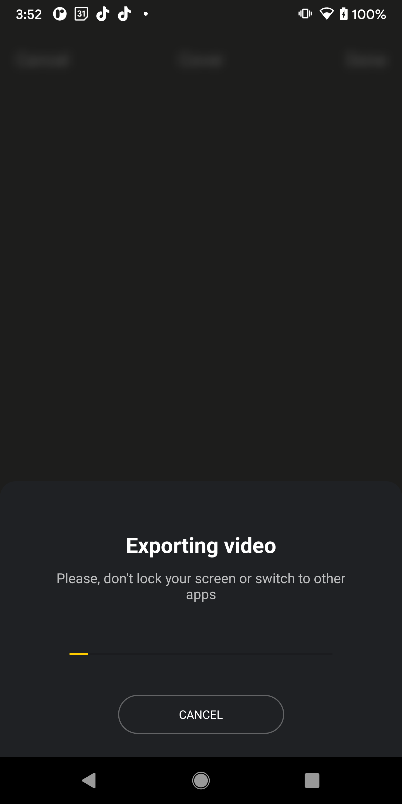

# Export guide

- [Overview](#Overview)
- [Video codecs](#Video-codecs)
- [Video quality](#Video-quality)
- [Export storage](#Export-storage)
- [Implement export flow](#Implement-export-flow)
- [Handle export result](#Handle-export-result)
- [Export in background](#Export-in-background)
- [Progress screen](#Progress-screen)
- [Add watermark](#Add-watermark)
- [Publish video](#Publish-video)
- [Export GIF preview](#Export-GIF-preview)
- [Get audio used in export](#Get-audio-used-in-export)
- [Export metadata analytics](#Export-metadata-analytics)

## Overview
You can export a number of media files i.e. video and audio with various resolutions and other configurations using. 
Video Editor export video as ```.mp4``` file.  

:exclamation: Important  
Export is a very heavy computational task that takes time and the user has to wait.
Execution time depends on
1. Video duration - the longer video the longer execution time.
2. Number of video sources - the many sources the longer execution time.
3. Number of effects and their usage in video - the more effects and their usage the longer execution time.
4. Number of exported video - the more video and audio you want to export the longer execution time.
5. Device hardware - the most powerful devices can execute export much quicker.

Export includes 2 modes:
- ```Foreground``` - the user has to wait on progress screen until processing is done.
- ```Background``` - the user can be taken to your screens. A notification will be sent when processing is done.  

```ForegroundExportFlowManager``` and ```BackgroundExportFlowManager``` are relevant implementations.  

Here is a screen that is shown in ```Foreground``` mode.
<p align="center">

</p>

## Video codecs
Video Editor supports video codec options:
1. ```HEVC``` - H265 codec. Enabled by **default**
2. ```AVC_PROFILES``` - H264 codec with profiles
3. ```BASELINE``` - H264 codec without profiles


## Video quality
| 240p(240x426) | 360p(360x640) | 480p(480x854) | QHD540(540x960) | HD(720x1280) | FHD(1080x1920) | QHD(1440x2560) | UHD(2160x3840) |
|---------------|------------|---------------|-----------------|--------------|----------------|----------------|----------------|
| 1000   kb/s   | 1200  kb/s     | 2000 kb/s         | 2400  kb/s          | 3600   kb/s  | 5800 kb/s      | 10000    kb/s      | 20000  kb/s        |

Video Editor has built in feature for detecting device performance capabilities and finding optimal video quality params for export.

## Export storage
Video Editor stores all exported video files in ```export``` directory on external storage.
You can change the folder by overriding ```exportDir``` dependency in [VideoEditorModule](../app/src/main/java/com/banuba/example/integrationapp/VideoEditorModule.kt)
Default implementation is
```kotlin
    single(named("exportDir")) {
        get<Context>().getExternalFilesDir("")?.toUri()
            ?.buildUpon()
            ?.appendPath("export")
            ?.build() 
            ?: throw NullPointerException("exportDir cannot be null!")
    }
```

## Implement export flow
You can create your own flow for exporting media files for your application.  

First, create class ```CustomExportParamsProvider``` and implement ```ExportParamsProvider```.
Method ```provideExportParams``` returns ```List<ExportParams>``` which is a list of media content to export.

Below is a sample to export 4 media files:
1. audio soundtrack of exported video
2. video with predefined resolution and watermark
3. video with predefined resolution and without watermark
4. video with extra 360p resolution and watermark

```kotlin
class CustomExportParamsProvider(
    private val exportDir: Uri,
    private val videoResolution: VideoResolution,
    private val watermarkBuilder: WatermarkBuilder
) : ExportParamsProvider {

    override fun provideExportParams(
        effects: Effects,
        videoRangeList: VideoRangeList,
        musicEffects: List<MusicEffect>,
        videoVolume: Float
    ): List<ExportParams> {
        val exportSessionDir = exportDir.toFile().apply {
            deleteRecursively()
            mkdirs()
        }
        val extraSoundtrackUri = Uri.parse(exportSessionDir.toString()).buildUpon()
            .appendPath("exported_soundtrack.${MediaFileNameHelper.DEFAULT_SOUND_FORMAT}")
            .build()

        return listOf(
            ExportParams.Builder(videoResolution)
                .effects(effects.withWatermark(watermarkBuilder, WatermarkAlignment.BottomRight(marginRightPx = 16.toPx)))
                .fileName("export_default_watermark")
                .videoRangeList(videoRangeList)
                .destDir(exportSessionDir)
                .musicEffects(musicEffects)
                .extraAudioFile(extraSoundtrackUri)
                .volumeVideo(videoVolume)
                .build(),
            ExportParams.Builder(videoResolution)
                .effects(effects)
                .fileName("export_default")
                .videoRangeList(videoRangeList)
                .destDir(exportSessionDir)
                .musicEffects(musicEffects)
                .volumeVideo(videoVolume)
                .build(),
            ExportParams.Builder(VideoResolution.Exact.VGA360)
                .effects(effects.withWatermark(watermarkBuilder, WatermarkAlignment.BottomRight(marginRightPx = 16.toPx)))
                .fileName("export_360_watermark")
                .videoRangeList(videoRangeList)
                .destDir(exportSessionDir)
                .musicEffects(musicEffects)
                .volumeVideo(videoVolume)
                .build()
        )
    }
}
``` 
where you set up name of exported video
``` diff
 ExportParams.Builder(videoResolution)
           .effects(effects.withWatermark(watermarkBuilder, WatermarkAlignment.BottomRight(marginRightPx = 16.toPx)))
 +          .fileName("export_default_watermark")
           .videoRangeList(videoRangeList)
           .destDir(exportSessionDir)
           .musicEffects(musicEffects)
           .extraAudioFile(extraSoundtrackUri)
           .volumeVideo(videoVolume)
           .build(),
``` 
and add watermark on bottom right of the video.
``` diff
 ExportParams.Builder(videoResolution)
 +         .effects(effects.withWatermark(watermarkBuilder, WatermarkAlignment.BottomRight(marginRightPx = 16.toPx)))
           .fileName("export_default_watermark")
           .videoRangeList(videoRangeList)
           .destDir(exportSessionDir)
           .musicEffects(musicEffects)
           .extraAudioFile(extraSoundtrackUri)
           .volumeVideo(videoVolume)
           .build(),
``` 

``` ExportParams.Builder``` class requires just single parameter ```resolution```, others are optional:
- `fileName(fileName: String)` - name of exported video file.
- `effects(effects: Effects)` - list of effects to export in video.
- `videoRangeList(videoRangeList: VideoRangeList)` - video sources to export target video
- `musicEffects(musicEffects: List<MusicEffect>)` - music effects for export video
- `destDir(destDir: File)` -  where to store exported video
- `extraAudioFile(extraAudioTrack: Uri)` - where to store extra audio file from video
- `volumeVideo(volume: Float)` - set audio volume in video
- `useHevcIfPossible(flag: Boolean)` -  ```true``` - HEVC codec is preferred and AVC will be used if only HEVC is not available.  ```false``` - use AVC only.

Next, specify this implementation in [VideoEditorModule](../app/src/main/java/com/banuba/example/integrationapp/VideoEditorModule.kt#L105)

```kotlin
    factory<ExportParamsProvider> {
        val hardwareClass = get<HardwareClassProvider>().provideHardwareClass()

        CustomExportParamsProvider(
            exportDir = get(named("exportDir")),
            videoResolution = hardwareClass.optimalResolution, // provide your video resolutions
            watermarkBuilder = get()
        )
}
```

Finally, use the most suitable export mode for your application - ```ForegroundExportFlowManager``` or ```BackgroundExportFlowManager``` in [VideoEditorModule](../app/src/main/java/com/banuba/example/integrationapp/VideoEditorModule.kt#L88).
```kotlin
        single<ExportFlowManager> {
            ForegroundExportFlowManager(
                exportDataProvider = get(),
                sessionParamsProvider = get(),
                exportSessionHelper = get(),
                exportDir = get(named("exportDir")),
                shouldClearSessionOnFinish = true,
                publishManager = get(),
                errorParser = get(),
                mediaFileNameHelper = get(),
                exportBundleProvider = get()
            )
        }
```
If you set ```shouldClearSessionOnFinish``` to ```true``` in ```ExportFlowManager```  you should clear ```VideoCreationActivity``` from Activity backstack. Otherwise crash will occur.

## Handle export result
The result is returned to your controller in [registerForActivityResult method](../app/src/main/ava/com/banuba/example/integrationapp/MainActivity.kt#L18) as an instance of ```ExportResult```.
```kotlin
private val createVideoRequest =
        registerForActivityResult(CustomExportResultVideoContract()) { exportResult ->
            exportResult?.let {
                    if (exportResult is ExportResult.Success) {
                        // Get uri of first exported video file
                        val videoUri = exportResult.videoList.getOrNull(0)
                           ...
                    }
            }
        }
```

```ExportResult``` class
```kotlin
    sealed class ExportResult {

        object Inactive : ExportResult()

        object Stopped : ExportResult()

        data class Progress(
            val preview: Uri
        ) : ExportResult()

        @Parcelize
        data class Success(
            val videoList: List<ExportedVideo>,
            val preview: Uri,
            val metaUri: Uri,
            val additionalExportData: Parcelable? = null
        ) : ExportResult(), Parcelable

        @Parcelize
        data class Error(val type: ExportError) : ExportResult(), Parcelable
}
```

When export finished successfully ```ExportResult.Success``` instance is returned with all export data.  
```ExportResult.Error``` is returned when an error is occurred while exporting media content.

## Export in background
If you want to export media in the background and do not show any progress screen to your user you can use ```BackgroundExportFlowManager``` implementation in [VideoEditorModule](../app/src/main/java/com/banuba/example/integrationapp/VideoEditorModule.kt).
```kotlin
        single<ExportFlowManager> {
            BackgroundExportFlowManager(
                exportDataProvider = get(),
                sessionParamsProvider = get(),
                exportSessionHelper = get(),
                exportNotificationManager = get(),
                exportDir = get(named("exportDir")),
                publishManager = get(),
                errorParser = get(),
                exportBundleProvider = get()
            )
        }
```

Next, specify Android ```CustomActivity``` that opens after export  in ```AndroidManifest.xml``` file and set special ``` <intent-filter>``` .
Please use ```applicationId``` as a part of intent action name to make it unique among other possible intent actions

    ```kotlin
    <activity android:name=".CustomActivity">
        <intent-filter>
          <action android:name="${applicationId}.ShowExportResult" />
          <category android:name="android.intent.category.DEFAULT" />
        </intent-filter>
    </activity>
    ```

Create new class ```CustomExportResultHandler``` and implement ```ExportResultHandler``` that will start your Activity mentioned above.
```kotlin
    class CustomExportResultHandler : ExportResultHandler {

        override fun doAction(activity: AppCompatActivity, result: ExportResult.Success?) {
            val intent = Intent("${activity.packageName}.ShowExportResult").apply {
                result?.let { putExtra(EXTRA_EXPORTED_SUCCESS, it) }
                addFlags(Intent.FLAG_ACTIVITY_CLEAR_TOP)
            }
            activity.startActivity(intent)
        }
    }
```
**Note**: action that is passed into ```Intent``` constructor **must be the same** as the action name from activity intent filter above.

Next, add ```ExportFlowManager``` dependency using Koin and observe for ```ExportResult``` in ```CustomActivity```

```kotlin
    class CustomActivity: AppCompatActivity() {
        private val exportFlowManager: ExportFlowManager by inject()
  
        override fun onCreate(savedInstanceState: Bundle?) {
            super.onCreate(savedInstanceState)
            exportFlowManager.resultData.nonNull().observe(this) { exportResult ->
                //...
            }
        }
    }
```

**Optional**. Provide ```ExportNotificationManager``` to manage notifications about exporting process state.
There are 3 options:
1. Remove notifications all notifications
    ```kotlin
    class EmptyExportNotificationManger() : ExportNotificationManager {
        fun showExportStartedNotification(){}
        fun showSuccessfulExportNotification(result: ExportResult.Success){}
        fun showFailedExportExportNotification(){}
    }
    ```
  and provide this implementation in [VideoEditorModule](../app/src/main/java/com/banuba/example/integrationapp/VideoEditorModule.kt):

```kotlin
    single<ExportNotificationManager> {
       EmptyExportNotificationManger()
    }
```

2. Customize default implementation

  You can override the following android resources:
   - R.string.export.notification_started - for message about started export
   - R.string.export_notification_success - for message about succeeded export
   - R.string.export_notification_fail - for message about failed export
   - R.drawable.ic_export_notification - for notification icon in system bar

3. Provide custom implementation of ```ExportNotificationManager``` in [VideoEditorModule](../app/src/main/java/com/banuba/example/integrationapp/VideoEditorModule.kt)
```kotlin
    single<ExportNotificationManager> {
       CustomExportNotificationManger()
    }
```

## Progress screen
You can change appearance of this screen by overriding these styles and resources.

- [loadingScreenParentViewStyle](../app/src/main/res/values/themes.xml#L442)  
  style for the root Constraint layout that represents

- [loadingScreenTitleStyle](../app/src/main/res/values/themes.xml#L443)  
  style for the loading dialog title

- [loadingScreenDescStyle](../app/src/main/res/values/themes.xml#L444)  
  style for the loading dialog description

- [loadingScreenProgressStyle](../app/src/main/res/values/themes.xml#L445)  
  style for the loading dialog progress

- [loadingScreenCancelBtnStyle](../app/src/main/res/values/themes.xml#L446)  
  style for the loading dialog cancel button

  

Below are string you can use or customize.

:exclamation: Important  
Some strings on the screen are defined in the styles. To localize these strings firstly create string resources and setup them into styles under `android:text` attribute.

| ResourceId        |      Value      |
| ------------- | :----------- |
| editor_alert_import_failed | Content uploading failed |
| editor_alert_import_failed_desc | |
| editor_alert_import_failed_positive | Retry |
| editor_alert_import_failed_negative | Cancel |
| editor_alert_export_stopped | Do you want to interrupt the video export? |
| editor_alert_export_stopped_desc | |
| editor_alert_export_stopped_positive | Interrupt |
| editor_alert_export_stopped_negative | Cancel |
| editor_alert_export_interrupted | Export interrupted |
| editor_alert_export_interrupted_desc | |
| editor_alert_export_interrupted_positive | Retry |
| editor_alert_export_interrupted_negative | Cancel |
| loading_export_title | Exporting video |
| loading_export_description | Please, don\'t lock your screen or switch to other apps |
| loading_import_title | Importing video |
| loading_import_description | Please, don\'t lock your screen or switch to other apps |


## Add watermark
:exclamation: Important  
Watermark is not added to exported video by default.  

Please use extension method ```Effects.withWatermark``` method to add watermark to video.
```kotlin
    fun Effects.withWatermark(
   watermarkBuilder: WatermarkBuilder,
   alignment: WatermarkAlignment
)
```
where ```WatermarkBuilder``` provides watermark drawable and ```alignment``` is used where to locate drawable
```kotlin
    WatermarkAlignment {
        TOP_LEFT,
        TOP_RIGHT,
        BOTTOM_LEFT,
        BOTTOM_RIGHT
    }
```
You can provide custom implementation ```WatermarkBuilder``` as well in [VideoEditorModule](../app/src/main/java/com/banuba/example/integrationapp/VideoEditorModule.kt)

To use your custom watermark image you should first create new class and implement ```WatermarkProvider```
```kotlin
   private class CustomWatermarkProvider : WatermarkProvider {

  /**
   * Provide your own watermark image
   * */
  override fun getWatermarkBitmap(): Bitmap? {
    return null
  }
}
```
and add this implementation in [VideoEditorModule](../app/src/main/java/com/banuba/example/integrationapp/VideoEditorModule.kt)
```kotlin
factory<WatermarkProvider> {
    CustomWatermarkProvider()
}
```

## Publish video
When export finishes successfully ```ForegroundExportFlowManager``` and ```BackgroundExportFlowManager``` implementations can publish video to specific destinations.
```PublishManager``` is used for implementing custom publish flow.  
Video Editor does not have built in implementation of ```PublishManager```.  
You can implement your ```CustomPublishManager``` that publishes video to gallery and specify it in [VideoEditorModule](../app/src/main/java/com/banuba/example/integrationapp/VideoEditorModule.kt)

```kotlin
    single(override = true) {
        CustomPublishManager()
    }
```

## Export GIF preview
Video Editor allows to export preview of a video as a GIF file.

Use ```GifMaker.Params``` in your ```CustomExportParamsProvider``` to create params for exporting GIF preview
 ```kotlin
     data class Params(
        val destFile: File,
        val sourceVideoRangeMs: LongRange = 0..1000L,
        val fps: Int = 15,
        val width: Int = 240,
        val useDithering: Boolean = true,
        val reverse: Boolean = true
    )
 ```
where
- `destFile` - where to store the file
- `sourceVideoRangeMs` - is a range of exported video that will be used to create gif image
- `fps` - frames per second within gif image
- `width` - width of gif image in pixels
- `useDithering` - flag that apply or remove dithering effect (in simple words make an image of better quality)
- `reverse` - flag to reverse playback inside gif

Use ```interactivePreview``` method in ```ExportParams.Builder``` to enable exporting GIF

 ```diff
ExportParams.Builder(sizeProvider.videoResolution)
                .effects(effects)
                .fileName("export_video")
                .videoRangeList(videoRangeList)
                .destDir(exportSessionDir)
                .musicEffects(musicEffects)
                .extraAudioFile(extraSoundtrackUri)
                .volumeVideo(videoVolume)
 +              .interactivePreview(gifPreviewParams)
                .build()
 ```

## Get audio used in export
You can get all audio used in exported video when export finished successfully.
```ExportBundleHelper.getExportedMusicEffect``` requires ```additionalExportData``` value of ```ExportResult.Success```.
The result is ```List<MusicEffectExportData>``` where ```MusicEffectExportData``` is
```kotlin
    @Parcelize
    data class MusicEffectExportData(
        val title: String,
        val type: MusicEffectType,
        val uri: Uri
    ) : Parcelable
```

`MusicEffectType` contains next values:
1. `TRACK` - audio tracks that were added on  the `Editor` screen
2. `VOICE` - voice record track that was added on the `Editor` screen
3. `CAMERA_TRACK` - audio track that was added on the `Camera` screen


## Export metadata analytics
Video Editor generates simple metadata analytics while exporting media content that you can use to analyze what media content your users make.  
Metadata is a JSON string and can be returned from ```ExportResult.Success``` in this way
```kotlin
//"exportResult" is an instance of ExportResult.Success object
val outputBundle = exportResult.additionalExportData.getBundle(ExportBundleProvider.Keys.EXTRA_EXPORT_OUTPUT_INFO)
val analytics = outputBundle?.getString(ExportBundleProvider.Keys.EXTRA_EXPORT_ANALYTICS_DATA)
```
```ExportBundleProvider.Keys``` includes all constants you can use for parsing.

Sample
```JSON
{
  "export_success": true, // defines if the export finished succesffully
  "aspect_ratio": "original", // aspect ration used in exported video
  "video_resolutions": ["1080x1920"], // list of video resolutions used in export
  "camera_effects": [], // list of effects of features used on camera screen while recording video
  "ppt_effects": {
    "visual": 2, // num of visual effects i.e. Glitch, VHS used in exported video
    "speed": 1, //  num of speed effects used in exported video
    "mask": 6, // num of AR masks used in exported video
    "color": 3, // num of color effects used in exported video
    "text": 1, // num of text effects used in exported video
    "sticker": 1, // num of sticker effects used in exported video
    "blur": 1 // num of blur effects used in exported video
  },
  "sources": {
    "camera": 0, // num of video sources recorded on camera screen(not PIP)
    "gallery": 1, // num of video sources selected in the gallery
    "pip": 0, // num of video recorded with PIP
    "slideshow": 0, // num of video exported as slideshow
    "audio": 0 // num of audi tracks
  },
  "export_duration": 12.645, // export processing duration
  "video_duration": 20.11, // exported video duration
  "video_count": 1, // num of exported video files
  "os_version": "11", // OS version
  "sdk_version": "1.26.6" // VE SDK version
}
```
