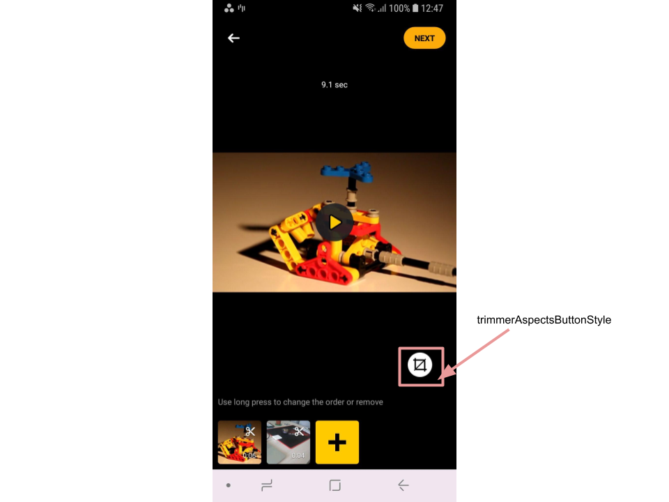

# Video editing guide

- [Configurations](#Configurations)
- [Trimmer screen](#Trimmer-screen)
- [Editor screen](#Editor-screen)
- [Text and Stickers editor screen](#Text-and-Stickers-editor-screen)

## Configurations
Video editing includes 3 main classes you can use to change configurations implemented in [VideoEditorModule](../app/src/main/java/com/banuba/example/integrationapp/VideoEditorModule.kt)
- ```EditorConfig``` - to change editor, trimmer, and gallery screens.
- ```MusicEditorConfig``` - to change audio editor screen, e.g. the number of timelines, tracks and others.
- ```ObjectEditorConfig``` - to change text and stickers editing screens, e.g. the number of timelines, effects allowed and others.

### EditorConfig
We grouped a number of properties into related sections(editor, trimmer, gallery) for your convince.

#### Editor

| Property                       |               Values               | Description |
|--------------------------------|:----------------------------------:| :------------- |
| minTotalVideoDurationMs        |  Number > 0, Default ```1_000L```  | the minimum total video duration *in milliseconds* that is required to proceed from the Trimmer screen to Editor screen (i.e. 3000 for 3 seconds).
| maxTotalVideoDurationMs        | Number > 0, Default ```120_000L``` | the maximum total video duration *in milliseconds* that is required to proceed from the Trimmer screen to Editor screen (i.e. 60000 for 1 minute).
| maxMediaSources                | 0 < Number <= 50, Default ```50``` | the maximum amount of video sources which can be added to Trimmer screen
| editorSupportsTimeEffects      |   true/false, Default ```true```   | defines if time effects (i.e. Rapid, SlowMo) are enabled
| editorSupportsVisualEffects    |   true/false, Default ```true```   | defines if visual effects (i.e. Glitch, VHS, etc.) are enabled
| editorSupportsMusicMixer       |   true/false, Default ```true```   | defines if the Audio editor is enabled
| supportsTextOnVideo            |   true/false, Default ```true```   | defines if text effects is enabled
| textOnVideoMaxSymbols          | -1 or Number > 0, Default ```-1``` | defines the maximum symbols available for the text effect. Value "-1" means no limit.
| stickersApiKey                 |               String               | Set your GIPHY key here.
| showEditorConfig               |  true/false, Default ```false```   | Enable button "Show config" that shows debug info of `EditorConfig` properties. *Do not forget to setup false for production build*.
| supportsTrimRecordedVideo      |   true/false, Default ```true```   | defines if the trimmer screen will be opened after camera. ```false``` means editor screen will be opened after camera.

#### Trimmer

| Property |              Values               | Description |
| ------------- |:---------------------------------:| :------------- |
| trimmerMinSourceVideoDurationMs |  Number > 0, Default ```300L```   | the minimum video duration *in milliseconds* that is required to be appended to the list of video sources recorded with camera or seleced from gallery.
| trimmerActionVibrationDurationMs |   Number >= 0, Default ```3L```   | defines vibration duration *in milliseconds* when drag and drop is applied on Trimmer screen. **Note**, this value should be small enougn to provide good user experience. Value "0" means no vibration.
| trimmerTimelineOneScreenDurationMs | Number > 0, Default ```10_000L``` | defines the maximum total video duration *in milliseconds* that takes the whole device's width on the Trimmer screen
| supportsTransitions |  true/false, Default ```true```   | if [transition effects](guide_effect.md#Transitions) are available

#### Slideshow
Slideshow is a small video made from image.

| Property |              Values              | Description |
| ------------- |:--------------------------------:| :------------- |
| slideShowFromGalleryAnimationEnabled |  true/false, Default ```true```  | defines if the slideshow created *from gallery images* is animated
| slideShowFromPhotoAnimationEnabled |  true/false, Default ```true```  | defines if the slideshow created *from captured camera photos* is animated
| slideShowSourceVideoDurationMs | Number > 0, Default ```3_000L``` | defines the duration in of slideshow in *in milliseconds* for 1 image. Total video duration of N images - ```N * slideShowSourceVideoDurationMs```

#### Gallery
| Property |          Available values          | Description |
| ------------- |:----------------------------------:| :------------- |
| gallerySupportsVideo |   true/false, Default ```true```   | defines if the Video tab available on the Gallery screen
| gallerySupportsImage |   true/false, Default ```true```   | defines if the Image tab available on the Gallery screen

### ObjectEditorConfig
The class allows to customize text/gif editor screen behavior.

| Property |              Values              | Description |
| ------------- |:--------------------------------:| :------------- | 
| objectMaxVisibleTimelineCount |   Number > 0, Default ```4```    | the maximum number of rows or timelines for adding effects
| objectInitialTimelineCount |   Number > 0, Default ```2```    | initial number of visible rows or timelines for adding effects
| objectEffectDefaultDuration | Number > 0, Default ```3_000L``` | default duration *in milliseconds* of playing an effect in timeline
| objectEffectMinDurationMs |  Number > 0, Default ```100L```  | the minimum required duration *in milliseconds* of applying the effect
| showObjectEffectsTogether | true/false, Default ```false```  | if stickers and text effects are managed on the single screen
| objectEditorVibrateActionDurationMs |   Number > 0, Default ```2L```   | vibration duration *in milliseconds* that is applied for object effect after drag action

### MusicEditorConfig
The class allows to customize music editor screen behavior.

| Property |        Available values        | Description |
| --------- |:------------------------------:| :------------- |
| minAudioDurationMs | Number > 0, Default ```100L``` | the minimum audio track duration *in milliseconds* that is allowed to add.
| minVoiceRecordingMs | Number > 0, Default ```100L``` | the minimum voice recording duration *in milliseconds* that is allowed to add.
| musicTimelineCount |  Number > 0, Default ```4```   | the number of rows or timelines available for adding audio tracks
| maxTracks |  Number > 0, Default ```10```  | for the maximum allowed audio tracks
| musicEditorVibrateActionDurationMs |  Number > 0, Default ```2L```  | vibration duration *in milliseconds* that is applied for audio track after changes

## Trimmer screen
Trimmer allows the user to trim, merge, change aspects of video sources. The user can apply transition effects between video sources. 

Use the following styles to change screen appearance.  

- [trimmerStyle](../app/src/main/res/values/themes.xml#L144)  
  style to customize trimmer view with custom attributes. There are a lot of properties can be changed from its default color to left and right pointers drawables

- [ic_trimmer_rotate](../app/src/main/res/drawable/ic_trimmer_rotate.xml), [ic_trimmer_remove](../app/src/main/res/drawable/ic_trimmer_remove.xml) and [ic_trimmer_trim](../app/src/main/res/drawable/ic_trimmer_trim.xml)  
  drawables for different trimmer view actions icons

- [trimmerTimelineActionTextStyle](../app/src/main/res/values/themes.xml#L149)  
  style to customize trimmer view actions text

- [timelinePlayerLineStyle](../app/src/main/res/values/themes.xml#L1037)  
  style to customize player line style, e.g. player line color

- [bg_selectable_video_timeline](../app/src/main/res/drawable/bg_selected_video_timeline.xml)  
  drawable for multi trimmer view border

- [timelineVideoTimeLabelStyle](../app/src/main/res/values/themes.xml#L899)  
  style to customize multi trimmer view time label

- [trimmerAspectsButtonStyle](../app/src/main/res/values/themes.xml#L156)  
  style for the button that opens aspects list

- [timelineAddVideoButtonStyle](../app/src/main/res/values/themes.xml#L895)  
  style for the button that opens gallery dialog to add video

- [timelineTimeTotalTextStyle](../app/src/main/res/values/themes.xml#L898)  
  style to customize the total time text label for the multi trimmer view

- [timelineTimeCurrentTextStyle](../app/src/main/res/values/themes.xml#L897)  
  style to customize the current time text label for the multi trimmer view


- [trimmer_icon_play](../app/src/main/res/values/themes.xml#L171) and [trimmer_icon_pause](../app/src/main/res/values/themes.xml#L172)  
  attributes for different playback icon states. Visibility of the playback icon itself is defined in [trimmer_play_control_visible](../app/src/main/res/values/themes.xml#L170) attribute

- [trimmerActionCancelButtonStyle](../app/src/main/res/values/themes.xml#L158)  
  style for the cancel button

- [trimmerActionDoneButtonStyle](../app/src/main/res/values/themes.xml#L157)  
  style for the done button

- [trimmerSingleTrimCurrentTimeTextStyle](../app/src/main/res/values/themes.xml#L154)  
  style to customize the current time text label for the single trimmer view

- [trimmerSingleTrimTotalTimeTextStyle](../app/src/main/res/values/themes.xml#L155)  
  style to customize the total time text label for the single trimmer view

 


- [trimmerThumbsItemImageStyle](../app/src/main/res/values/themes.xml#L167)  
  style to customize the thumbnail image, especially the background, border and corner radius

- [trimmerThumbsItemTimeTextStyle](../app/src/main/res/values/themes.xml#L168)  
  style to customize the thumbnail time label

- [trimmerThumbsHintTextStyle](../app/src/main/res/values/themes.xml#L165)  
  style to customize the thumbnail hint label

  


- [trimmerTimelineStyle](../app/src/main/res/values/themes.xml#L145)  
  style that contains other styles, such as ```timelineAddVideoButtonStyle```, ```timelinePlayerLineStyle```, ```timelineTimeCurrentTextStyle```, ```timelineTimeTotalTextStyle```, ```timelineVideoTimeLabelStyle``` and so on

- [trimmerTimelineActionButtonsRecyclerStyle](../app/src/main/res/values/themes.xml#L146)  
  style for the RecyclerView containing the list of the action buttons

- [trimmerTimelineActionParentStyle](../app/src/main/res/values/themes.xml#L147)  
  style to customize the action buttons layout size and margins

- [trimmerTimelineActionImageStyle](../app/src/main/res/values/themes.xml#L148)  
  style to customize the action buttons image sizes


- [trimmerParentStyle](../app/src/main/res/values/themes.xml#L150)  
  style to customize the trimmer video item layout parameters, background, clickable and focusable attributes

- [trimmerVideoContainerStyle](../app/src/main/res/values/themes.xml#L151)  
  style to customize the trimmer video item margins

- [trimmerPlayButtonStyle](../app/src/main/res/values/themes.xml#L152)  
  style to customize the trimmer play button layout parameters and background

- [trimmerContentBackgroundStyle](../app/src/main/res/values/themes.xml#L153)  
  style to customize the trimmer video item background

- [trimmerThumbsRecyclerViewStyle](../app/src/main/res/values/themes.xml#L164)  
  style fot the RecyclerView containing the list of thumbnails

- [trimmerThumbsItemParentStyle](../app/src/main/res/values/themes.xml#L166)  
  style to customize the thumbnail item layout parameters, clickable and focusable attributes


Below are string resources are used and can be customized.

| ResourceId        |      Value      |   Description |
| ------------- | :----------- | :------------- |
| trimmer_action_rotate | Rotate | label that is shown under the rotate action icon
| trimmer_action_delete | Delete | label that is shown under the delete action icon
| trimmer_action_trim | Trim | label that is shown under the trim action icon
| trimmer_drag_hint | Drag to swap | hint that is shown to the user when he is long pressing on the video thumbnail in multitrimmer mode. Related TextView is customized in ```trimmerThumbsHintTextStyle```
| err_trimmer_invalid_duration | Video duration should be between %1$d and %2$d seconds | error message shown as a [toast](guide_popus.md#L11). Here placeholders are values from ```minVideoDuration``` and ```maxVideoDuration``` parameters in [EditorConfig](config_videoeditor.md) class
| err_trimmer_internal | Error while making video | error message shown as a [toast](guide_popus.md#L11) if an undefined exception appeared during trimming video

### Aspects

- [trimmerAspectsButtonStyle](../app/src/main/res/values/themes.xml#L156)  
  style for the button that opens aspects list

  

- [trimmerAspectsDoneButtonStyle](../app/src/main/res/values/themes.xml#L157)  
  style for the button that applies selected aspect

- [trimmerAspectsCancelButtonStyle](../app/src/main/res/values/themes.xml#L158)  
  style for the button that returns the user to the previous screen

- [trimmerAspectsRecyclerViewStyle](../app/src/main/res/values/themes.xml#L159)  
  style for the view containing all aspects

- [trimmerAspectsItemParentStyle](../app/src/main/res/values/themes.xml#L160)  
  style for the view containing single aspect

- [trimmerAspectsItemImageStyle](../app/src/main/res/values/themes.xml#L161)  
  style for the image for single aspect

- [trimmerAspectsItemDescriptionStyle](../app/src/main/res/values/themes.xml#L162)  
  style for the description text for single aspect

  


Icon resources

| ResourceId        |   Description |
| ------------- | :------------- |
| ic_aspect_original | Icon for `EditorAspectSettings.Original` aspect |
| ic_aspect_16_9 | Icon for `EditorAspectSettings.16_9` aspect |
| ic_aspect_9_16 | Icon for `EditorAspectSettings.9_16` aspect |
| ic_aspect_4_3 | Icon for `EditorAspectSettings.4_3` aspect |
| ic_aspect_4_5 | Icon for `EditorAspectSettings.4_5` aspect |


You can turn the feature off by overriding `AspectsProvider` implementation with just single `EditorAspectSettings` type in [VideoEditorModule](../app/src/main/java/com/banuba/example/integrationapp/VideoEditorModule.kt).
```kotlin
single(override = true) {
    object : AspectsProvider {

        override var availableAspects: List<AspectSettings> = listOf(
            EditorAspectSettings.`4_5`
        )

        override fun provide(): AspectsProvider.AspectsData {
            return AspectsProvider.AspectsData(
                allAspects = availableAspects,
                default = availableAspects.first()
            )
        }
    }
}
```

In this case there will not be any aspect icon on trimmer screen. All video sources will be resized to 4x5 aspect ratio by default besides the way they were added (from gallery or recorded on camera).

Use ``AspectRatioProvider`` to provide the default aspect ratio for post processing screens (also if the video editor is started from the editor screen) and for export.
By default ``9:16`` is used but you can configure any aspect you want by implementing it in [VideoEditorModule](../app/src/main/java/com/banuba/example/integrationapp/VideoEditorModule.kt)
```kotlin
        single<AspectRatioProvider>(override = true) {
            object : AspectRatioProvider {
                override fun provide(): AspectRatio {
                    return AspectRatio(4.0/5)
                }
            }
        }
```

:exclamation: Important  
If you want to display video without black lines provide the following ```VideoDrawParams``` in [VideoEditorModule](../app/src/main/java/com/banuba/example/integrationapp/VideoEditorModule.kt)
```kotlin
single(override = true) {
    VideoDrawParams(
        scaleType = VideoScaleType.CenterCrop,
        normalizedCropRect = RectF(0F, 0F, 1F, 1F)
    )
}
```
Default value is
```kotlin
single {
    VideoDrawParams(
        scaleType = VideoScaleType.CenterInside(VideoBackgroundType.Black),
        normalizedCropRect = RectF(0F, 0F, 1F, 1F)
    )
}
```

Yon can change video scaling on the editor screen while playback by providing ```PlayerScaleType``` [VideoEditorModule](../app/src/main/java/com/banuba/example/integrationapp/VideoEditorModule.kt).
To ensure that the video will be fully shown - use ```CENTER_INSIDE``` (keep in mind that if device and video resolutions are different black lines will appear),
to fill the screen - use ```FIT_SCREEN_HEIGHT``` (it fills the screen only if video has aspect ratio 9:16)
```kotlin
    factory<PlayerScaleType>(named("editorVideoScaleType"), override = true) {
         PlayerScaleType.CENTER_INSIDE
}
```
<p align="center">
    &nbsp;
</p>

```kotlin
    factory<PlayerScaleType>(named("editorVideoScaleType"), override = true){
         PlayerScaleType.FIT_SCREEN_HEIGHT
}
```
<p align="center">
    &nbsp;
</p>


## Editor screen

- [editorOverlayStyle](../app/src/main/res/values/themes.xml#L72)  
  style defines back icon drawable, playback icon visibility, several editor screen appearance parameters, also setups icons used for voice recording (they can be omitted if music editor feature is enabled)

- [editorActionsStyle](../app/src/main/res/values/themes.xml#L73)  
  style **setups drawables** for all action buttons **on the editor screen** (for instance, [editor_act_icon_masks_off](../app/src/main/res/values/themes.xml#L717) and [editor_act_icon_masks_on](../app/src/main/res/values/themes.xml#L718) setup drawables for an icon that related to AR masks applied to video)

- [editorActionButtonStyle](../app/src/main/res/values/themes.xml#L74)   
  style defines how action buttons look like (size, title visibility, margins, etc.). It is applied to every action button on the editor screen

- [editorBackButtonStyle](../app/src/main/res/values/themes.xml#L68)  
  style for the button that is used to return the user on the previous screen

- [editorNextButtonStyle](../app/src/main/res/values/themes.xml#L69)  
  style for the button that is used to proceed with current video

  

- [editorTextActionsStyle](../app/src/main/res/values/themes.xml#L70)  
  style setups drawables for text editor options (alignment, background)

- [editorTextColorLabelStyle](../app/src/main/res/values/themes.xml#L71)  
  style for appearance of text label for colors applicable in text editor

- [editorTextEditorInputStyle](../app/src/main/res/values/themes.xml#L73)  
  style for the view used in text editor to create text effect. It should be mentioned that background color, typeface and text color are customized by the user while creating text effect, so you should avoid to setup these attributes in this style. Also input view allows autosizing

- [editorTypefaceSwitcherStyle](../app/src/main/res/values/themes.xml#L74)  
  style for the view that is used to switch typeface in text editor

- [editorTextDoneStyle](../app/src/main/res/values/themes.xml#L75)  
  style for the button on the text editor that applies created text effect to the video. It can be the same as editorDoneStyle if you do not need to make them different

- [editorTextColorBackground](../app/src/main/res/values/themes.xml#L72)  
  attribute defines a background drawable under the list of available colors on text editor screen (@null can be used if the transparent color is needed)

- [editorTextColorItemBackground](../app/src/main/res/values/themes.xml#L102)  
  attribute for the drawable resource that defines a background of every color item in text editor (checkout an [**example**](../app/src/main/res/drawable/bg_checkable_color.xml))

  

- [editorPlaybackControllerParentStyle](../app/src/main/res/values/themes.xml#L90)  
  style defines appearance of the view containig buttons to control applying effects screen (cancel, play/pause, done)

- [editorPlaybackControllerCancelStyle](../app/src/main/res/values/themes.xml#L93)  
  style defines cancel button appearance

- [editorPlaybackControllerPlayStyle](../app/src/main/res/values/themes.xml#L96)  
  style defines playback button appearance (drawable resource should have two states: activated - for pause icon and non activated for play icon)

- [editorPlaybackControllerDoneStyle](../app/src/main/res/values/themes.xml#L99)  
  style defines done button appearance

- [editorUndoButtonStyle](../app/src/main/res/values/themes.xml#L77)  
  style for the button that is used to remove the last added effect on visual or time effects editor

- [editorVisualAndTimeEffectsRecyclerStyle](../app/src/main/res/values/themes.xml#L78)  
  style for the RecyclerView containing visual or time effects

- [editorApplyEffectHintStyle](../app/src/main/res/values/themes.xml#L81)  
  style for the TextView that shows a hint on visual/time effects editor

- [editorTimelineStyle](../app/src/main/res/values/themes.xml#L89)  
  style for the timeline that represents effects applied on the video in case of editing visual or time effects

- [actionableEffectTitleStyle](../app/src/main/res/values/themes.xml#L31)  
  style is used to set text appearance for "actionable" effects (applied by long pressing) title. This type of effects includes:
    - visual effects on editor screen
    - time effects on editor screen
    - AR masks on editor screen

  The other effects type - "checkable" - defined in [camera styles](camera_styles.md#L52)

- [editorEffectVisualStyle](../app/src/main/res/values/themes.xml#L82)  
  style for the every item in the visual effects list

  

- [editorEffectTimeStyle](../app/src/main/res/values/themes.xml#L83)  
  style for the every item in the time effects list

- [editorEffectMaskStyle](../app/src/main/res/values/themes.xml#L84)  
  style for the every item in the AR mask effects list

- [editorEffectLutItemStyle](../app/src/main/res/values/themes.xml#L85)  
  style for the every item in the color filters list

- [editorColorEffectsLabelStyle](../app/src/main/res/values/themes.xml#L86)  
  style for the color filter list label. By default the label is not visible so this style can be omitted. This style is similar to [cameraEffectsLabelStyle](camera_styles.md#L33) for camera screen

- [editorColorEffectsRecyclerStyle](../app/src/main/res/values/themes.xml#L87)
  style applied to RecyclerView containing color filters. This style is similar to [cameraEffectsRecyclerStyle](camera_styles.md#L39) for camera screen  

- [editorBoardStyle](../app/src/main/res/values/themes.xml#L76)  
  style for the custom view that holds all visual effects on the editor screen. This view handles different touch actions (drag, zoom in or out) on effects. It has a bulk of custom attributes that setup its appearance depends on user action


Below are string resources are used and can be customized.

| ResourceId        |      Value      |   Description |
| ------------- | :----------- | :------------- |
| control_description_stickers | Stickers | title of the action button that opens stickers
| control_description_text_effects | Text | title of the action button that opens text effects editor
| control_description_visual_effects | VHS | title of the action button that opens visual effects editor
| control_description_mask_effects | Mask | title of the action button that opens AR masks
| control_description_music_effects | Music | title of the action button that opens an audio content
| control_description_time_effects | Time | title of the action button that opens time effects editor
| control_description_color_effects | Luts | title of the action button that opens color filters
| control_description_interactions | Interactions | title of the action button that opens interaction effects editor (feature recently under development)
| control_description_link | Link | title of the action button that applies link to the video (feature recently under development)
| editor_next | Next | text on the button defined in ```editorNextButtonStyle```. Also used on the [trimmer screen](trimmer_styles.md#L10) for the view defined in ```trimmerNextButtonStyle```
| editor_done | Done | text on the button defined in ```editorTextDoneStyle```. Also used on the [cover screen](guide_cover_image.md#L4) for the view defined in ```extendedCoverNextButtonStyle```
| editor_cancel | Cancel | text that is used on the [trimmer screen](trimmer_styles.md#L50) for the view defined in ```trimmerCancelButtonStyle``` and on the [cover screen](guide_cover_image.md#L7) for the view defined in ```extendedCoverCancelButtonStyle```
| editor_effect_hint | Press and hold | hint that is shown on visual effects editor telling the user how the effect can be applied. The view itself is customized in ```editorApplyEffectHintStyle```
| editor_effect_undo | Undo | text on the button that allows to remove recently added effect. View is defined in ```editorUndoButtonStyle```
| font_regular_title | Regular | title of the normal text appearance for the text effects. The view is defined in ```editorTypefaceSwitcherStyle```
| font_bold_title | Bold | title of the bold text appearance for the text effects. The view is defined in ```editorTypefaceSwitcherStyle```
| font_italic_title | Italic | title of the italic text appearance for the text effects. The view is defined in ```editorTypefaceSwitcherStyle```
| err_file_not_supported | File is not supported | message shown as a [toast](guide_popus.md#L11) when the user is trying to use any media file (select from gallery or select as a cover) that is not supported by the Video Editor SDK
| err_editor_network_connection_failure | Connection failed | message shown as a [toast](guide_popus.md#L11) in case of the user is trying to load more [stickers](advanced_integration.md#configure-stickers-content) but the request is failed
| err_editor_player_initializer | Error on player launch | message shown as a [toast](guide_popus.md#L11) in case of internal error within the Video Editor SDK


## Text and Stickers editor screen

Some views are the same as in [Music Editor](guide_audio_content.md#Music-Editor-screen) and can be configured using the same theme attributes.

Below are certain attributes to this screen.

- [timelineTextViewStyle](../app/src/main/res/values/themes.xml#L253)  
  style for the TextView that represents the text effect on the timeline

- [object_editor_icon_text](../app/src/main/res/values/themes.xml#L255)  
  theme attribute for the text effect drawable

- [object_editor_icon_sticker](../app/src/main/res/values/themes.xml#L256)  
  theme attribute for the sticker effect drawable

- [object_editor_icon_edit](../app/src/main/res/values/themes.xml#L257)  
  theme attribute for the button that opens text editor screen (it is disabled if you try to edit sticker, cause the sticker is only available to delete)

- [object_editor_icon_delete](../app/src/main/res/values/themes.xml#L258)  
  theme attribute for the button that deletes selected effect

  

- [stickersSearchViewStyle](../app/src/main/res/values/themes.xml#L262)  
  style for the SearchView while adding sticker effect. A lot of custom attributes are intended to customize search icon, hint color, cursor and other items.
  <br />GIPHY doesn't charge for their content. The one thing they do require is attribution. Also, there is no commercial aspect to the current version of the product (no advertisements, etc.) We suggest to use **"Search GIPHY"** text as a search hint inside editor_search_hint attribute of this style.

- [stickersRetryTitleTextStyle](../app/src/main/res/values/themes.xml#L263)  
  style for the TextView that is shown in case of absent internet connection appearing during stickers searching

- [stickersRetryMessageTextStyle](../app/src/main/res/values/themes.xml#L264)  
  style for the TextView that shows additional information for the user in case of lost network connection

- [stickersRetryBtnStyle](../app/src/main/res/values/themes.xml#L265)
  style for the button that is used to retry stickers loading


Below are string resources are used and can be customized.

:exclamation: Important
Some string resources (i.e. button titles) are common with [Music editor screen](guide_audio_content.md#Music-Editor-screen).

| ResourceId        |      Value      |   Description |
| ------------- | :----------- | :------------- |
| stickers_empty_list | No stickers found | message that is shown while the user is searching [stickers](advanced_integration.md#configure-stickers-content) and has no result
| stickers_search_cancel | Cancel | text on the button on the right of the search view on [stickers](advanced_integration.md#configure-stickers-content) screen
| connection_view_title | Connection failed | message that is shown in case of network error while [stickers](advanced_integration.md#configure-stickers-content) are being loaded. The text appearance is defined in ```stickersRetryTitleTextStyle```
| connection_view_message | Please check connection\nand retry | hint that is shown in case of network error while [stickers](advanced_integration.md#configure-stickers-content) are being loaded. The text appearance is defined in ```stickersRetryMessageTextStyle```
| connection_view_retry | Retry | text on the button that is shown in case of network error while [stickers](advanced_integration.md#configure-stickers-content) are being loaded. It allows to resend the request for stickers. The text appearence is defined in ```stickersRetryBtnStyle```
| error_invalid_duration_object_effect | Min effect duration - %1$.1f sec | toast message that is shown when the user tries to make the object effect shorter than defined in `objectEffectMinDurationMs` parameter of the [**ObjectEditor**](config_object_editor.md) class


