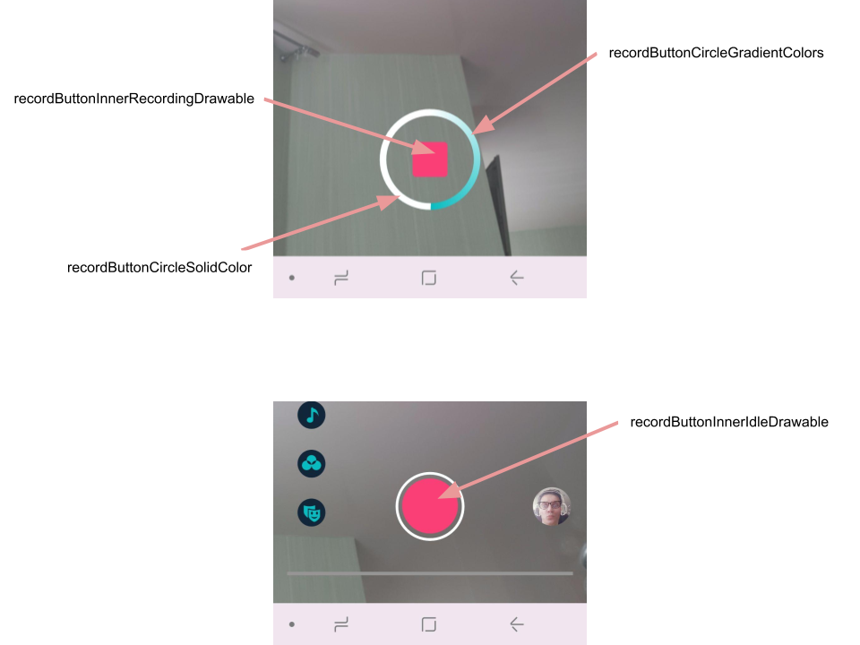
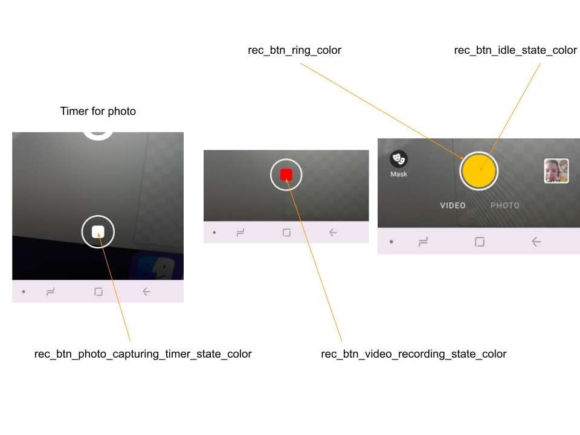
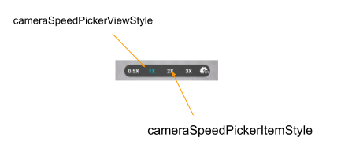

# Video recording integration guide

- [Quality details](#Quality-details)
- [Customize configurations](#Customize-configurations)
- [Configure microphone state](#Configure-microphone-state)
- [Configure recording modes](#Configure-recording-modes)
- [Configure timer](#Configure-timer)
- [Configure hands free](#Configure-hands-free)
- [Configure record button appearance](#Configure-record-button-appearance)
- [Picture in picture](#Picture-in-picture)
- [Configure camera screen appearance](#Configure-camera-screen-appearance)

## Quality details
Subsequent table describes video quality details used for video recording in various resolutions.  

| Recording speed | 360p(360 x 640) | 480p(480 x 854) | HD(720 x 1280) | FHD(1080 x 1920) |
| --------------- | --------------- | --------------- | -------------- | ---------------- |
| 1x(Default)     | 1200            | 2000            | 4000           | 6400             |
| 0.5x            | 900             | 1500            | 3000           | 4800             |
| 2x              | 1800            | 3000            | 6000           | 9600             |
| 3x              | 2400            | 4000            | 8000           | 12800            |

## Customize configurations
```CameraConfig``` is a main class used to customize features, behavior and user experience for video recording on camera screen i.e. set min/max recording duration, flashlight, etc.  
Video editor includes default implementation but you can provide your own implementation to meet your requirements in [VideoEditorModule](../app/src/main/java/com/banuba/example/integrationapp/VideoEditorModule.kt).  
For example, to sets max video recording duration to 30 seconds.
```kotlin
single(override = true) {
  CameraConfig(maxRecordedTotalVideoDurationMs = 30_000)
}
```

| Property |                                            Values                                            | Description |
| ------------- |:--------------------------------------------------------------------------------------------:| :------------- |
| minRecordedTotalVideoDurationMs |                                Number > 0; Default ```3000```                                | minimum video recording duration *in milliseconds* required to proceed and open video editing screen (i.e. 3000 for 3 seconds)
| maxRecordedTotalVideoDurationMs |                               Number > 0; Default ```120000```                               | maximum video recording duration *in milliseconds* available to record
| minRecordedChunkVideoDurationMs |                              Number > 1000; Default ```1000```                               | minimum video recording duration *in milliseconds* that is allowed to record on camera
| takePhotoOnTap |                               true/false; Default ```false```                                | defines if it is available to take a photo on the camera screen by tap. ```true``` photo is taken by tap and video is recording by long press.
| supportsMultiRecords |                                true/false; Default ```true```                                | defines if the use can record multiple video subsequently. ```false```  when the first video recording is done the editing screen will be opened
| supportsFlashlight |                                true/false; Default ```true```                                | enables flashlight icon on the camera screen and possibility to take a photo with flashlight
| supportsSpeedRecording |                                true/false; Default ```true```                                | enables speed recording icon on the camera screen and possibility to select recording speed
| supportsExternalMusic |                                true/false; Default ```true```                                | enables the music icon on the camera screen and possibility to add music track playing over the video recording
| supportsMuteMic |                                true/false; Default ```true```                                | enables mute microphone icon on the camera screen and possibility to record video without capturing sound
| switchFacingOnDoubleTap |                                true/false; Default ```true```                                | ```true``` allows to switch between front and back camera by double tap
| isStartFrontFacingFirst |                                true/false; Default ```true```                                | ```true``` means that ```front``` camera facing is used on the first launch of the camera screen, ```false``` means that ```back``` camera facing is used on the first launch of the camera screen
| isSaveLastCameraFacing |                                true/false; Default ```true```                                | defines if the camera facing (```back``` or ```front```) is saved and restored
| cameraFpsMode |                 CameraFpsMode enum values; Default ```CameraFpsMode.FIXED```                 | ```CameraFpsMode.FIXED``` means that video recording quality can be degraded to maintain 30 FPS while applying "heavy" Face AR effects (*This behavior is recommended* and allows to reach seamless usage on wide range of devices). ```CameraFpsMode.ADAPTIVE``` means that FPS can be reduced in order to maintain video quality(not recommended).
| showCameraInfoAndPerformance |                               true/false; Default ```false```                                | enables debug views for showing camera system details such as current FPS, Iso etc.
| supportsSwitchFacing |                                true/false; Default ```true```                                | defines if camera facing switching is available.
| supportsAudioRateEqualsVideoSpeed |                               true/false; Default ```false```                                | determines if the audio playback speed is equal to the video recording speed.
| supportsGallery |                                true/false; Default ```true```                                | defines if there is an icon on the camera screen at the bottom-right to pick a content from gallery.
| videoDurations | List<Long>; Default ```listOf(maxRecordedTotalVideoDurationMs, 60_000L, 30_000L, 15_000L)``` | defines the list of durations available to record. The user can see the option on the camera screen and pick new option. For example,  ```60000L``` means that the user can record a number of video with total duration no more than 60 seconds.
| supportsVideoDurationSwitcher | true/false; Default ```true```  | defines if video recording time interval swithced is enabled


## Configure microphone state
Use ```CameraMuteMicConfig``` if you want to customize default state of microphone on the camera screen.
Here is default implementation in [VideoEditorModule](../app/src/main/java/com/banuba/example/integrationapp/VideoEditorModule.kt)
```kotlin
factory {
    CameraMuteMicConfig(
        // If mic should be muted when open camera screen in normal mode
        muteInNormalMode = false,
        // If mic should be muted when open camera screen in picture in picture mode
        muteInPipMode = true,
        // If mic should be muted when open camera screen with passed audio track
        muteWithAudioTrack = true 
    )
}
```

## Configure recording modes
Camera screen includes 3 modes for recording content implemented as ```RecordMode```
- ```Photo```
- ```Video```
- ```Photo``` and ```Video```;**Default**

Implement ```CameraRecordingModesProvider``` in [VideoEditorModule](../app/src/main/java/com/banuba/example/integrationapp/VideoEditorModule.kt) to customize mode that meets your requirements.
Default implementation is
```kotlin
single<CameraRecordingModesProvider> {
    object : CameraRecordingModesProvider {
        override var availableModes = setOf(RecordMode.Video, RecordMode.Photo)
    }
}
```
:exclamation: Important     
```availableModes``` must not be empty, otherwise a crash will happen.

## Configure timer
This feature allows to take a picture or record a video after some delay.  
Implement ```CameraTimerStateProvider``` to customize timer feature in [VideoEditorModule](../app/src/main/java/com/banuba/example/integrationapp/VideoEditorModule.kt#L291) where every delay is a ```TimerEntry```.
Subsequent example shows how to add timer with 2 options - 0 seconds and 3 seconds.
```kotlin
class CustomCameraTimerStateProvider : CameraTimerStateProvider {

  override val timerStates = listOf(
    TimerEntry(
      durationMs = 0
    ),
    TimerEntry(
      durationMs = 3000
    )
  )
}
```

Video Editor includes more advanced timer feature which is called [Hands Free](#Configure-hands-free).

## Configure hands free
Hands Free is an advanced timer feature that allows to set up delay before starting of video recording and desired duration for video recording. The feature is enabled by default.  
The feature uses ```CameraTimerStateProvider``` implementation to provide list of delays, and ```CameraTimerAnimationProvider``` for countdown animation.
Every ```TimerEntry``` instance of ```CameraTimerStateProvider``` is passed as an argument into ```animate()``` method of ```CameraTimerAnimationProvider```.  

Video Editor includes ```DefaultCameraTimerAnimationProvider``` with 10 seconds timer animation. If you want either more than 10 seconds timer or another animation you can implement ```CameraTimerAnimationProvider```.  

To disable hands free feature you should remove `HandsFreeTimerActionProvider` implementation in [VideoEditorModule](../app/src/main/java/com/banuba/example/integrationapp/VideoEditorModule.kt#L137).
```diff
-    single<CameraTimerActionProvider> {
-       HandsFreeTimerActionProvider()
-    }
```
```B2BTimerStateProvider``` implementation with of 3, 5, and 10 seconds will be used once you disable hands free feature.


Hands free feature can be customized with a number of [Android styles](../app/src/main/res/values/themes.xml#L1275)

- ```handsFreeBottomSheetStyle``` - style for the background of Hands Free feature
- ```handsFreeTimerPickerStyle``` - style for the parent view containing timer options
- ```handsFreeTimerItemStyle``` - style for every item within timer options container
- ```handsFreeTimelineHintStyle``` - style for the timeline hint
- ```handsFreeTimelineRangeDurationStyle``` - style for the time labels that define min and max available video duration
- ```handsFreeTimelineCurrentDurationStyle``` - style for the time label that define the video recording duration recently configured
- ```handsFreeTimelineStyle``` - style for the timeline view that is used to configure video recording duration
- ```handsFreeRecordButtonStyle``` - style for the button that starts video recording

<p align="center">

</p>
Available string resources to customize.

| ResourceId        |      Value      |   Description |
| ------------- | :----------- | :------------- |
| hands_free_timeline_hint | Drag to set video duration: | text of the timeline hint
| hands_free_record_button_text | start recording | label of the recording button


## Configure record button appearance
Use [RecordButtonStyle](../app/src/main/res/values/themes.xml#L1357) to customize appearance of content recording button

- ```recordButtonRecordingSize``` - size of recording button
- ```recordButtonInnerIdleDrawable``` - drawable inside record button shown during idle state
- ```recordButtonInnerRecordingDrawable``` - drawable inside record button shown during recording
- ```recordButtonElevation``` - elevation of the record button
- ```recordButtonInnerRecordingSize``` - size of the drawable shown during recording
- ```recordButtonCircleIdleWidth``` - width of the record button circle during idle state
- ```recordButtonCircleRecordingWidth``` - width of the record button circle during recording
- ```recordButtonCircleGradientColors``` - array for the gradient colors that fill the record button circle during recording
- ```recordButtonCircleSolidColor``` - color of the record button circle
- ```recordButtonAnimationPhotoScale``` - array with two integers where the first is an initial scale and the second is a final scale during animation (these values should be multiplier of 1000: for example, for 1.0 use 1000)
- ```recordButtonAnimationVideoInnerScale``` - array with two integers where the first is an initial scale of the inner drawable of record button and the second is a final scale during animation (these values should be multiplier of 1000: for example, for 1.0 use 1000)
- ```recordButtonAnimationVideoOuterScale``` - array with two integers where the first is an initial scale of the outer circle of record button and the second is a final scale during animation (these values should be multiplier of 1000: for example, for 1.0 use 1000)
- ```recordButtonAnimationDuration``` - duration for all animations of the record button
<p align="center">

</p>

You can customize color resources as well 
```xml
<resources>
    ...
    <color name="rec_btn_idle_state_color">#FFCA00</color>
    <color name="rec_btn_video_recording_state_color">#FD0005</color>
    <color name="rec_btn_photo_capturing_timer_state_color">#FFFFFF</color>
    <color name="rec_btn_ring_color">#FFFFFF</color>
</resources>
```
<p align="center">

</p>

## Picture in picture
Picture in Picture or ```PIP``` is video editing technique that lets you overlay two videos in the same video.
The multi-layer editing effect is perfect for reaction videos, slideshows, product demos, and more. This feature is similar to TikTok duet feature.  

<p align="center">

</p>

:exclamation: Important
The feature is disabled by default and can be enabled if the license supports it. Please ask Banuba business representatives to include the feature in your license.  

The subsequent guide explains how to start and customize ```PIP```.  

First, pass ```pictureInPictureConfig``` in [VideoCreationActivity.startFromCamera](../app/src/main/java/com/banuba/example/integrationapp/MainActivity.kt#L31) method

```kotlin
val localVideoUri = ...
VideoCreationActivity.startFromCamera(
    context = this,
    // set PiP video configuration
    pictureInPictureConfig = PipConfig(
        video = localVideoUri,
        openPipSettings = false // if you want to open pip settings at startup
    )
)
```

```PIP``` includes 4 modes that you can use.
- ```Floating```
- ```TopBottom```
- ```React```
- ```LeftRight```

Implement ```PipLayoutProvider``` in [VideoEditorModule](../app/src/main/java/com/banuba/example/integrationapp/VideoEditorModule.kt) to customize the order of modes and other capabilities. 
```kotlin
single<PipLayoutProvider> {
    object : PipLayoutProvider {
        override fun provide(
            insetsOffset: Int,
            screenSize: Size
        ): List<EditorPipLayoutSettings> {
            val context = androidContext()
            return listOf(
                EditorPipLayoutSettings.Floating(
                    context = context,
                    physicalScreenSize = screenSize,
                    topOffsetPx = context.dimen(R.dimen.pip_floating_top_offset) + insetsOffset
                ),
                EditorPipLayoutSettings.TopBottom(),
                EditorPipLayoutSettings.React(
                    context = context,
                    physicalScreenSize = screenSize,
                    topOffsetPx = context.dimen(R.dimen.pip_react_top_offset) + insetsOffset
                ),
                EditorPipLayoutSettings.LeftRight()
            )
        }
    }
}
```
Please do not forget to update [CameraMuteMicConfig](#Configure-microphone-state) implementation if you want to change use of microphone in ```PIP```.  

You can even customize camera align for each mode and exclude actions for some modes:
```diff
...
    return listOf(
        EditorPipLayoutSettings.Floating(
            ...,
            excludeActions = listOf(
                EditorPipLayoutAction.SwitchVertical,
                EditorPipLayoutAction.Square,
                EditorPipLayoutAction.Round
            ),
+            isCameraAlignTop = false
        ),
        EditorPipLayoutSettings.TopBottom(
            excludeActions = listOf(
                EditorPipLayoutAction.SwitchVertical,
                EditorPipLayoutAction.Original,
                EditorPipLayoutAction.Centered
            ),
+            isCameraAlignTop = false
        ),
        EditorPipLayoutSettings.React(
            ...,
            excludeActions = listOf(
                EditorPipLayoutAction.SwitchVertical,
                EditorPipLayoutAction.Square,
                EditorPipLayoutAction.Round,
                EditorPipLayoutAction.Centered,
                EditorPipLayoutAction.Original
            ),
            isCameraMain = false
        ),
        EditorPipLayoutSettings.LeftRight(
            excludeActions = listOf(
                EditorPipLayoutAction.SwitchHorizontal,
                EditorPipLayoutAction.Original,
                EditorPipLayoutAction.Centered
            ),
+            isCameraAlignLeft = false
        )
    )
```


## Configure camera screen appearance
There are a number of Android styles and other resources you can use to customize camera screen.  

- [cameraOverlayStyle](../app/src/main/res/values/themes.xml#L24)  
  allows to **setup action button icons**, customize relative position and appearance of music, gallery, switch camera icons. Icons drawables customized by using custom attributes of this style (for instance, [icon_mask_on](../app/src/main/res/values/themes.xml#L470) and [icon_mask_off](../app/src/main/res/values/themes.xml#L471) setup drawables for icons related to applied AR mask effect)

- [cameraActionButtonStyle](../app/src/main/res/values/themes.xml#L25)  
  defines action buttons appearance

- [cameraBackButtonStyle](../app/src/main/res/values/themes.xml#L27)  
  defines "back" button appearance

- [cameraNextButtonStyle](../app/src/main/res/values/themes.xml#L28)
  defines "next" button appearance

- [cameraRemoveLastPieceButtonStyle](../app/src/main/res/values/themes.xml#L29)
  defines an appearance of the button that is used to delete the last recorded video chunk from the timeline

- [cameraRecorderTimelineStyle](../app/src/main/res/values/themes.xml#L31)  
  allows to customize the timeline

<p align="center">

</p>

To customize music icon on the top of the screen use the following approach
<p align="center">

</p>

- setup [cameraMusicTopIconStyle](../app/src/main/res/values/themes.xml#L26) - defines appearance of music icon in case it is placed on the top of the camera screen (if the music icon is placed on the left side the cameraActionButtonStyle is applied to it, so this attribute can be omitted). **subtitleAvailable** attribute is responsible for displaying of soundtrack name in two lines. There are two possible values for this attribute:
    - ```true``` - soundtrack name and artist display in **two** lines
    - ```false``` - soundtrack name and artist display in **one** lines
- use ```top``` in [icon_music_screen_position](../app/src/main/res/values/themes.xml#L483)  


- [cameraEffectsLabelStyle](../app/src/main/res/values/themes.xml#L32)
  defines the label which appears at the top of the visual effects menu (color filters and AR masks). By default the label is not visible and this style can be omitted

- [cameraEffectsItemStyle](../app/src/main/res/values/themes.xml#L33)
  applies to every item within visual effects list

- [cameraEffectsRecyclerStyle](../app/src/main/res/values/themes.xml#L34)
  applies to RecyclerView containing visual effects list

- [cameraSpeedPickerViewStyle](../app/src/main/res/values/themes.xml#L36)  
  applies to custom recording speed options container

- [cameraSpeedPickerItemStyle](../app/src/main/res/values/themes.xml#L37)  
  applies to TextView representing every recording speed option within container 

- [checkableEffectTitleStyle](../app/src/main/res/values/themes.xml#L39)  
  is used to set text appearance of "checkable" effects (applied/removed by selection) title. This type of effects includes:
  - color filters on camera screen
  - AR masks on camera screen
  - color filters on editor screen

  The other effects type - "actionable" - defined in [editor styles](editor_styles.md#L57)

<p align="center">

</p>

<p align="center">

</p>


3 groups of string resources are available for customizations
1. All available ```CameraActionButtonStyle```. You can adjust the size, color, font, margins, shadow, ellipsize(truncate at marquee) and position of the title text, overriding the attributes below in [CameraActionButtonStyle](../app/src/main/res/values/themes.xml#L544).
```xml
<style name="CustomCameraActionButtonStyle" parent="CameraActionButtonStyle">
    <item name="description">Custom Title</item> <!--title text value-->
    <item name="descriptionSize">14sp</item><!--title text size-->
    <item name="descriptionColor">color/white</item><!--title text color-->
    <item name="descriptionMarginStart">4dp</item><!--title text margin start-->
    <item name="descriptionMarginEnd">4dp</item><!--title text margin end-->
    <item name="descriptionTypeface">@font/roboto</item><!--title text typeface-->
    <item name="descriptionPosition">[left|bottom|right|none]</item><!--title text position-->
    <item name="descriptionApplyShadow">[true|false]</item> <!--title text shadow state-->
    <item name="descriptionApplyMarquee">[true|false]</item> <!--title text ellipsize truncate at marquee state-->
</style>
```

2. ```Notification``` displayed as [Toast](https://developer.android.com/reference/android/widget/Toast) is shown at the top of the screen upon some actions.
     Some of them has a dynamic message that depends on additional data (i.e. parameters from config files)

3. Bottom view with ```AR masks and color filters``` may have a label (its visibility is configured in [checkableEffectTitleStyle](../app/src/main/res/values/themes.xml#L39)

Groups described above are shown on the screenshot along with some string resources:
<p align="center">

</p>

| ResourceId        |      Value      |   Description |
| ------------- | :----------- | :------------- |
| control_description_switch | Flip | title for the icon to switch camera facing
| control_description_flashlight |  Flash | title for the icon to switch flashlight
| control_description_timer | Timer | title for the timer icon
| control_description_speed | Speed | title for the icon to switch recording speed
| control_description_mute | Mute | title for the icon to switch mic recording
| control_description_beauty | Beauty | title for the icon to apply beautification effect
| control_description_music | Music | title for the icon to request an [audio content](advanced_integration.md#configure-audio-content)
| control_description_color | Filter | title for the icon to open color filters
| control_description_mask | Mask | title for the icon to open AR masks
| message_record_first_video | Record at least %1$s | message shown in case user tries to proceed with the video shorter than ```minVideoDuration``` parameter in ```CameraConfig```
| message_record_video_duration | {0,choice,0#{0} second\|1#{0} seconds\|2#{0} seconds\|3#{0} seconds\|4#{0} seconds\|4&lt;{0} seconds} | special string that defines the string value of the placeholder from ```message_record_first_video``` string (i.e. "1 second" or "3 seconds").  In this string only the selected words should be translated: {0,choice,0#{0} **second**\|1#{0} **seconds**\|2#{0} **seconds**\|3#{0} **seconds**\|4#{0} **seconds**\|4&lt;{0} **seconds**}. Other formatting should remain the same for every locale
| err_no_space_left | Not enough disk space | message widely used in Video Editor SDK and informing that there is not space to effort further operations
| err_no_time_left | Max video length %1$.1f sec | message shown in case of user tries to record video longer than the ```maxVideoDuration``` parameter in ```CameraConfig```
| err_no_space_left_recording | Running out of disk space. Recording is canceled. | message shown in case the phone is running out of space during video recording
| label_camera_effects_luts | Filter | label at the top of the color filters list (visibility of the label is configured in [cameraEffectsLabelStyle](../app/src/main/res/values/themes.xml#L25))
| label_camera_effects_mask | Mask | label at the top of the AR masks list (visibility of the label is configured in [cameraEffectsLabelStyle](../app/src/main/res/values/themes.xml#L25))
| camera_next | Next | text on the button that goes on the editor screen

:exclamation: Important  
In case if a ```TextView``` that is shown on camera screen does not have string resource mentioned in the table it means you may use any resource and apply it through view's style configuration.
All alert messages shown on the camera screen that require user's action are described in [Alert dialogs](guide_popus.md) guide.

