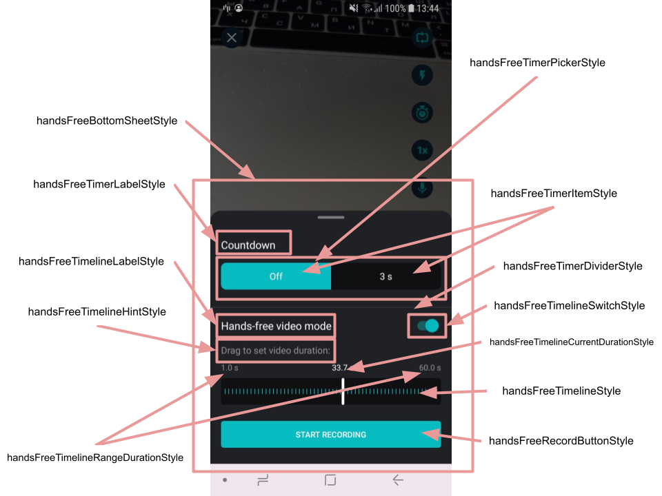

# Hands-Free integration

## Overview

Hands-Free is an advanced timer feature.

It allows to setup not only delay before start recording but also desired duration of the video.

Hands-Free feature uses `CameraTimeStateProvider` implementation for available delays, `CameraTimerAnimationProvider` for countdown animation and `CameraTimerActionProvider` as Hands-Free behavior itself. 

Every chosen delay (`TimerEntry` object) from `CameraTimerStateProvider` passed as an argument into `animate()` method of `CameraTimerAnimationProvider`. 

**Note**: We provide `DefaultTimerAnimationProvider` with 10-seconds timer animation. If you need either more than 10-seconds timer or another animation view you need to implement your own `CameraTimerAnimationProvider`.

## Implementation

### Step 1
Override `CameraTimerActionProvider` implementation inside DI module:
```kotlin
override val cameraTimerActionProvider: BeanDefinition<CameraTimerActionProvider> =
        single(override = true) {
            HandsFreeTimerActionProvider()
        }
```

### Step 2
Customize Hands Free appearance by overriding default [styles](https://github.com/Banuba/ve-sdk-android-integration-sample/blob/1e37324dea76304e8e9205d463844ac5c8c199f7/app/src/main/res/values/themes.xml#L1119).

## Customization

Hands-Free is customized by [main theme attributes](https://github.com/Banuba/ve-sdk-android-integration-sample/blob/1e37324dea76304e8e9205d463844ac5c8c199f7/app/src/main/res/values/themes.xml#L347) like any other Video Editor SDK screens.

 - **handsFreeBottomSheetStyle** - style for the background of Hands Free feature
 - **handsFreeTimerLabelStyle** - style for the label of timer options
 - **handsFreeTimerPickerStyle** - style for the parent view containing timer options
 - **handsFreeTimerItemStyle** - style for every item within timer options container
 - **handsFreeTimerDividerStyle** - style for the divider that separates timer options and timeline settings
 - **handsFreeTimelineLabelStyle** - style for the label of timeline options
 - **handsFreeTimelineSwitchStyle** - style for the switcher that enables hands-free configurations
 - **handsFreeTimelineHintStyle** - style for the timeline hint
 - **handsFreeTimelineRangeDurationStyle** - style for the time labels that define min and max available video duration
 - **handsFreeTimelineCurrentDurationStyle** - style for the time label that define the video recording duration recently configured
 - **handsFreeTimelineStyle** - style for the timeline view that is used to configure video recording duration
 - **handsFreeRecordButtonStyle** - style for the button that starts video recording

 

## String resources

| ResourceId        |      Value      |   Description |
| ------------- | :----------- | :------------- |
| hands_free_timer_label | Countdown | label of timer options
| hands_free_timer_off | Off | text representing that the timer is off 
| hands_free_timeline_label | Hands-free video mode | label of timeline options
| hands_free_timeline_hint | Drag to set video duration: | text of the timeline hint
| hands_free_record_button_text | start recording | label of the recording button
