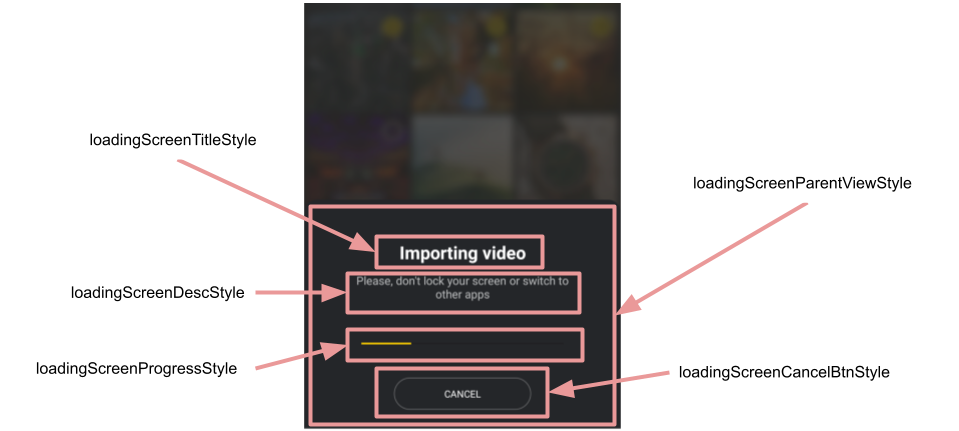

# Banuba AI Video Editor SDK
## Loading dialog styles

- [loadingScreenParentViewStyle](../app/src/main/res/values/themes.xml#L442)

    style for the root Constraint layout that represents loading dialog
- [loadingScreenTitleStyle](../app/src/main/res/values/themes.xml#L443)
    
    style for the loading dialog title
- [loadingScreenDescStyle](../app/src/main/res/values/themes.xml#L444)

    style for the loading dialog description
- [loadingScreenProgressStyle](../app/src/main/res/values/themes.xml#L445)

    style for the loading dialog progress
- [loadingScreenCancelBtnStyle](../app/src/main/res/values/themes.xml#L446)

    style for the loading dialog cancel button

    

## String resources

**Pay attention** that some strings on the loading dialog are defined in the styles. To localize these strings firstly create string resources and setup them into styles under `android:text` attribute.

| ResourceId        |      Value      |   Description |
| ------------- | :----------- | :------------- |
| editor_alert_import_failed | Content uploading failed | title of alert that is shown when the process of gallery resources import was failed
| editor_alert_import_failed_desc | | description of alert that is shown when the process of gallery resources import was failed
| editor_alert_import_failed_positive | Retry | positive button text of alert that is shown when the process of gallery resources import was failed
| editor_alert_import_failed_negative | Cancel | negative button text of alert that is shown when the process of gallery resources import was failed
| editor_alert_export_stopped | Do you want to interrupt the video export? | title of alert that is shown when the export process was stopped
| editor_alert_export_stopped_desc | | description of alert that is shown when the export process was stopped
| editor_alert_export_stopped_positive | Interrupt | positive button text of alert that is shown when the export process was stopped
| editor_alert_export_stopped_negative | Cancel | negative button text of alert that is shown when the export process was stopped
| editor_alert_export_interrupted | Export interrupted | title of alert that is shown when the process of export was interrupted
| editor_alert_export_interrupted_desc | | description of alert that is shown when the process of export was interrupted
| editor_alert_export_interrupted_positive | Retry | positive button text of alert that is shown when the process of export was interrupted
| editor_alert_export_interrupted_negative | Cancel | negative button description of alert that is shown when the process of export was interrupted
| loading_export_title | Exporting video | title of the exporting dialog
| loading_export_description | Please, don\'t lock your screen or switch to other apps | description of the exporting dialog
| loading_import_title | Importing video | title of the importing dialog
| loading_import_description | Please, don\'t lock your screen or switch to other apps | description of the importing dialog
