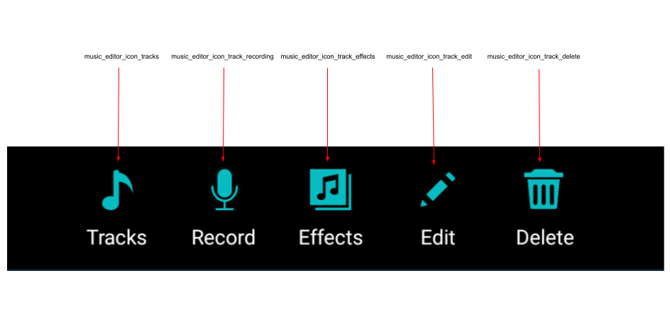
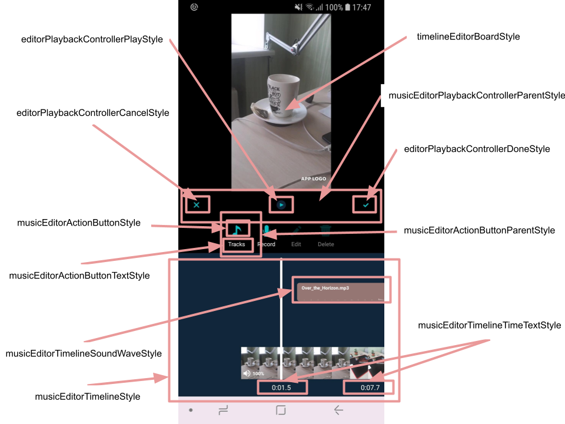
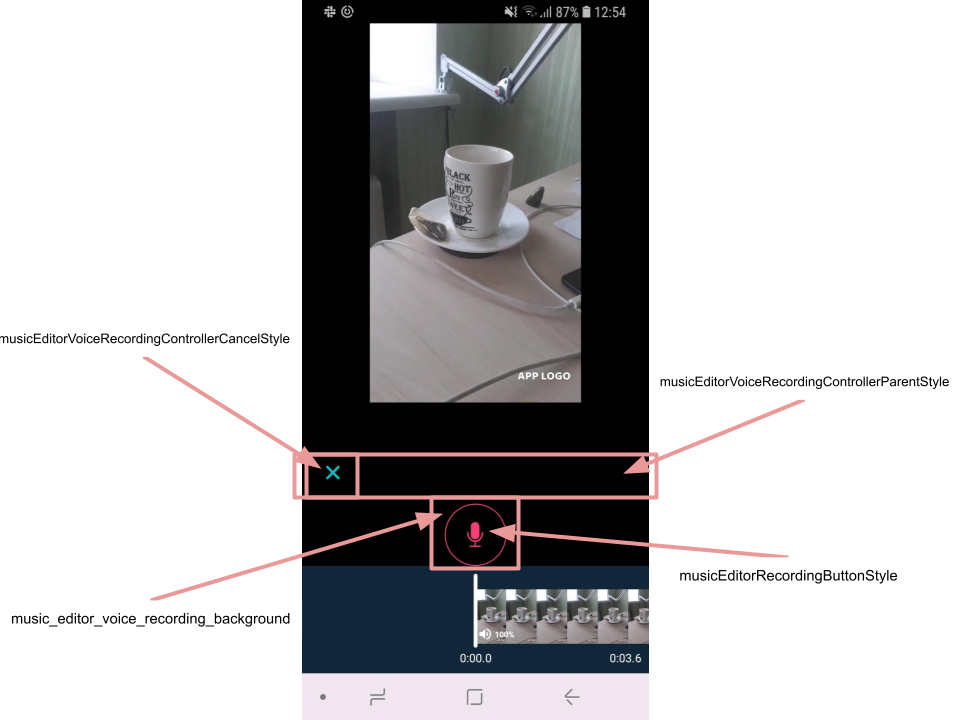
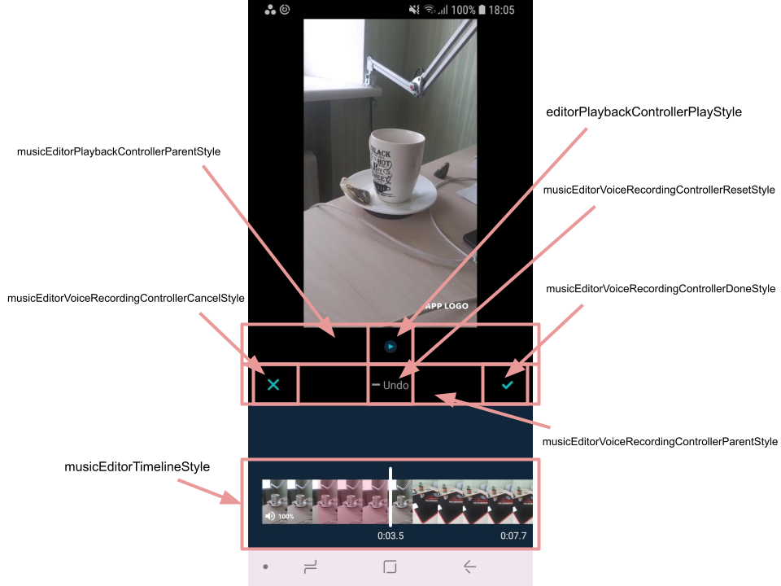
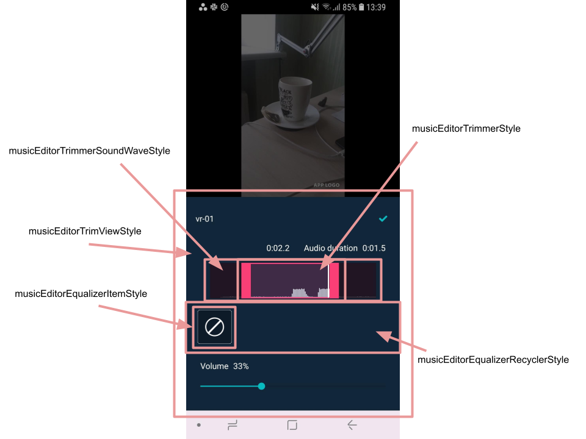
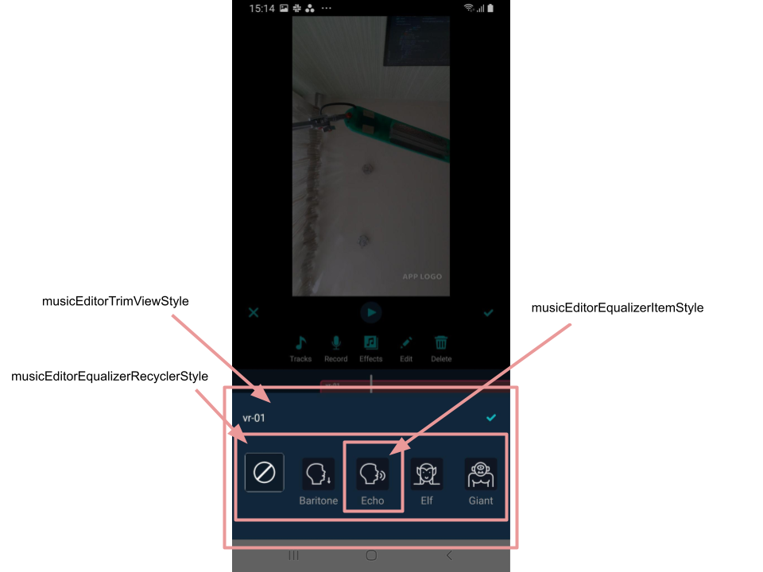

# Banuba AI Video Editor SDK
## Music Editor screen styles

- [musicEditorPlaybackControllerParentStyle](https://github.com/Banuba/ve-sdk-android-integration-sample/blob/1e37324dea76304e8e9205d463844ac5c8c199f7/app/src/main/res/values/themes.xml#L157)

    style for the parent of buttons defined in `editorPlaybackControllerCancelStyle`, `editorPlaybackControllerPlayStyle`, `editorPlaybackControllerDoneStyle` attributes. See buttons on the [Editor screen](editor_styles.md#L46) page

- [musicEditorTimelineStyle](https://github.com/Banuba/ve-sdk-android-integration-sample/blob/1e37324dea76304e8e9205d463844ac5c8c199f7/app/src/main/res/values/themes.xml#L160)

    style for the complex view that contains applied music tracks, video timeline, video volume button. It has a lot of custom attributes appliceable to children views

- [musicEditorTimelineTimeTextStyle](https://github.com/Banuba/ve-sdk-android-integration-sample/blob/1e37324dea76304e8e9205d463844ac5c8c199f7/app/src/main/res/values/themes.xml#L161)

    style for TextViews that represent current pointer's position and the whole video duration

- [musicEditorTimelineSoundWaveStyle](https://github.com/Banuba/ve-sdk-android-integration-sample/blob/1e37324dea76304e8e9205d463844ac5c8c199f7/app/src/main/res/values/themes.xml#L172)

    style for the view that represents added music effect on the timeline view. It configured with a lot of custom attributes

- [musicEditorActionButtonParentStyle](https://github.com/Banuba/ve-sdk-android-integration-sample/blob/1e37324dea76304e8e9205d463844ac5c8c199f7/app/src/main/res/values/themes.xml#L164)

    style for the ConstraintLayout that is used as container for every action button

- [musicEditorActionButtonStyle](https://github.com/Banuba/ve-sdk-android-integration-sample/blob/1e37324dea76304e8e9205d463844ac5c8c199f7/app/src/main/res/values/themes.xml#L167)

    style for the ImageView representing an icon for action button. Drawables for all action buttons in music editor are configured in custom theme attributes:
    - [music_editor_icon_tracks](https://github.com/Banuba/ve-sdk-android-integration-sample/blob/1e37324dea76304e8e9205d463844ac5c8c199f7/app/src/main/res/values/themes.xml#L227) - to open music track selection
    - [music_editor_icon_track_recording](https://github.com/Banuba/ve-sdk-android-integration-sample/blob/1e37324dea76304e8e9205d463844ac5c8c199f7/app/src/main/res/values/themes.xml#L229) - to show voice recording screen
    - [music_editor_icon_track_effects](https://github.com/Banuba/ve-sdk-android-integration-sample/blob/main/app/src/main/res/values/themes.xml#L234) - to open voice recording effects selection
    - [music_editor_icon_track_edit](https://github.com/Banuba/ve-sdk-android-integration-sample/blob/1e37324dea76304e8e9205d463844ac5c8c199f7/app/src/main/res/values/themes.xml#L230) - to open music trimmer for the selected music track
    - [music_editor_icon_track_delete](https://github.com/Banuba/ve-sdk-android-integration-sample/blob/1e37324dea76304e8e9205d463844ac5c8c199f7/app/src/main/res/values/themes.xml#L232) - to delete selected music track

- [musicEditorActionButtonTextStyle](https://github.com/Banuba/ve-sdk-android-integration-sample/blob/1e37324dea76304e8e9205d463844ac5c8c199f7/app/src/main/res/values/themes.xml#L168)

    style for action button title

- [timelineEditorBoardStyle](https://github.com/Banuba/ve-sdk-android-integration-sample/blob/1e37324dea76304e8e9205d463844ac5c8c199f7/app/src/main/res/values/themes.xml#L171)

    style for an invisible view that holds applied graphic effects. This view is similar to [editorBoardStyle](editor_styles.md#L86) and has several custom attributes to configure its behavior

- [musicEditorVideoVolumeContainerStyle](https://github.com/Banuba/ve-sdk-android-integration-sample/blob/1e37324dea76304e8e9205d463844ac5c8c199f7/app/src/main/res/values/themes.xml#L189)

    style for the bottom sheet view that is opened by tapping on left bottom icon of the video timeline to change video volume
- [musicEditorVideoVolumeTitleStyle](https://github.com/Banuba/ve-sdk-android-integration-sample/blob/1e37324dea76304e8e9205d463844ac5c8c199f7/app/src/main/res/values/themes.xml#L192)

    style for the title of the volume setting
- [musicEditorVideoVolumeValueStyle](https://github.com/Banuba/ve-sdk-android-integration-sample/blob/1e37324dea76304e8e9205d463844ac5c8c199f7/app/src/main/res/values/themes.xml#L195)

    style for the digit value of the video volume
- [musicEditorVideoVolumeProgressBarStyle](https://github.com/Banuba/ve-sdk-android-integration-sample/blob/1e37324dea76304e8e9205d463844ac5c8c199f7/app/src/main/res/values/themes.xml#L198)

    style for the seek bar that is used to change video volume

- [music_editor_voice_recording_background](https://github.com/Banuba/ve-sdk-android-integration-sample/blob/1e37324dea76304e8e9205d463844ac5c8c199f7/app/src/main/res/values/themes.xml#L222)

    attribute that defines the background of the voice recording button

- [musicEditorRecordingButtonStyle](https://github.com/Banuba/ve-sdk-android-integration-sample/blob/1e37324dea76304e8e9205d463844ac5c8c199f7/app/src/main/res/values/themes.xml#L202)

    style for the voice recording button. There are a lot of custom attributes to configure its appearance. Please check out an [**example**](https://github.com/Banuba/ve-sdk-android-integration-sample/blob/1e37324dea76304e8e9205d463844ac5c8c199f7/app/src/main/res/values/themes.xml#L910)

- [musicEditorVoiceRecordingControllerParentStyle](https://github.com/Banuba/ve-sdk-android-integration-sample/blob/1e37324dea76304e8e9205d463844ac5c8c199f7/app/src/main/res/values/themes.xml#L176)

    style for the view that holds action buttons to manipulate with voice recording on the music editor
- [musicEditorVoiceRecordingControllerCancelStyle](https://github.com/Banuba/ve-sdk-android-integration-sample/blob/1e37324dea76304e8e9205d463844ac5c8c199f7/app/src/main/res/values/themes.xml#L179)

    style for the button that closes voice recording screen returning back to the music editor
- [musicEditorVoiceRecordingControllerResetStyle](https://github.com/Banuba/ve-sdk-android-integration-sample/blob/1e37324dea76304e8e9205d463844ac5c8c199f7/app/src/main/res/values/themes.xml#L182)

    style for the button that removes the last voice recording
- [musicEditorVoiceRecordingControllerDoneStyle](https://github.com/Banuba/ve-sdk-android-integration-sample/blob/1e37324dea76304e8e9205d463844ac5c8c199f7/app/src/main/res/values/themes.xml#L185)

    style for the button that applies voice recordings to the common timeline and returns back to music editor

- [musicEditorTrimViewStyle](https://github.com/Banuba/ve-sdk-android-integration-sample/blob/1e37324dea76304e8e9205d463844ac5c8c199f7/app/src/main/res/values/themes.xml#L206)

    style for the view that is used to trim music effects and to apply voice effects. This style is applied to the bottom sheet dialog and all children views configuration are available through custom attributes 

- [musicEditorTrimmerStyle](https://github.com/Banuba/ve-sdk-android-integration-sample/blob/1e37324dea76304e8e9205d463844ac5c8c199f7/app/src/main/res/values/themes.xml#L207)

    style for the trim view. It has a bulk of custom attributes to cofigure colors and left/right drawables

- [musicEditorTrimmerSoundWaveStyle](https://github.com/Banuba/ve-sdk-android-integration-sample/blob/1e37324dea76304e8e9205d463844ac5c8c199f7/app/src/main/res/values/themes.xml#L208)

    style for the custom view laying behind the trimmer view. It is similar to [musicEditorTimelineSoundWaveStyle](music_editor_styles.md#L16) and has its own custom attributes as well

    

- [musicEditorEqualizerRecyclerStyle](https://github.com/Banuba/ve-sdk-android-integration-sample/blob/1e37324dea76304e8e9205d463844ac5c8c199f7/app/src/main/res/values/themes.xml#L212)

    style for the RecyclerView containing voice recording effects. This view is shown while applying effects over the voice recording

- [musicEditorEqualizerItemStyle](https://github.com/Banuba/ve-sdk-android-integration-sample/blob/1e37324dea76304e8e9205d463844ac5c8c199f7/app/src/main/res/values/themes.xml#L215)

    style for every item within voice recording effects. This style is applied to custom view and similar to [cameraEffectsItemStyle](camera_styles.md#L36)

- [musicEditorEqualizerThrobberStyle](https://github.com/Banuba/ve-sdk-android-integration-sample/blob/1e37324dea76304e8e9205d463844ac5c8c199f7/app/src/main/res/values/themes.xml#L216)

    style for the circle progress view that is shown over the voice effect item while this effect is being prepared (very short time after click on item and before the item become bigger, i.e. selected)

Music Editor screen also has some theme attributes that define background of some views:

- [music_editor_surface_background](https://github.com/Banuba/ve-sdk-android-integration-sample/blob/1e37324dea76304e8e9205d463844ac5c8c199f7/app/src/main/res/values/themes.xml#L221) - background of Surface view that shows the video
- [music_editor_timeline_background](https://github.com/Banuba/ve-sdk-android-integration-sample/blob/1e37324dea76304e8e9205d463844ac5c8c199f7/app/src/main/res/values/themes.xml#L223) - background of [timeline view](music_editor_styles.md#L8)
- [music_editor_playback_controller_bg](https://github.com/Banuba/ve-sdk-android-integration-sample/blob/1e37324dea76304e8e9205d463844ac5c8c199f7/app/src/main/res/values/themes.xml#L224) - background of control panel on music editor screen
- [music_editor_action_container_bg](https://github.com/Banuba/ve-sdk-android-integration-sample/blob/1e37324dea76304e8e9205d463844ac5c8c199f7/app/src/main/res/values/themes.xml#L225) - background of action buttons container

## String resources

| ResourceId        |      Value      |   Description |
| ------------- | :----------- | :------------- |
| action_add_music_track | Tracks | title of the button to add tracks on the timeline
| action_add_voice_recording | Record | title of the button to add voice recording to the timeline
| action_effects | Effects | title of the button to add voice effects on the voice recording
| action_edit | Edit | title of the button to edit music effect (or object effect if applies on the timeline screen)
| action_delete | Delete | title of the button to delete selected music effect (or object effect if applies on the timeline screen)
| edit_track_volume_title | Volume | text label shown together with the value when volume of the music effect and video change
| edit_track_volume_percent | %1$d%% | placeholder for the digit volume representation
| edit_track_audio_duration | Audio duration | label on the edit music effect screen
| edit_track_duration_error | Audio should be longer than %1$.1f sec | toast message that is shown when the user tries to cut music track smaller than `minVoiceRecordingMs` parameter of the [**music_editor.json**](https://github.com/Banuba/ve-sdk-android-integration-sample/blob/main/app/src/main/assets/music_editor.json) config file
| error_voice_recording_start | Error on voice recording start | toast message that is shown when the error occurs at the start of the voice recording
| error_voice_recording_stop | Error on voice recording stop | toast message that is shown when the error occurs in the end of the voice recording
| error_invalid_duration_voice_recording | Min voice recording duration - %1$.1f sec | toast message that is shown when the user tries to create voicerecording smaller than `minVoiceRecordingMs` parameter of the [**music_editor.json**](https://github.com/Banuba/ve-sdk-android-integration-sample/blob/main/app/src/main/assets/music_editor.json) config file
| error_invalid_duration_music_track | Min music track duration - %1$.1f sec | toast message that is shown when the user tries to cut the music track smaller than `minVoiceRecordingMs` parameter of the [**music_editor.json**](https://github.com/Banuba/ve-sdk-android-integration-sample/blob/main/app/src/main/assets/music_editor.json) config file
| error_voice_recording_delete_file | Internal error when try to delete voice recording file | toast message that is shown when the error occures during voice recording deletion
| error_track_limit | Max available tracks - %1$d | toast message that is shown when the user tries to add more music tracks than defined in `maxTracks` parameter of the [**music_editor.json**](https://github.com/Banuba/ve-sdk-android-integration-sample/blob/main/app/src/main/assets/music_editor.json) config file
| error_no_space | No space | toast message that is shown when the device is out of space before starting voive recording

