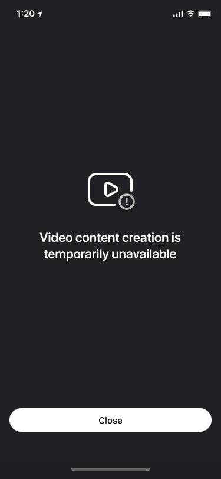

# Quickstart Integration Guide

## Concepts
- Export - the process of making video file in video editor.
- Slideshow - the feature that allows to create short video from single or multiple images.
- PIP - short Picture-in-Picture feature.
- Trimmer - a screen where the user can trim, merge, change aspects of videos
- Editor -  a screen where the user can manage effects and audio. The next screen after trimmer.

- [Installation](#installation)
- [Resources](#resources)
- [Configuration](#configuration)
- [Launch](#Launch)
- [Advanced integration](#Advanced-integration)

## Installation
GitHub Packages is used for downloading Android Video Editor SDK modules.

First, add repositories to [gradle](../build.gradle#L21) file in ```allprojects``` section.
```groovy
...

allprojects {
    repositories {
        ...

        maven {
            name = "GitHubPackages"
            url = uri("https://maven.pkg.github.com/Banuba/banuba-ve-sdk")
            credentials {
                username = "Banuba"
                password = "\u0038\u0036\u0032\u0037\u0063\u0035\u0031\u0030\u0033\u0034\u0032\u0063\u0061\u0033\u0065\u0061\u0031\u0032\u0034\u0064\u0065\u0066\u0039\u0062\u0034\u0030\u0063\u0063\u0037\u0039\u0038\u0063\u0038\u0038\u0066\u0034\u0031\u0032\u0061\u0038"
            }
        }
        maven {
            name = "ARCloudPackages"
            url = uri("https://maven.pkg.github.com/Banuba/banuba-ar")
            credentials {
                username = "Banuba"
                password = "\u0038\u0036\u0032\u0037\u0063\u0035\u0031\u0030\u0033\u0034\u0032\u0063\u0061\u0033\u0065\u0061\u0031\u0032\u0034\u0064\u0065\u0066\u0039\u0062\u0034\u0030\u0063\u0063\u0037\u0039\u0038\u0063\u0038\u0038\u0066\u0034\u0031\u0032\u0061\u0038"
            }
        }
       maven {
          name "GitHubPackagesEffectPlayer"
          url "https://maven.pkg.github.com/sdk-banuba/banuba-sdk-android"
          credentials {
             username = "sdk-banuba"
             password = "\u0067\u0068\u0070\u005f\u0033\u0057\u006a\u0059\u004a\u0067\u0071\u0054\u0058\u0058\u0068\u0074\u0051\u0033\u0075\u0038\u0051\u0046\u0036\u005a\u0067\u004f\u0041\u0053\u0064\u0046\u0032\u0045\u0046\u006a\u0030\u0036\u006d\u006e\u004a\u004a"
          }
       }

        ...
    }
}
```

Next, specify a list of dependencies in [gradle](../app/build.gradle#L63) file.

```groovy
    def banubaSdkVersion = '1.36.4'

    implementation "com.banuba.sdk:ffmpeg:5.1.3"
    implementation "com.banuba.sdk:camera-sdk:${banubaSdkVersion}"
    implementation "com.banuba.sdk:camera-ui-sdk:${banubaSdkVersion}"
    implementation "com.banuba.sdk:core-sdk:${banubaSdkVersion}"
    implementation "com.banuba.sdk:core-ui-sdk:${banubaSdkVersion}"
    implementation "com.banuba.sdk:ve-flow-sdk:${banubaSdkVersion}"
    implementation "com.banuba.sdk:ve-timeline-sdk:${banubaSdkVersion}"
    implementation "com.banuba.sdk:ve-sdk:${banubaSdkVersion}"
    implementation "com.banuba.sdk:ve-ui-sdk:${banubaSdkVersion}"
    implementation "com.banuba.sdk:ve-gallery-sdk:${banubaSdkVersion}"
    implementation "com.banuba.sdk:ve-effects-sdk:${banubaSdkVersion}"
    implementation "com.banuba.sdk:effect-player-adapter:${banubaSdkVersion}"
    implementation "com.banuba.sdk:ar-cloud:${banubaSdkVersion}"
    implementation "com.banuba.sdk:ve-audio-browser-sdk:${banubaSdkVersion}"
    implementation "com.banuba.sdk:ve-export-sdk:${banubaSdkVersion}"
    implementation "com.banuba.sdk:ve-playback-sdk:${banubaSdkVersion}"

```

Additionally, make sure the following plugins are in your app [gradle](../app/build.gradle#L1) file.
```groovy
    apply plugin: 'com.android.application'
    apply plugin: 'kotlin-android'
    apply plugin: 'kotlin-parcelize'
```

## Resources
Video Editor SDK uses a lot of resources required for running in the app.  
Please make sure all these resources exist in your project.

1. [bnb-resources](../app/src/main/assets/bnb-resources)  Banuba AR and color filters. AR effects ```assets/bnb-resources/effects``` requires [Face AR](https://docs.banuba.com/face-ar-sdk-v1) product.

2. [drawable-xhdpi](../app/src/main/res/drawable-xhdpi),
   [drawable-xxhdpi](../app/src/main/res/drawable-xxhdpi),
   [drawable-xxxhdpi](../app/src/main/res/drawable-xxxhdpi) are visual assets for color filter previews.

3. [themes.xml](../app/src/main/res/values/themes.xml) includes implementation of ```VideoCreationTheme``` of Video Editor SDK.

## Configuration
Add ```VideoCreationActivity``` in [AndroidManifest.xml](../app/src/main/AndroidManifest.xml#L27) files.  
``` xml
<activity android:name="com.banuba.sdk.ve.flow.VideoCreationActivity"
    android:screenOrientation="portrait"
    android:theme="@style/CustomIntegrationAppTheme"
    android:windowSoftInputMode="adjustResize"
    tools:replace="android:theme" />
```  

```VideoCreationActivity``` is used for brining together and managing a number of Video Editor screens in a certain flow.   
Each screen is implemented as a Android [Fragment](https://developer.android.com/guide/fragments). 

Next, allow Network by adding permissions
```xml
<uses-permission android:name="android.permission.ACCESS_NETWORK_STATE" />
<uses-permission android:name="android.permission.INTERNET" />
```
Network is used for downloading AR effects from AR Cloud and stickers from [Giphy](https://giphy.com/).

Custom implementation of ```VideoCreationTheme``` is required for running ```VideoCreationActivity``` for customizing visual appearance of Video Editor SDK i.e. colors, icons and more.  
[See example](../app/src/main/res/values/themes.xml#L13).

Create new Kotlin class [VideoEditorModule](../app/src/main/java/com/banuba/example/integrationapp/VideoEditorModule.kt) in your project
for initializing and customizing Video Editor SDK features.

Next, add new class [SampleIntegrationKoinModule](../app/src/main/java/com/banuba/example/integrationapp/VideoEditorModule.kt#L51)  for customizing Video Editor SDK features. 
``` kotlin
class VideoEditorModule {
   ...
   private class SampleIntegrationKoinModule {
      val module = module {
         ...
      }
   } 
}
```

Next, add method to initialize Video Editor SDK modules and add ```SampleIntegrationKoinModule``` to the list of modules.
``` diff
fun initialize(applicationContext: Context) {
        startKoin {
            androidContext(applicationContext)
            allowOverride(true)

            // pass the customized Koin module that implements required dependencies. Keep order of modules
            modules(
                VeSdkKoinModule().module,
                VeExportKoinModule().module,
                VePlaybackSdkKoinModule().module,
                AudioBrowserKoinModule().module, // use this module only if you bought it
                ArCloudKoinModule().module,
                VeUiSdkKoinModule().module,
                VeFlowKoinModule().module,
                GalleryKoinModule().module,
                BanubaEffectPlayerKoinModule().module,
                
+                SampleIntegrationKoinModule().module,
            )
        }
    }
```

## Launch

Initialize ```VideoEditorModule```  in [Application](../app/src/main/java/com/banuba/example/integrationapp/SampleApp.kt#L42).
``` kotlin
override fun onCreate() {
        super.onCreate()
        VideoEditorModule().initialize(this)
        
        ...
    }
```

Next, create instance of ```BanubaVideoEditor```  by using the license token
``` kotlin
val videoEditorSDK = BanubaVideoEditor.initialize(LICENSE_TOKEN)
```

:exclamation: Important
1. Instance ```videoEditorSDK``` is ```null``` if the license token is incorrect. In this case you cannot use photo editor. Check your license token.
2. It is highly recommended to [check](../app/src/main/java/com/banuba/example/integrationapp/MainActivity.kt#L104) if the license is active before starting Photo Editor.


:exclamation: Video content unavailable screen will appear if you start Video Editor SDK with revoked or expired license.  
<p align="center">

</p>
   
Video Editor supports multiple launch methods described in [this guide](advanced_integration.md#Launch-methods).

The following [implementation](../app/src/main/java/com/banuba/example/integrationapp/MainActivity.kt#L18) starts Video Editor from camera screen.
```kotlin
 val createVideoRequest =
    registerForActivityResult(IntegrationAppExportVideoContract()) { exportResult ->
        exportResult?.let {
            //handle ExportResult object
        }
    }

val intent = VideoCreationActivity.startFromCamera(
    context = this,
    // set PiP video configuration
    pictureInPictureConfig = null,
    // setup what kind of action you want to do with VideoCreationActivity
    // setup data that will be acceptable during export flow
    additionalExportData = null,
    // set TrackData object if you open VideoCreationActivity with preselected music track
    audioTrackData = null
)
createVideoRequest.launch(intent)
```

## Advanced integration
Video editor has built in UI/UX experience and provides a number of customizations you can use to meet your requirements.

**AVAILABLE**  
:white_check_mark: Use your branded icons  
:white_check_mark: Use you branded colors  
:white_check_mark: Change text styles i.e. font, color  
:white_check_mark: Localize and change text resources. Default locale is :us:  
:white_check_mark: Make content you want i.e. a number of video with different resolutions  and durations, an audio file. [See details](advanced_integration.md#Configure-export-flow)  
:white_check_mark: Masks and filters order.

NOT AVAILABLE  
:x: Change layout  
:x: Change order of screens after entry point

Visit [Advanced integration guide](advanced_integration.md) to know more about features and customizations.


