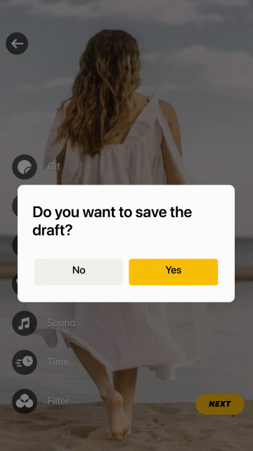
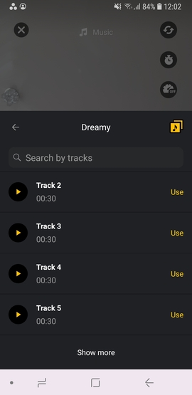

# 1.0.17

*Released on July 13, 2021*

This release requires prior migration to **1.0.16.3**

## List of changes

1. Save undone editing progress to **Drafts**. Continue making cool videos anytime!

    <p align="center">
       &nbsp;
       </p>

2. New Picture in Picture modes: React, Landscape, Portrait:

    <p align="center">
       &nbsp;
       </p>

3. There is an option to get **GIF image as a preview** of exported video. Checkout our [guide](https://github.com/Banuba/ve-sdk-android-integration-sample/blob/main/mddocs/faq.md#12-how-to-obtain-gif-preview-image-of-exported-video) inside FAQ section.
4. You can configure **muting microphone behavior** on camera screen for some scenarios.
5. The SDK now collects **few more data:** start of the video editor and exported video metadata. 
6. Bugfixes:
    - Fix crash when no selected files returned from external gallery
    - Fix bug with unsaved position on audio browser when an app returns from the background
    - Fix bug with failed Giphy response on stickers loading

## Migration guide

### Checkout an [example of migration to 1.0.17](https://github.com/Banuba/ve-sdk-android-integration-sample/pull/110) version in our sample.

1. **AudioBrowser** has **Show more** button. It allows to load more tracks inside audio browser.

    

    This feature is provided with new styles:

    ```diff
    + audioBrowserTrackLoadMoreStyle
    + audioBrowserTrackLoadMoreItemStyle
    + audioBrowserThrobberViewStyle
    ```

    and string resource (for localization):

    ```kotlin
    audio_browser_load_more
    ```

    To customize its appearance just override default styles as below (вставить существующие ссылки):

    ```kotlin
    <style name="CustomAudioBrowserTrackLoadMoreItemStyle" parent="AudioBrowserTrackLoadMoreItemStyle" />

    <style name="CustomAudioBrowserTrackLoadMoreStyle" parent="AudioBrowserTrackLoadMoreStyle" />

    <style name="CustomAudioBrowserThrobberViewStyle" parent="ThrobberViewStyle"/>
    ```

2. New **Drafts** screen is available from the gallery screen, here is the [guide](https://github.com/Banuba/ve-sdk-android-integration-sample/blob/main/mddocs/gallery_styles.md#drafts) on how to customize the gallery and drafts screens.
3. Since the Drafts feature was implemented there are some changes in [confirmation alerts](https://github.com/Banuba/ve-sdk-android-integration-sample/blob/main/mddocs/alert_styles.md#confirmation-alert). We **removed** following attributes for alert icons:

    ```diff
    - alert_camera_return_to_camera
    - alert_camera_return_to_editor
    - alert_camera_return_to_trimmer
    ```

    And **add** new attributes for icons:

    ```diff
    + alert_draft_remove_icon_res
    + alert_draft_update_icon_res
    + alert_draft_restore_icon_res
    ```

    If you do not use icons for confirmation alerts you may not change anything with attributes but only check out new string resources for localization inside [Confirmation alerts](https://github.com/Banuba/ve-sdk-android-integration-sample/blob/main/mddocs/alert_styles.md#confirmation-alert) section.

4. Since **Draft** feature was implemented there are some changes in `ExportFlowManager` implementation. If you use `ForegroundExportFlowManager` or `BackgroundExportFlowManager` just add `draftManager` dependency within constructor:

    ```diff
    override val exportFlowManager: BeanDefinition<ExportFlowManager> = single(override = true) {
            ForegroundExportFlowManager(
                exportDataProvider = get(),
                editorSessionHelper = get(),
                exportDir = get(named("exportDir")),
                mediaFileNameHelper = get(),
                shouldClearSessionOnFinish = true,
                publishManager = get(),
    +            draftManager = get()
            )
        }
    ```

    **NOTE**: If you use `ForegroundExportFlowManager` provided by default and **did not override** its implementation in koin module - no additional action is required.

5. `ExoPlayerPictureInPictureProvider` is provided by default in Video Editor SDK which means you can remove it if you use Picture In Picture.

    ```diff
    -override val pipProvider: BeanDefinition<IPictureInPictureProvider> = single(override = true) {
    -        ExoPlayerPictureInPictureProvider()
    -    }
    ```

6. If you use `HandsFreeTimerActionProvider` just check correct import statement within koin module - this class was moved from `ve-flow-sdk` into `ve-camera-ui-sdk` module:

    ```diff
    -import com.banuba.sdk.ve.flow.provider.HandsFreeTimerActionProvider
    +import com.banuba.sdk.cameraui.domain.HandsFreeTimerActionProvider
    ```

7. **For any** `ContentFeatureProvider` implementation (i.e. for audio content provider) add `Fragment` as the second parameter:

    ```kotlin
    override val musicTrackProvider: BeanDefinition<ContentFeatureProvider<TrackData, Fragment>> =
            single(named("musicTrackProvider"), override = true) {
                AudioBrowserMusicProvider()
            }
    ```

8. **Record Button** has its own style in the main theme (check out our [detailed guide](https://github.com/Banuba/ve-sdk-android-integration-sample/blob/main/mddocs/record_button_styles.md)). 

    In case you want **to remain the approach with custom view** just change `provideView()` method signature within your implementation of `CameraRecordingAnimationProvider` with  `Context` parameter:

    ```kotlin
    override fun provideView(context: Context)
    ```

    In case you want **to apply the approach with custom style**, follow the style configuration presented inside **[migration PR](https://github.com/Banuba/ve-sdk-android-integration-sample/pull/110)**. Please do not forget to remove `CameraRecordingAnimationProvider` from koin module:

     

    ```diff
    -override val cameraRecordingAnimationProvider:   BeanDefinition<CameraRecordingAnimationProvider> =
    -        factory(override = true) {
    -            IntegrationAppRecordingAnimationProvider(context = get())
    -        }
    ```

9. All major Video Editor SDK **dependencies were updated** (check recent versions [here](https://github.com/Banuba/ve-sdk-android-integration-sample/blob/main/mddocs/all_dependencies.md))
10. Parameter `supportsTextOnVideo` was added inside [videoeditor.json](https://github.com/Banuba/ve-sdk-android-integration-sample/blob/main/app/src/main/assets/videoeditor.json) file to toggle text on video feature. By default the feature is **available.**