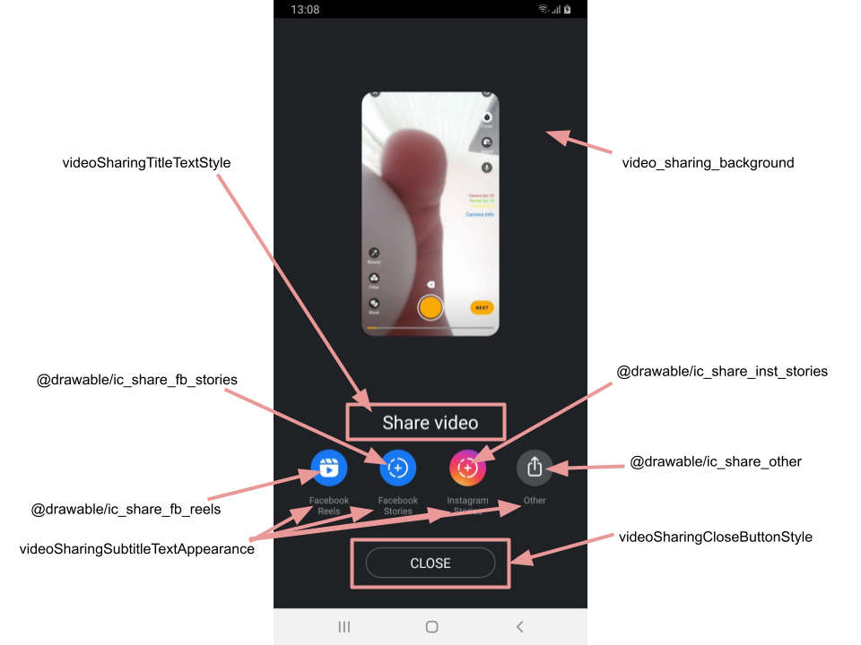

# Sharing screen

**Feature is available since 1.24.2**

## Overview

Sharing screen is an **optional** screen which can be added to the application in order to add Facebook sharing flow just after video export.

## Implementation

Sharing screen is presented by `VideoSharingFragment` which is provided together with Banuba Video Editor. 

To utilize this screen in your application you should follow the next steps:

- ensure that there is a `FileProvider` declared in app's AndroidManifest file (this is mandatory to be able to share media files across the apps):
```xml
<provider
    android:name="androidx.core.content.FileProvider"
    android:authorities="${applicationId}.provider"
    android:exported="false"
    android:grantUriPermissions="true">
    <meta-data
        android:name="android.support.FILE_PROVIDER_PATHS"
        android:resource="@xml/provider_paths" />
</provider>
```

- ensure that you have appropriate `SharingActionHandler` implementation. This interface links the sharing screen behavior with the main video editor flow - it handles both **back** and **close button pressing**.

- open `VideoSharingFragment` after export video by utilizing one of the helper functions:
```kotlin
fun newInstance(
        exportResult: ExportResult?,
        fbAppId: String
    )

fun newInstance(
        exportResult: Uri?,
        fbAppId: String
    )
```
here `fbAppId` is an id of your facebook application.

## Customization

Sharing screen has following customizable theme attributes:

 - **video_sharing_background** - which defines the background of the sharing screen
 - **videoSharingTitleTextStyle** -  is an attribute for styling the title view
 - **videoSharingSubtitleTextAppearance** - for styling sharing options titles
 - **videoSharingCloseButtonSytle** - to customize close button appearance

 **NOTE!** Above attributes are **not a part of VideoCreationTheme** and should be declared in the theme applied to the activity which contains the sharing screen.

 All sharing options has drawable and string resources which correspond to their icon and title. These resources may be overridden in an application:

| Sharing option       |      Icon resource      |   Title resource |
| ------------- | :----------- | :------------- |
| Facebook Reels | @drawable/ic_share_fb_reels | @string/sharing_fb_reels
| Facebook Stories | @drawable/ic_share_fb_stories | @string/sharing_fb_stories
| Instagram Stories | @drawable/ic_share_inst_stories | @string/sharing_instagram_stories
| Other | @drawable/ic_share_other | @string/sharing_other


