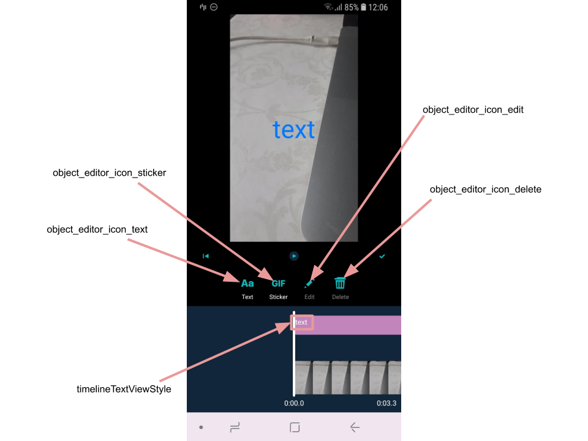
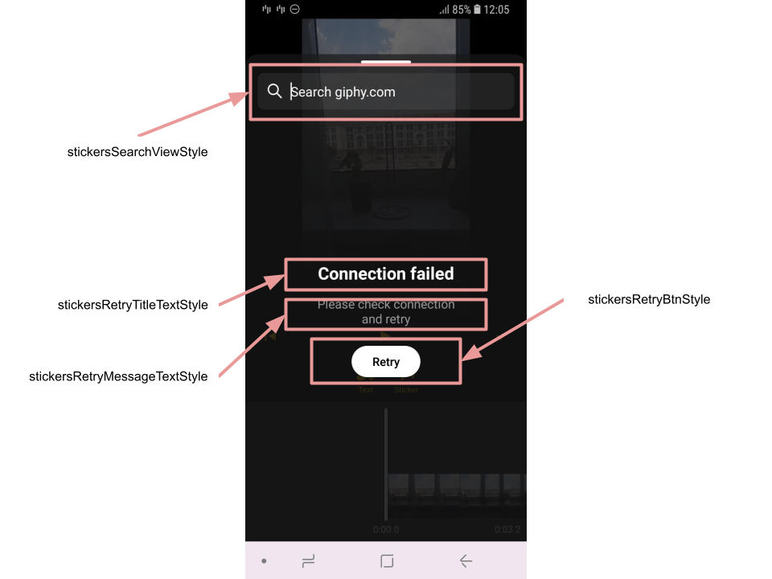

# Banuba VideoEditor SDK
## Timeline Editor screen styles

This screen is used to edit gif (sticker) and text effects. 

Almost all views are the same as in [Music Editor screen](music_editor_styles.md) and configured using the same theme attributes. The special attributes related to this screen directly:

- [timelineTextViewStyle](https://github.com/Banuba/ve-sdk-android-integration-sample/blob/main/app/src/main/res/values/themes.xml#L183)

    style for the TextView that represents the text effect on the timeline

- [object_editor_icon_text](https://github.com/Banuba/ve-sdk-android-integration-sample/blob/main/app/src/main/res/values/themes.xml#L184)

    theme attribute for the text effect drawable

- [object_editor_icon_sticker](https://github.com/Banuba/ve-sdk-android-integration-sample/blob/main/app/src/main/res/values/themes.xml#L185)

    theme attribute for the sticker effect drawable

- [object_editor_icon_edit](https://github.com/Banuba/ve-sdk-android-integration-sample/blob/main/app/src/main/res/values/themes.xml#L186)

    theme attribute for the button that opens text editor screen (it is disabled if you try to edit sticker, cause the sticker is only available to delete)
- [object_editor_icon_delete](https://github.com/Banuba/ve-sdk-android-integration-sample/blob/main/app/src/main/res/values/themes.xml#L187)

    theme attribute for the button that deletes selected effect

    

- [stickersSearchViewStyle](https://github.com/Banuba/ve-sdk-android-integration-sample/blob/main/app/src/main/res/values/themes.xml#L177)

    style for the SearchView while adding sticker effect. A lot of custom attributes are intended to customize search icon, hint color, cursor and other items
- [stickersRetryTitleTextStyle](https://github.com/Banuba/ve-sdk-android-integration-sample/blob/main/app/src/main/res/values/themes.xml#L178)

    style for the TextView that is shown in case of absent internet connection appearing during stickers searching
- [stickersRetryMessageTextStyle](https://github.com/Banuba/ve-sdk-android-integration-sample/blob/main/app/src/main/res/values/themes.xml#L179)

    style for the TextView that shows additional information for the user in case of lost network connection
- [stickersRetryBtnStyle](https://github.com/Banuba/ve-sdk-android-integration-sample/blob/main/app/src/main/res/values/themes.xml#L180)

    style for the button that is used to retry stickers loading




## String resources

| ResourceId        |      Value      |   Description |
| ------------- | :----------- | :------------- |
| stickers_empty_list | No stickers found | message that is shown while the user is searching [stickers](https://github.com/Banuba/ve-sdk-android-integration-sample#configure-stickers-content) and has no result
| stickers_search_hint | Search giphy.com | hint shown on the search view on the screen that provides [stickers](https://github.com/Banuba/ve-sdk-android-integration-sample#configure-stickers-content). The text appearance of this view is define in ```stickersSearchViewStyle```
| stickers_search_cancel | Cancel | text on the button on the right of the search view on [stickers](https://github.com/Banuba/ve-sdk-android-integration-sample#configure-stickers-content) screen
| connection_view_title | Connection failed | message that is shown in case of network error while [stickers](https://github.com/Banuba/ve-sdk-android-integration-sample#configure-stickers-content) are being loaded. The text appearance is defined in ```stickersRetryTitleTextStyle```
| connection_view_message | Please check connection\nand retry | hint that is shown in case of network error while [stickers](https://github.com/Banuba/ve-sdk-android-integration-sample#configure-stickers-content) are being loaded. The text appearance is defined in ```stickersRetryMessageTextStyle```
| connection_view_retry | Retry | text on the button that is shown in case of network error while [stickers](https://github.com/Banuba/ve-sdk-android-integration-sample#configure-stickers-content) are being loaded. It allows to resend the request for stickers. The text appearence is defined in ```stickersRetryBtnStyle```