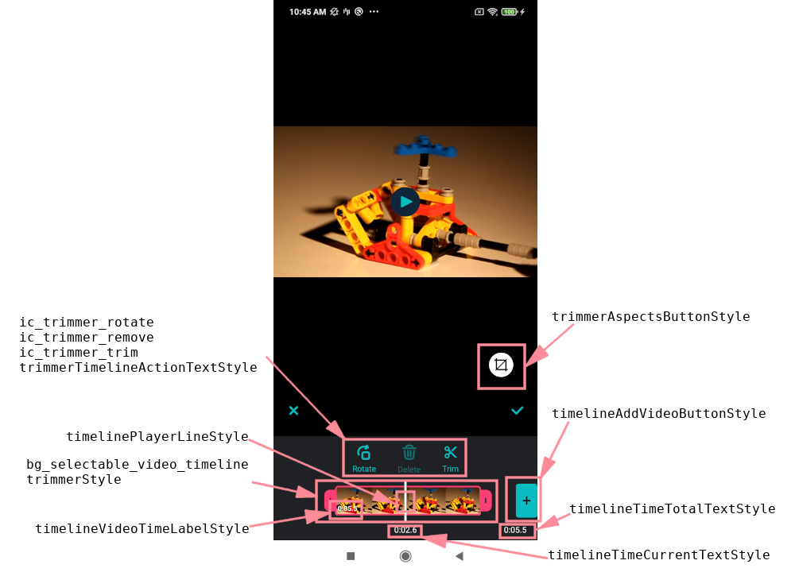
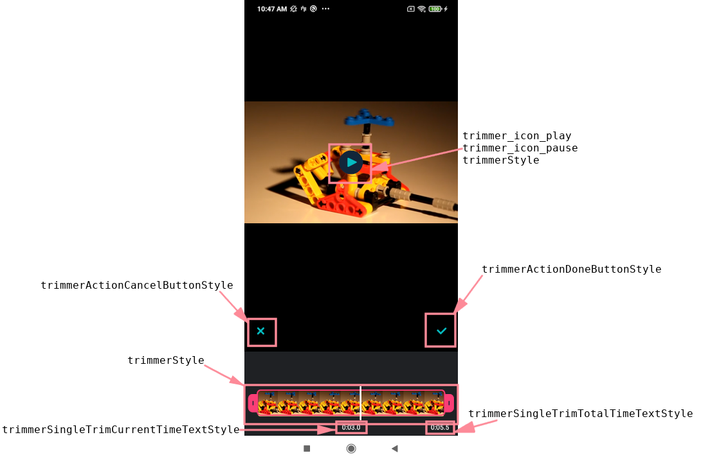
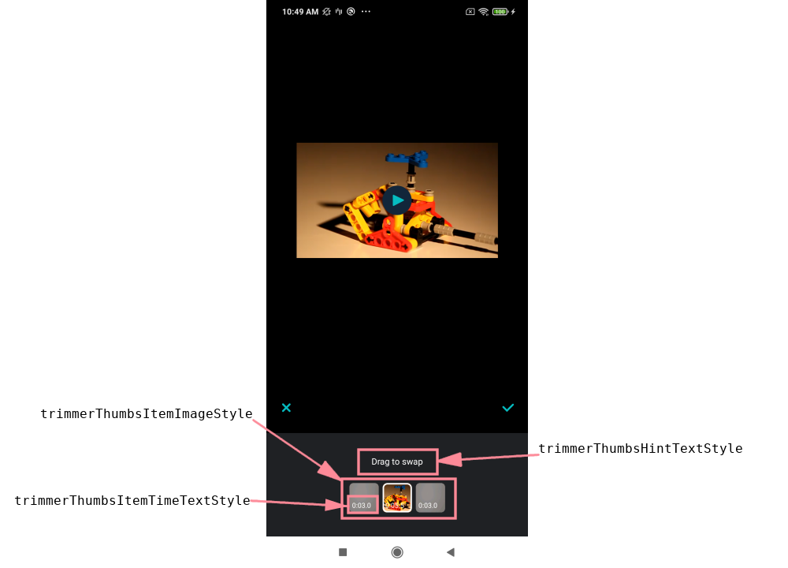

# Banuba AI Video Editor SDK
## Trimmer screen styles

- [trimmerStyle](../app/src/main/res/values/themes.xml#L130)

    style to customize trimmer view with custom attributes. There are a lot of properties can be changed from its default color to left and right pointers drawables

- [ic_trimmer_rotate](../app/src/main/res/drawable/ic_trimmer_rotate.xml), [ic_trimmer_remove](../app/src/main/res/drawable/ic_trimmer_remove.xml) and [ic_trimmer_trim](../app/src/main/res/drawable/ic_trimmer_trim.xml)

    drawables for different trimmer view actions icons

- [trimmerTimelineActionTextStyle](../app/src/main/res/values/themes.xml#L136)

    style to customize trimmer view actions text 

- [timelinePlayerLineStyle](../app/src/main/res/values/themes.xml#L828)

    style to customize player line style, e.g. player line color

- [bg_selectable_video_timeline](../app/src/main/res/drawable/bg_selected_video_timeline.xml)

    drawable for multi trimmer view border

- [timelineVideoTimeLabelStyle](../app/src/main/res/values/themes.xml#L831)

    style to customize multi trimmer view time label

- [trimmerAspectsButtonStyle](../app/src/main/res/values/themes.xml#L143)

    style for the button that opens aspects list

- [timelineAddVideoButtonStyle](../app/src/main/res/values/themes.xml#L827)

    style for the button that opens gallery dialog to add video 

- [timelineTimeTotalTextStyle](../app/src/main/res/values/themes.xml#L830)

    style to customize the total time text label for the multi trimmer view

- [timelineTimeCurrentTextStyle](../app/src/main/res/values/themes.xml#L829)

    style to customize the current time text label for the multi trimmer view

    

- [trimmer_icon_play](../app/src/main/res/values/themes.xml#L158) and [trimmer_icon_pause](../app/src/main/res/values/themes.xml#L159)

    attributes for different playback icon states. Visibility of the playback icon itself is defined in [trimmer_play_control_visible](../app/src/main/res/values/themes.xml#L157) attribute

- [trimmerActionCancelButtonStyle](../app/src/main/res/values/themes.xml#L145)

    style for the cancel button

- [trimmerActionDoneButtonStyle](../app/src/main/res/values/themes.xml#L144)

    style for the done button

- [trimmerSingleTrimCurrentTimeTextStyle](../app/src/main/res/values/themes.xml#L141)

    style to customize the current time text label for the single trimmer view

- [trimmerSingleTrimTotalTimeTextStyle](../app/src/main/res/values/themes.xml#L142)

    style to customize the total time text label for the single trimmer view


    


- [trimmerThumbsItemImageStyle](../app/src/main/res/values/themes.xml#L154)

    style to customize the thumbnail image, especially the background, border and corner radius 

- [trimmerThumbsItemTimeTextStyle](../app/src/main/res/values/themes.xml#L155)

    style to customize the thumbnail time label

- [trimmerThumbsHintTextStyle](../app/src/main/res/values/themes.xml#L152)

    style to customize the thumbnail hint label

    


- [trimmerTimelineStyle](../app/src/main/res/values/themes.xml#L131)

    style that contains other styles, such as ```timelineAddVideoButtonStyle```, ```timelinePlayerLineStyle```, ```timelineTimeCurrentTextStyle```, ```timelineTimeTotalTextStyle```, ```timelineVideoTimeLabelStyle``` and so on


- [trimmerTimelineActionButtonsRecyclerStyle](../app/src/main/res/values/themes.xml#L133)
    style for the RecyclerView containing the list of the action buttons

- [trimmerTimelineActionParentStyle](../app/src/main/res/values/themes.xml#L134)

    style to customize the action buttons layout size and margins

- [trimmerTimelineActionImageStyle](../app/src/main/res/values/themes.xml#L135)

    style to customize the action buttons image sizes


- [trimmerParentStyle](../app/src/main/res/values/themes.xml#L137)

    style to customize the trimmer video item layout parameters, background, clickable and focusable attributes

- [trimmerVideoContainerStyle](../app/src/main/res/values/themes.xml#L138)

    style to customize the trimmer video item margins

- [trimmerPlayButtonStyle](../app/src/main/res/values/themes.xml#L139)

    style to customize the trimmer play button layout parameters and background

- [trimmerContentBackgroundStyle](../app/src/main/res/values/themes.xml#L140)

    style to customize the trimmer video item background

- [trimmerThumbsRecyclerViewStyle](../app/src/main/res/values/themes.xml#L151)

    style fot the RecyclerView containing the list of thumbnails

- [trimmerThumbsItemParentStyle](../app/src/main/res/values/themes.xml#L153)

    style to customize the thumbnail item layout parameters, clickable and focusable attributes


## String resources

| ResourceId        |      Value      |   Description |
| ------------- | :----------- | :------------- |
| trimmer_action_rotate | Rotate | label that is shown under the rotate action icon
| trimmer_action_delete | Delete | label that is shown under the delete action icon
| trimmer_action_trim | Trim | label that is shown under the trim action icon
| trimmer_drag_hint | Drag to swap | hint that is shown to the user when he is long pressing on the video thumbnail in multitrimmer mode. Related TextView is customized in ```trimmerThumbsHintTextStyle```
| err_trimmer_invalid_duration | Video duration should be between %1$d and %2$d seconds | error message shown as a [toast](alert_styles.md#L11). Here placeholders are values from ```minVideoDuration``` and ```maxVideoDuration``` parameters in [videoeditor.json](https://github.com/Banuba/ve-sdk-android-integration-sample/blob/main/app/src/main/assets/videoeditor.json#L3) file
| err_trimmer_internal | Error while making video | error message shown as a [toast](alert_styles.md#L11) if an undefined exception appeared during trimming video
