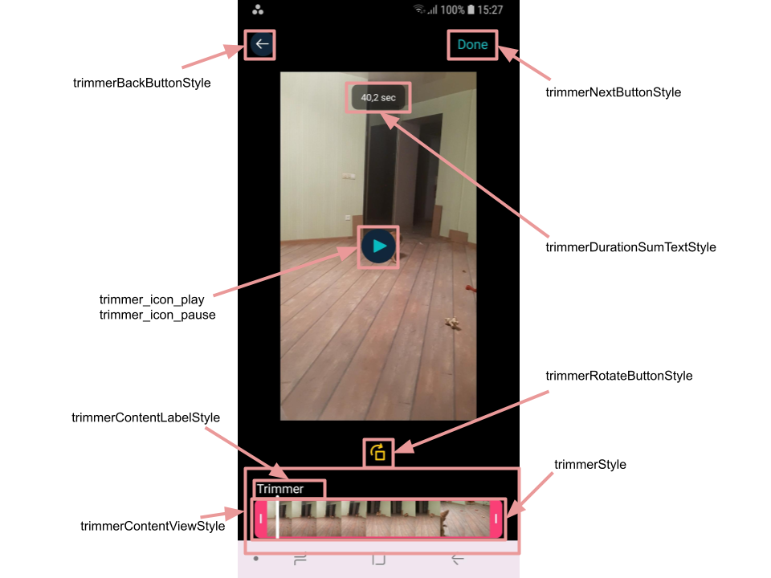
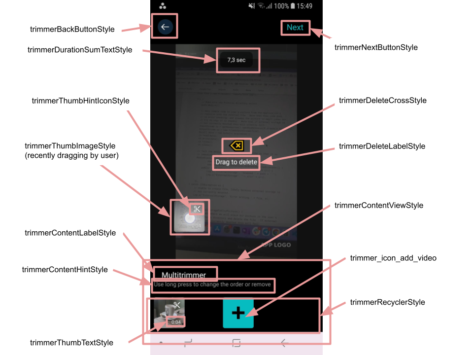
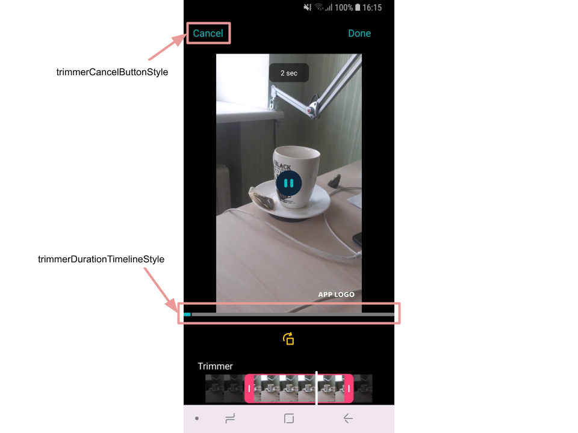

# Banuba VideoEditor SDK
## Trimmer screen styles

- [trimmerStyle](https://github.com/Banuba/ve-sdk-android-integration-sample/blob/main/app/src/main/res/values/themes.xml#L114)

    style to customize trimmer view with custom attributes. There are a lot of properties can be changed from its default color to left and right pointers drawables
- [trimmerBackButtonStyle](https://github.com/Banuba/ve-sdk-android-integration-sample/blob/main/app/src/main/res/values/themes.xml#L115)

    style for the button that returns the user to the previous screen
- [trimmerNextButtonStyle](https://github.com/Banuba/ve-sdk-android-integration-sample/blob/main/app/src/main/res/values/themes.xml#L116)

    style for the button that starts trimming process and proceeds to the editor screen. In case of single video it called "Done" and starts trimming, in case of multi videos it called "Done" or "Next" depending on the current action:
    - applies new time borders for the selected video and return to multi videos screen
    - proceeds with all changes to the editor screen
- [trimmerDurationSumTextStyle](https://github.com/Banuba/ve-sdk-android-integration-sample/blob/main/app/src/main/res/values/themes.xml#L117)

    style for the top label that shows the final duration of selected videos after trimming process

- [trimmerContentViewStyle](https://github.com/Banuba/ve-sdk-android-integration-sample/blob/main/app/src/main/res/values/themes.xml#L118)

    style for the view that plays a role of a container for the trimmer view or the view containing list of selected videos

- [trimmerContentLabelStyle](https://github.com/Banuba/ve-sdk-android-integration-sample/blob/main/app/src/main/res/values/themes.xml#L119)

    style for the label of trimmer view (or list of videos) container

    
- [trimmerRecyclerStyle](https://github.com/Banuba/ve-sdk-android-integration-sample/blob/main/app/src/main/res/values/themes.xml#L120)

    style for the RecyclerView containing the list of selected videos

- [trimmerThumbImageStyle](https://github.com/Banuba/ve-sdk-android-integration-sample/blob/main/app/src/main/res/values/themes.xml#L121)

    style for the video item image within trimmer RecyclerView

- [trimmerThumbTextStyle](https://github.com/Banuba/ve-sdk-android-integration-sample/blob/main/app/src/main/res/values/themes.xml#L122)

    style for the video item duration within trimmer RecyclerView

- [trimmerDeleteLabelStyle](https://github.com/Banuba/ve-sdk-android-integration-sample/blob/main/app/src/main/res/values/themes.xml#L123)

    style for the text view that appears when the user dragging video from the videos list. The video should be moved over the "delete" image to be deleted

- [trimmerDeleteCrossStyle](https://github.com/Banuba/ve-sdk-android-integration-sample/blob/main/app/src/main/res/values/themes.xml#L124)

    style for the image view that appears when the user dragging video from the videos list. The video should be moved over the "delete" image to be deleted 

    

- [trimmerCancelButtonStyle](https://github.com/Banuba/ve-sdk-android-integration-sample/blob/main/app/src/main/res/values/themes.xml#L125)

    style for the button that cancels recent changes

- [trimmerDurationTimelineStyle](https://github.com/Banuba/ve-sdk-android-integration-sample/blob/main/app/src/main/res/values/themes.xml#L126)

    style for the view that represents the whole video after trimming process. This view is shown only when user is changing time borders for the video from videos list. There are a lot of custom attributes allowing to setup colors for different parts of the timeline

    

Trimmer screen customization also provided by several custom theme attributes:
- [trimmer_play_control_visible](https://github.com/Banuba/ve-sdk-android-integration-sample/blob/main/app/src/main/res/values/themes.xml#L128) - to set if buttons play/pause should be visible
- [trimmer_icon_play](https://github.com/Banuba/ve-sdk-android-integration-sample/blob/main/app/src/main/res/values/themes.xml#L129) - for play button drawable
- [trimmer_icon_pause](https://github.com/Banuba/ve-sdk-android-integration-sample/blob/main/app/src/main/res/values/themes.xml#L130) - for pause button drawable
- [trimmer_icon_add_video](https://github.com/Banuba/ve-sdk-android-integration-sample/blob/main/app/src/main/res/values/themes.xml#L131) - for the last item in videos list RecyclerView. This item allows the user to open gallery screen to add videos to the recent list
- [trimmer_bg_color_add_video](https://github.com/Banuba/ve-sdk-android-integration-sample/blob/main/app/src/main/res/values/themes.xml#L132) - for the background color of the special item configured by "trimmer_icon_add_video" attribute
- [trimmer_time_visible](https://github.com/Banuba/ve-sdk-android-integration-sample/blob/main/app/src/main/res/values/themes.xml#L133) - to set if the label that shows final video duration should be visible
- [trimmer_hint_visible](https://github.com/Banuba/ve-sdk-android-integration-sample/blob/main/app/src/main/res/values/themes.xml#L134) - to set if the custom hint should be visible. To configure the custom hint the TrimmerHintStyle should be overridden.
